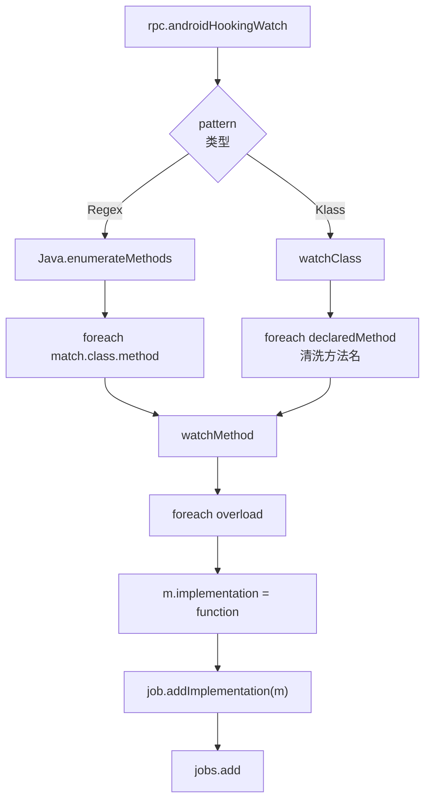

# Hook 引擎 <code>agent/src/android/hooking.ts</code>

`hooking.ts` 是 Android 平台最核心的模块之一，提供 Java 类枚举、方法枚举与重载解析、方法监听（watch）、返回值篡改、当前 Activity/Service/Receiver 枚举等能力。它是 `android hooking` 命令族在 Agent 侧的全部实现。

## 📋 模块概览
| 项目 | 值 |
| --- | --- |
| 文件路径 | `agent/src/android/hooking.ts` |
| 平台 | Android |
| 导出 RPC | `androidHookingGetClassMethods`、`androidHookingGetClassMethodsOverloads`、`androidHookingGetClasses`、`androidHookingGetClassLoaders`、`androidHookingGetCurrentActivity`、`androidHookingListActivities`、`androidHookingListBroadcastReceivers`、`androidHookingListServices`、`androidHookingSetMethodReturn`、`androidHookingWatch`、`androidHookingEnumerate`、`androidHookingLazyWatchForPattern` |
| 依赖 | `lib/color.ts`、`lib/jobs.ts`、`android/lib/interfaces.ts`、`android/lib/libjava.ts`、`android/lib/types.ts`、`frida-java-bridge` |

## 🎯 解决的问题
- 枚举已加载的 Java 类与 ClassLoader，定位目标类。
- 按"类.方法"或正则模式批量 Hook 方法，记录参数/返回值/调用栈。
- 篡改布尔方法返回值（绕过 root/jailbreak 检测的常用手段）。
- 列出 App 当前注册的 Activity / Service / BroadcastReceiver。
- 支持"懒监听"：类还没加载时定时轮询，加载后再 Hook。

## 🏗️ 导出的 RPC 方法
| RPC 名 | 说明 |
| --- | --- |
| `androidHookingGetClasses` | `Java.enumerateLoadedClassesSync()` |
| `androidHookingGetClassLoaders` | `Java.enumerateClassLoaders` |
| `androidHookingGetClassMethods(className)` | `getDeclaredMethods().toGenericString()` |
| `androidHookingGetClassMethodsOverloads(className, allowList, loader)` | 解析每个方法的所有 overload 的 arg/return 类型 |
| `androidHookingGetCurrentActivity` | 从 `ActivityThread.mActivities` 找未 paused 的 Activity |
| `androidHookingListActivities` | `PackageManager.getPackageInfo(GET_ACTIVITIES)` |
| `androidHookingListServices` | `mLoadedApk.mServices` + `GET_SERVICES` |
| `androidHookingListBroadcastReceivers` | `mLoadedApk.mReceivers` + `GET_RECEIVERS` |
| `androidHookingWatch(pattern, args, bt, ret)` | 按类或正则 watch |
| `androidHookingEnumerate(query)` | `Java.enumerateMethods` |
| `androidHookingLazyWatchForPattern(...)` | 5 秒轮询直到类加载再 watch |
| `androidHookingSetMethodReturn(fqClazz, filterOverload, ret)` | 篡改返回值 |

### `rpc.androidHookingWatch` — 监听方法
源码：`agent/src/android/hooking.ts:258`

按 pattern 类型分流：不含 `!` 视为类名（watch 整个类），含 `!` 视为正则（`Java.enumerateMethods` 后逐方法 watch）：

```ts
// agent/src/android/hooking.ts:262-294
const patternType = getPatternType(pattern);
if (patternType === PatternType.Klass) {
  const job = new jobs.Job(jobs.identifier(), `watch-class for: ${pattern}`);
  const w = watchClass(pattern, job, dargs, dbt, dret);
  jobs.add(job);
  return w;
}
// PatternType.Regex
const job = new jobs.Job(jobs.identifier(), `watch-pattern for: ${pattern}`);
jobs.add(job);
return new Promise((resolve, reject) => {
  javaEnumerate(pattern).then((matches) => {
    matches.forEach((match) => {
      match.classes.forEach((klass) => {
        klass.methods.forEach((method) => {
          watchMethod(`${klass.name}.${method}`, job, dargs, dbt, dret);
        });
      });
    });
    resolve();
  }).catch(reject);
});
```

### `watchMethod` — 单方法 Hook
源码：`agent/src/android/hooking.ts:342`

对每个 overload 替换 `implementation`，按标志位 dump 参数/调用栈/返回值：

```ts
// agent/src/android/hooking.ts:359-408
targetClass[method].overloads.forEach((m: any) => {
  const calleeArgTypes = m.argumentTypes.map((arg) => arg.className);
  send(`Watching ${clazz}.${method}(${calleeArgTypes.join(", ")})`);
  m.implementation = function () {
    send(`[${job.identifier}] Called ${clazz}.${m.methodName}(${calleeArgTypes.join(", ")})`);
    if (dbt) {
      send(`[${job.identifier}] Backtrace:\n\t` +
        throwable.$new().getStackTrace().map((t) => t.toString() + "\n\t").join(""));
    }
    if (dargs && calleeArgTypes.length > 0) {
      const argValues = [];
      for (const h of arguments) argValues.push((h || "(none)").toString());
      send(`[${job.identifier}] Arguments ${clazz}.${m.methodName}(${argValues.join(", ")})`);
    }
    const retVal = m.apply(this, arguments);   // 调原方法
    if (dret) {
      send(`[${job.identifier}] Return Value: ${((retVal || "(none)").toString())}`);
    }
    return retVal;
  };
  job.addImplementation(m);   // 供 jobsKill 还原
});
```

### `rpc.androidHookingSetMethodReturn` — 篡改返回值
源码：`agent/src/android/hooking.ts:535`

```ts
// agent/src/android/hooking.ts:550-575
targetClazz[method].overloads.forEach((m: any) => {
  const calleeArgTypes = m.argumentTypes.map((arg) => arg.className);
  if (filterOverload != null && calleeArgTypes.join(",") !== filterOverload) return;
  m.implementation = function () {
    let retVal = m.apply(this, arguments);
    if (retVal !== newRet) {
      send(`[${job.identifier}] Return value was not ${newRet}, setting to ${newRet}.`);
      retVal = newRet;
    }
    return retVal;
  };
  job.addImplementation(m);
});
```

### `rpc.androidHookingGetCurrentActivity` — 当前 Activity
源码：`agent/src/android/hooking.ts:421`

```ts
// agent/src/android/hooking.ts:427-448
const activityThread = Java.use("android.app.ActivityThread");
const activity = Java.use("android.app.Activity");
const activityClientRecord = Java.use("android.app.ActivityThread$ActivityClientRecord");
const currentActivityThread = activityThread.currentActivityThread();
const activityRecords = currentActivityThread.mActivities.value.values().toArray();
for (const i of activityRecords) {
  const activityRecord = Java.cast(i, activityClientRecord);
  if (!activityRecord.paused.value) {
    currentActivity = Java.cast(activityRecord.activity.value, activity);
    break;
  }
}
```

## ⚙️ 实现要点

- **PatternType 判定**：`pattern.indexOf('!') !== -1` 为正则，否则为类名（`:65-71`）。正则需 `*class*!*` 格式喂给 `Java.enumerateMethods`（`:127`）。
- **方法名清洗**：`watchClass` 把 `public static void com.foo.Bar.doIt(Canvas)` 清洗成 `doIt`，去掉泛型/throws/作用域/类名/签名（`:301-319`）。
- **ClassLoader 透明化**：`getClassHandle`/`getClassHandleWithLoaderClassName`（`:157-208`）遍历所有 ClassLoader 用 `Java.ClassFactory.get(loader).use(name)` 取类，解决多 ClassLoader App 找不到类的问题。
- **overload 过滤**：`setReturnValue` 用 `calleeArgTypes.join(",") !== filterOverload` 跳过非目标 overload（`:555`）。
- **ClassNotFoundError 检测**：`(err).stack` 含 `java.lang.ClassNotFoundException` 时静默返回，避免噪音（`:27-30`）。
- **Job 注册**：每个 watch / setReturn 都建 Job 并 `job.addImplementation(m)`，使 `jobsKill` 能把 `implementation = null` 还原（`lib/jobs.ts:59-67`）。
- **懒监听**：`lazyWatchForPattern` 用 `setInterval` 5 秒轮询 `javaEnumerate`，找到后 watchMatches 并 `clearInterval`（`:107-122`）。

## 📐 watch 流程



## 🔍 源码索引
| 符号 | 位置 |
| --- | --- |
| `PatternType` enum | `agent/src/android/hooking.ts:22` |
| `isClassNotFoundError` | `agent/src/android/hooking.ts:27` |
| `splitClassMethod` | `agent/src/android/hooking.ts:32` |
| `getClasses` | `agent/src/android/hooking.ts:42` |
| `getClassLoaders` | `agent/src/android/hooking.ts:48` |
| `getPatternType` | `agent/src/android/hooking.ts:65` |
| `lazyWatchForPattern` | `agent/src/android/hooking.ts:73` |
| `javaEnumerate` | `agent/src/android/hooking.ts:124` |
| `getClassMethods` | `agent/src/android/hooking.ts:135` |
| `getClassHandle` | `agent/src/android/hooking.ts:157` |
| `getClassHandleWithLoaderClassName` | `agent/src/android/hooking.ts:182` |
| `getClassMethodsOverloads` | `agent/src/android/hooking.ts:210` |
| `watch` | `agent/src/android/hooking.ts:258` |
| `watchClass` | `agent/src/android/hooking.ts:296` |
| `watchMethod` | `agent/src/android/hooking.ts:342` |
| `getCurrentActivity` | `agent/src/android/hooking.ts:421` |
| `getActivities` | `agent/src/android/hooking.ts:457` |
| `getServices` | `agent/src/android/hooking.ts:472` |
| `getBroadcastReceivers` | `agent/src/android/hooking.ts:502` |
| `setReturnValue` | `agent/src/android/hooking.ts:535` |

## 🔗 相关文档
- [Frida 与 Agent](/guide/frida-agent)
- [RPC 通信机制](/guide/rpc)
- [`hooking.md`](/reference/agent/ios/hooking) · [`jobs.md`](/reference/agent/lib/jobs)
- 命令文档：[/reference/commands/android/hooking](/reference/commands/android/hooking)
