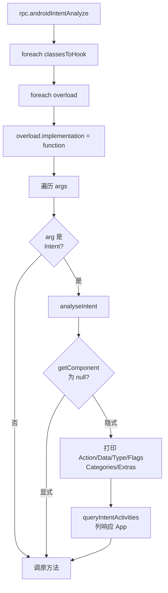

# Intent <code>agent/src/android/intent.ts</code>

`intent.ts` 在 Android 进程内启动 Activity/Service，以及 Hook 隐式 Intent 相关方法做安全分析（检测隐式 Intent 泄露与解析目标 App）。

## 📋 模块概览
| 项目 | 值 |
| --- | --- |
| 文件路径 | `agent/src/android/intent.ts` |
| 平台 | Android |
| 导出 RPC | `androidIntentStartActivity`、`androidIntentStartService`、`androidIntentAnalyze` |
| 依赖 | `lib/color.ts`、`android/lib/libjava.ts`、`android/lib/types.ts`、`android/lib/intentUtils.ts`、`lib/jobs.ts`、`frida-java-bridge` |

## 🎯 解决的问题
- 在 App 上下文内直接 `startActivity` / `startService`，绕过 manifest 限制触发未导出组件。
- 检测隐式 Intent：监听 `startActivity` / `onActivityResult` / `onReceive` 等，发现无显式 Component 的 Intent 时打印 Action / Data / Type / Flags / Categories / Extras 并列出会响应的 App。

## 🏗️ 导出的 RPC 方法
| RPC 名 | 说明 |
| --- | --- |
| `androidIntentStartActivity(activityClass)` | 构造 Intent 启动 Activity |
| `androidIntentStartService(serviceClass)` | 构造 Intent 启动 Service |
| `androidIntentAnalyze(backtrace)` | Hook 隐式 Intent 相关方法做分析 |

### `rpc.androidIntentStartActivity` — 启动 Activity
源码：`agent/src/android/intent.ts:18`

```ts
// agent/src/android/intent.ts:25-41
return wrapJavaPerform(() => {
  const context = getApplicationContext();
  const androidIntent = Java.use("android.content.Intent");
  const newActivity = Java.use(activityClass).class;
  send(`Starting activity ${activityClass}...`);
  const newIntent = androidIntent.$new(context, newActivity);
  newIntent.setFlags(FLAG_ACTIVITY_NEW_TASK);
  context.startActivity(newIntent);
  send(`Activity successfully asked to start.`);
});
```

### `rpc.androidIntentAnalyze` — 隐式 Intent 分析
源码：`agent/src/android/intent.ts:73`

Hook 一组组件入口，对每个 Intent 参数调 `analyseIntent`：

```ts
// agent/src/android/intent.ts:79-107
const classesToHook = [
  { className: "android.app.Activity", methodName: "startActivityForResult" },
  { className: "android.app.Activity", methodName: "onActivityResult" },
  { className: "androidx.activity.ComponentActivity", methodName: "onActivityResult" },
  { className: "android.content.Context", methodName: "startActivity" },
  { className: "android.content.BroadcastReceiver", methodName: "onReceive" }
];
classesToHook.forEach(hook => {
  try {
    const clazz = Java.use(hook.className);
    const method = clazz[hook.methodName];
    method.overloads.forEach((overload) => {
      overload.implementation = function (...args) {
        args.forEach(arg => {
          if (arg && arg.$className === "android.content.Intent") {
            analyseIntent(`${hook.className}::${hook.methodName}`, arg, backtrace);
          }
        });
        return overload.apply(this, args);
      };
      job.addImplementation(overload);
    });
  } catch (e) { send(`Error hooking ${hook.className}.${hook.methodName}: ${e}`); }
});
```

## ⚙️ 实现要点

- **FLAG_ACTIVITY_NEW_TASK = 0x10000000**：从 Context 启动 Activity 必须带该 flag（`:13`），否则会抛 `RuntimeException`。
- **隐式判定**：`intent.getComponent()` 为 null 即隐式（见 `intentUtils.ts:9-13`），随后打印全部元数据并用 `PackageManager.queryIntentActivities` 列出会响应的 App。
- **overload 全覆盖**：`startActivity` 等方法有多个 overload，逐个替换 implementation（`:92`）。
- **Job 注册**：每个被 Hook 的 overload 都 `job.addImplementation`，可被 `jobsKill` 还原。

## 📐 隐式 Intent 分析流程



## 🔍 源码索引
| 符号 | 位置 |
| --- | --- |
| `FLAG_ACTIVITY_NEW_TASK` | `agent/src/android/intent.ts:13` |
| `startActivity` | `agent/src/android/intent.ts:18` |
| `startService` | `agent/src/android/intent.ts:45` |
| `analyzeImplicits` | `agent/src/android/intent.ts:73` |

## 🔗 相关文档
- [Frida 与 Agent](/guide/frida-agent)
- [`intent-utils.md`](/reference/agent/android/lib/intent-utils)
- 命令文档：[/reference/commands/android/intents](/reference/commands/android/intents)
