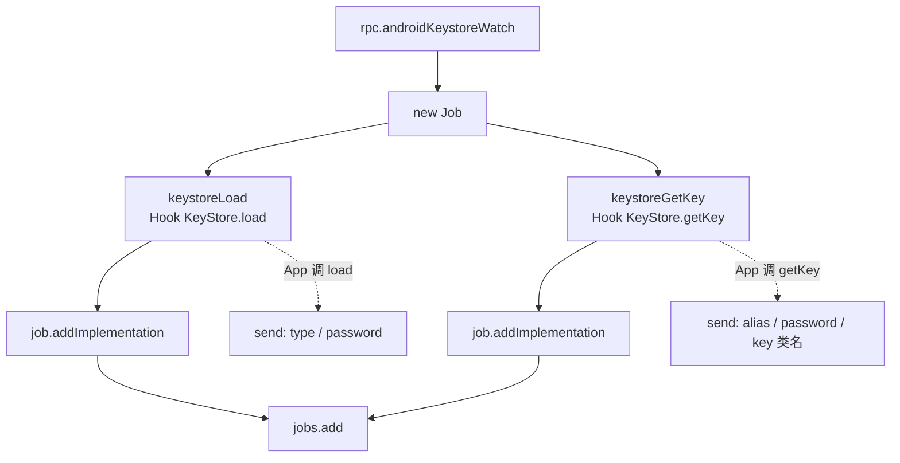

# Keystore <code>agent/src/android/keystore.ts</code>

`keystore.ts` 操作 Android KeyStore：列出条目、dump 每个密钥的详细属性（算法/大小/模式/padding/有效性/是否硬件安全等）、清空、以及 Hook `KeyStore.load` / `getKey` 监听密钥使用。

## 📋 模块概览
| 项目 | 值 |
| --- | --- |
| 文件路径 | `agent/src/android/keystore.ts` |
| 平台 | Android |
| 导出 RPC | `androidKeystoreClear`、`androidKeystoreList`、`androidKeystoreDetail`、`androidKeystoreWatch` |
| 依赖 | `lib/color.ts`、`android/lib/interfaces.ts`、`android/lib/libjava.ts`、`android/lib/types.ts`、`lib/jobs.ts` |

## 🎯 解决的问题
- 枚举 `AndroidKeyStore` provider 中的全部 alias，标记是 key 还是 certificate。
- 提取每个 key 的 `KeyInfo` 属性，判断是否在 Secure Hardware 内、是否需要用户认证、是否被生物识别失效。
- 监听 App 何时 `load` keystore 与 `getKey`，捕获 alias 与 password。

## 🏗️ 导出的 RPC 方法
| RPC 名 | 说明 |
| --- | --- |
| `androidKeystoreList` | 列出全部 alias 及 key/cert 标记 |
| `androidKeystoreDetail` | 每 alias 的 `KeyInfo` 详细属性 |
| `androidKeystoreClear` | 删除全部 alias |
| `androidKeystoreWatch` | Hook `KeyStore.load` 与 `getKey` |

### `rpc.androidKeystoreList` — 列出 alias
源码：`agent/src/android/keystore.ts:22`

```ts
// agent/src/android/keystore.ts:32-56
const keyStore = Java.use("java.security.KeyStore");
const ks = keyStore.getInstance("AndroidKeyStore");
ks.load(null, null);
const aliases = ks.aliases();
while (aliases.hasMoreElements()) {
  const alias = aliases.nextElement();
  entries.push({
    alias: alias.toString(),
    is_certificate: ks.isCertificateEntry(alias),
    is_key: ks.isKeyEntry(alias),
  });
}
```

### `rpc.androidKeystoreDetail` — 详细属性
源码：`agent/src/android/keystore.ts:64`

内嵌 `keystore_info(alias)` 用 `KeyFactory.getKeySpec(key, KeyInfo.class)` 拿 `KeyInfo`，逐字段读取：
```ts
// agent/src/android/keystore.ts:93-110
r.keyAlgorithm = key.getAlgorithm();
r.keySize = keyInfo['getKeySize'].call(keySpec);
r.blockModes = keyInfo['getBlockModes'].call(keySpec);
r.encryptionPaddings = keyInfo['getEncryptionPaddings'].call(keySpec);
r.isInsideSecureHardware = keyInfo['isInsideSecureHardware'].call(keySpec);
r.isUserAuthenticationRequired = keyInfo['isUserAuthenticationRequired'].call(keySpec);
// ... 共 18 个字段
```
`SecretKeyFactory` 作为 `KeyFactory` 失败时的回退（`:88-90`），兼容密钥类型差异。

### `rpc.androidKeystoreWatch` — 监听 load / getKey
源码：`agent/src/android/keystore.ts:245`

```ts
// agent/src/android/keystore.ts:245-252
export const watchKeystore = async (): Promise<void> => {
  const job = new jobs.Job(jobs.identifier(), "android-keystore-watch");
  job.addImplementation(await keystoreLoad(job.identifier));
  job.addImplementation(await keystoreGetKey(job.identifier));
  jobs.add(job);
};
```

`keystoreLoad` Hook `KeyStore.load(InputStream, char[])`，打印 keystore 类型与 password；`keystoreGetKey` Hook `getKey(String, char[])`，打印 alias / password / 返回的 key 类名（`:186-241`）。

## ⚙️ 实现要点

- **provider 固定 `AndroidKeyStore`**：`list/detail/clear` 都用 `KeyStore.getInstance("AndroidKeyStore")`，不读 JKS 文件。
- **`KeyInfo` 反射**：detail 用 `keyInfo['getXxx'].call(keySpec)` 形式调用实例方法，因为 `keySpec` 是 `KeyInfo` 实例但 TS 类型无法直接表达。
- **crashy 字段容错**：`isTrustedUserPresenceRequired` / `isUserConfirmationRequired` 用 try/catch 单独包，部分设备不支持（`:113-118`）。
- **ClassNotFoundError 静默**：watch 的两个 hook 在类不存在时返回 null，`addImplementation` 据此跳过（`:203-205`，`lib/jobs.ts:28`）。

## 📐 watch 流程



## 🔍 源码索引
| 符号 | 位置 |
| --- | --- |
| `list` | `agent/src/android/keystore.ts:22` |
| `detail` | `agent/src/android/keystore.ts:64` |
| `keystore_info` | `agent/src/android/keystore.ts:67` |
| `clear` | `agent/src/android/keystore.ts:152` |
| `keystoreLoad` | `agent/src/android/keystore.ts:186` |
| `keystoreGetKey` | `agent/src/android/keystore.ts:215` |
| `watchKeystore` | `agent/src/android/keystore.ts:245` |

## 🔗 相关文档
- [Frida 与 Agent](/guide/frida-agent)
- [`keychain.md`](/reference/agent/ios/keychain)
- 命令文档：[/reference/commands/android/keystore](/reference/commands/android/keystore)
