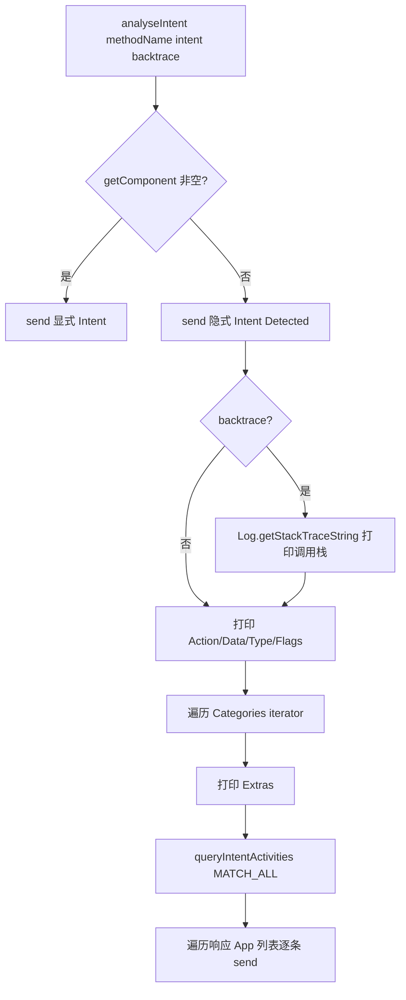

# Intent 分析工具 `agent/src/android/lib/intentUtils.ts`

为 Intent 监控提供单个导出函数 `analyseIntent`，在 Hook 到 Intent 分发时把 Intent 的类型（显式/隐式）、Action、Data、Type、Flags、Categories、Extras 以及隐式 Intent 的响应 App 列表通过 `send()` 打印出来。该模块不导出 RPC，被 `agent/src/android/intent.ts` 复用。

## 📋 模块概览

| 项目 | 值 |
| --- | --- |
| 源码路径 | `agent/src/android/lib/intentUtils.ts` |
| 平台 | Android（Java 层） |
| 导出的 RPC | 无（工具函数，供 `intent.ts` 内部调用） |
| 导出的函数 | `analyseIntent(methodName, intent, backtrace?)` |
| 依赖 | `./libjava.js`（仅用 `Java` 全局引用）、`../../lib/color.js` |

## 🎯 解决的问题

- 监控隐式 Intent 泄漏：隐式 Intent 可被其他 App 拦截，是 Android 安全审计的重点。
- 在 Hook 到 `startActivity` / `startService` 等方法时，需要把 Intent 的关键字段格式化输出，便于人工判断是否敏感。
- 对隐式 Intent 自动查询 `PackageManager.queryIntentActivities`，列出哪些 App 能响应，定位越权风险。

## 🏗️ 导出的函数

### `analyseIntent(methodName, intent, backtrace)` — 解析并打印 Intent

源码：`agent/src/android/lib/intentUtils.ts:4`

函数先用 `intent.getComponent()` 判断是否为显式 Intent：非空即显式，只打印一行类型；为空即隐式，进入详细打印分支。`backtrace=true` 时用 `android.util.Log.getStackTraceString(new Exception())` 取调用栈。

```ts
export const analyseIntent = (methodName: string, intent: any, backtrace: boolean = false): void => {
  const component = intent.getComponent();
  if (component) {
    send(`[-] ${c.green('Intent Type: Explicit Intent')}`);
  } else {
    send(`[+] ${c.redBright('Implicit Intent Detected!')}`);
    if (backtrace) {
      send(Java.use('android.util.Log').getStackTraceString(Java.use('java.lang.Exception').$new()));
    }
    send(`[+] Action: ${intent.getAction()}`);
    send(`[+] Data URI: ${intent.getDataString()}`);
    // Flags / Categories / Extras ...
  }
};
```

对隐式 Intent，函数依次打印：Action、Data URI、Type、Flags（十六进制）、Categories（遍历 `iterator()`）、Extras。随后取 `ActivityThread.currentApplication().getApplicationContext()` 拿 Context，调 `PackageManager.queryIntentActivities(intent, MATCH_ALL)` 列出所有能响应的 App：

```ts
const activityContext = Java.use("android.app.ActivityThread").currentApplication().getApplicationContext();
const packageManager = activityContext.getPackageManager();
const resolveInfoList = packageManager.queryIntentActivities(intent,
  Java.use("android.content.pm.PackageManager").MATCH_ALL.value);
for (let i = 0; i < resolveInfoList.size(); i++) {
  send(`[*] Resolve Info List at position ${i}: ${c.green(`${resolveInfoList.get(i).toString()}`)}`);
}
```

整个函数外层 `try/catch`，出错时 `send("[!] Error analyzing intent: " + e)` 而不抛出，避免把异常带到 Hook 上下文导致 App 崩溃。



## ⚙️ 实现要点

- **复用者**：`agent/src/android/intent.ts` 在 Hook 到 `Activity.startActivity` / `Context.startService` 等方法时调用 `analyseIntent`，把捕获的 Intent 实例传进来；RPC 层 `androidIntentAnalyze`（`agent/src/rpc/android.ts:75`）触发的是 `intent.analyzeImplicits(backtrace)`，后者内部批量 Hook 这些入口。
- **不抛异常**：全函数 `try/catch`，任何字段访问失败都只 `send` 错误信息，保证 Hook 链不中断。
- **颜色区分**：隐式 Intent 用 `redBright` 突出风险，显式与各字段用 `green`，便于在控制台快速扫读。
- **`Java.use` 在调用时取类**：`android.util.Log`、`java.lang.Exception`、`ActivityThread` 等都在函数体内 `Java.use`，依赖调用方已处于 `Java.perform` 上下文（Hook 实现天然满足）。
- **MATCH_ALL 常量**：用 `PackageManager.MATCH_ALL.value` 取整型常量传给 `queryIntentActivities`，确保列出全部匹配组件。

## 🔍 源码索引

| 符号 | 位置 |
| --- | --- |
| `export const analyseIntent` | `agent/src/android/lib/intentUtils.ts:4` |
| `getComponent()` 显式/隐式判断 | `agent/src/android/lib/intentUtils.ts:9` |
| backtrace 取栈 | `agent/src/android/lib/intentUtils.ts:14` |
| 打印 Action/Data/Type/Flags | `agent/src/android/lib/intentUtils.ts:22` |
| 遍历 Categories | `agent/src/android/lib/intentUtils.ts:28` |
| `queryIntentActivities(MATCH_ALL)` | `agent/src/android/lib/intentUtils.ts:51` |
| 遍历响应 App 列表 | `agent/src/android/lib/intentUtils.ts:54` |
| 顶层 `try/catch` | `agent/src/android/lib/intentUtils.ts:5` |

## 🔗 相关文档

- [Frida 与 Agent](/guide/frida-agent)
- [RPC 通信机制](/guide/rpc)
- [Agent：Intent 监控](/reference/agent/android/intent)
- [Android 命令：Intent](/reference/commands/android/intents)
- [libjava 工具模块](/reference/agent/android/lib/libjava)
