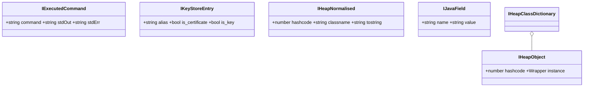

# 接口类型定义 `agent/src/android/lib/interfaces.ts`

集中定义 Android agent 各模块之间、以及 agent 与 Python 端之间通过 RPC 传递的数据结构（TypeScript `interface`）。本模块不含任何运行时逻辑，仅做类型契约，被 `shell.ts`、`keystore.ts`、`heap.ts`、`hooking.ts` 以及 RPC 聚合层 `agent/src/rpc/android.ts` 引用。

## 📋 模块概览

| 项目 | 值 |
| --- | --- |
| 源码路径 | `agent/src/android/lib/interfaces.ts` |
| 平台 | Android（仅类型，无运行时代码） |
| 导出的 RPC | 无 |
| 导出的接口 | `IAndroidFilesystem`、`IExecutedCommand`、`IKeyStoreEntry`、`ICurrentActivityFragment`、`IHeapClassDictionary`、`IHeapObject`、`IHeapNormalised`、`IJavaField`、`IKeyStoreDetail` |
| 依赖 | `frida-java-bridge`（仅类型 `JavaTypes`） |

## 🎯 解决的问题

- 让 `shell.ts` 返回的命令执行结果有统一形状（`command` / `stdOut` / `stdErr`），Python 端按字段名取值。
- 让 `keystore.ts` 的 key/alias 列表与详情、`heap.ts` 的活动实例与字段、`hooking.ts` 的当前 Activity/Fragment 都有明确契约。
- 在 RPC 聚合层 `agent/src/rpc/android.ts` 中作为参数/返回类型注解，提供编译期检查。

## 🏗️ 导出的接口

### 文件系统与命令执行

| 接口 | 字段 | 用途 |
| --- | --- | --- |
| `IAndroidFilesystem` | `files: any; path: string; readable: boolean; writable: boolean` | `filesystem.ts` 返回目录列举与可读写性 |
| `IExecutedCommand` | `command: string; stdOut: string; stdErr: string` | `shell.ts` 返回的命令结果，见 [`agent/src/android/lib/interfaces.ts:10`](https://github.com/android-security-engineer/objection-skills/blob/master/agent/src/android/lib/interfaces.ts#L10) |

### Keystore

| 接口 | 字段 | 用途 |
| --- | --- | --- |
| `IKeyStoreEntry` | `alias: string; is_certificate: boolean; is_key: boolean` | keystore 列表项，区分证书与密钥，见 [`agent/src/android/lib/interfaces.ts:16`](https://github.com/android-security-engineer/objection-skills/blob/master/agent/src/android/lib/interfaces.ts#L16) |
| `IKeyStoreDetail` | `keyAlgorithm?`、`keySize?`、`blockModes?`、`digests?`、`encryptionPaddings?`、`signaturePaddings?`、`purposes?`、`origin?`、`keystoreAlias?`、`isInsideSecureHardware?`、`isUserAuthenticationRequired?` 等大量可选字符串字段 | keystore 密钥详情，全部可选以应对不同 API level 与设备支持度，见 [`agent/src/android/lib/interfaces.ts:47`](https://github.com/android-security-engineer/objection-skills/blob/master/agent/src/android/lib/interfaces.ts#L47) |

`IKeyStoreDetail` 末尾标注了两个“crashy fields”——`isTrustedUserPresenceRequired` 与 `isUserConfirmationRequired`（[`agent/src/android/lib/interfaces.ts:67`](https://github.com/android-security-engineer/objection-skills/blob/master/agent/src/android/lib/interfaces.ts#L67)），部分设备上访问会抛异常，因此单列注释提醒。

### Heap

| 接口 | 字段 | 用途 |
| --- | --- | --- |
| `IHeapClassDictionary` | `[index: string]: IHeapObject[]` | 按类名分组的堆实例字典，见 [`agent/src/android/lib/interfaces.ts:27`](https://github.com/android-security-engineer/objection-skills/blob/master/agent/src/android/lib/interfaces.ts#L27) |
| `IHeapObject` | `hashcode: number; instance: JavaTypes.Wrapper` | 单个堆实例，`instance` 是 frida-java-bridge 的 `Wrapper`，见 [`agent/src/android/lib/interfaces.ts:31`](https://github.com/android-security-engineer/objection-skills/blob/master/agent/src/android/lib/interfaces.ts#L31) |
| `IHeapNormalised` | `hashcode: number; classname: string; tostring: string` | 规范化后的堆实例展示，不含 `Wrapper`，便于序列化回传 Python，见 [`agent/src/android/lib/interfaces.ts:36`](https://github.com/android-security-engineer/objection-skills/blob/master/agent/src/android/lib/interfaces.ts#L36) |

### Hooking 与字段

| 接口 | 字段 | 用途 |
| --- | --- | --- |
| `ICurrentActivityFragment` | `activivity: string | null; fragment: string | null` | 当前 Activity/Fragment 名（注意字段名 `activivity` 为源码原拼写），见 [`agent/src/android/lib/interfaces.ts:22`](https://github.com/android-security-engineer/objection-skills/blob/master/agent/src/android/lib/interfaces.ts#L22) |
| `IJavaField` | `name: string; value: string` | 堆实例字段名/值，见 [`agent/src/android/lib/interfaces.ts:42`](https://github.com/android-security-engineer/objection-skills/blob/master/agent/src/android/lib/interfaces.ts#L42) |

## ⚙️ 实现要点

- **纯类型模块**：文件只有 `import type` 与 `export interface`，编译后不产生运行时代码，对 agent 体积零影响。
- **`JavaTypes.Wrapper` 引用**：`IHeapObject.instance` 显式标注为 `frida-java-bridge` 的 `Wrapper` 类型，避免在序列化路径上误用——Python 端无法直接接收 `Wrapper`，因此 `IHeapNormalised` 把它拆成 `classname`/`tostring` 两个字符串再回传。
- **大量可选字段**：`IKeyStoreDetail` 几乎所有字段都标 `?`，因为 `KeyInfo` 的各属性在不同 Android 版本、不同硬件安全模块（HSM/TEE）上可用性不一，缺失字段不应当让整个 RPC 失败。
- **字段名拼写遗留**：`ICurrentActivityFragment.activivity` 是源码中的既有拼写（[`agent/src/android/lib/interfaces.ts:23`](https://github.com/android-security-engineer/objection-skills/blob/master/agent/src/android/lib/interfaces.ts#L23)），文档与下游代码需按此名访问，未做修正以免破坏契约。
- **复用者**：[`agent/src/rpc/android.ts:15-25`](https://github.com/android-security-engineer/objection-skills/blob/master/agent/src/rpc/android.ts#L15) 显式 `import` 了 `IHeapObject`、`IJavaField`、`IKeyStoreDetail`、`ICurrentActivityFragment`、`IExecutedCommand`、`IKeyStoreEntry` 作为 RPC 方法的参数/返回类型。

## 🔍 源码索引

| 符号 | 位置 |
| --- | --- |
| `IAndroidFilesystem` | [`agent/src/android/lib/interfaces.ts:3`](https://github.com/android-security-engineer/objection-skills/blob/master/agent/src/android/lib/interfaces.ts#L3) |
| `IExecutedCommand` | [`agent/src/android/lib/interfaces.ts:10`](https://github.com/android-security-engineer/objection-skills/blob/master/agent/src/android/lib/interfaces.ts#L10) |
| `IKeyStoreEntry` | [`agent/src/android/lib/interfaces.ts:16`](https://github.com/android-security-engineer/objection-skills/blob/master/agent/src/android/lib/interfaces.ts#L16) |
| `ICurrentActivityFragment` | [`agent/src/android/lib/interfaces.ts:22`](https://github.com/android-security-engineer/objection-skills/blob/master/agent/src/android/lib/interfaces.ts#L22) |
| `IHeapClassDictionary` | [`agent/src/android/lib/interfaces.ts:27`](https://github.com/android-security-engineer/objection-skills/blob/master/agent/src/android/lib/interfaces.ts#L27) |
| `IHeapObject` | [`agent/src/android/lib/interfaces.ts:31`](https://github.com/android-security-engineer/objection-skills/blob/master/agent/src/android/lib/interfaces.ts#L31) |
| `IHeapNormalised` | [`agent/src/android/lib/interfaces.ts:36`](https://github.com/android-security-engineer/objection-skills/blob/master/agent/src/android/lib/interfaces.ts#L36) |
| `IJavaField` | [`agent/src/android/lib/interfaces.ts:42`](https://github.com/android-security-engineer/objection-skills/blob/master/agent/src/android/lib/interfaces.ts#L42) |
| `IKeyStoreDetail` | [`agent/src/android/lib/interfaces.ts:47`](https://github.com/android-security-engineer/objection-skills/blob/master/agent/src/android/lib/interfaces.ts#L47) |
| “crashy fields” 注释 | [`agent/src/android/lib/interfaces.ts:66`](https://github.com/android-security-engineer/objection-skills/blob/master/agent/src/android/lib/interfaces.ts#L66) |

## 🔗 相关文档

- [Frida 与 Agent](/guide/frida-agent)
- [RPC 通信机制](/guide/rpc)
- [Agent：Shell 命令执行](/reference/agent/android/shell)
- [Agent：Keystore](/reference/agent/android/keystore)
- [Agent：Heap](/reference/agent/android/heap)
- [types 类型别名](/reference/agent/android/lib/types)
