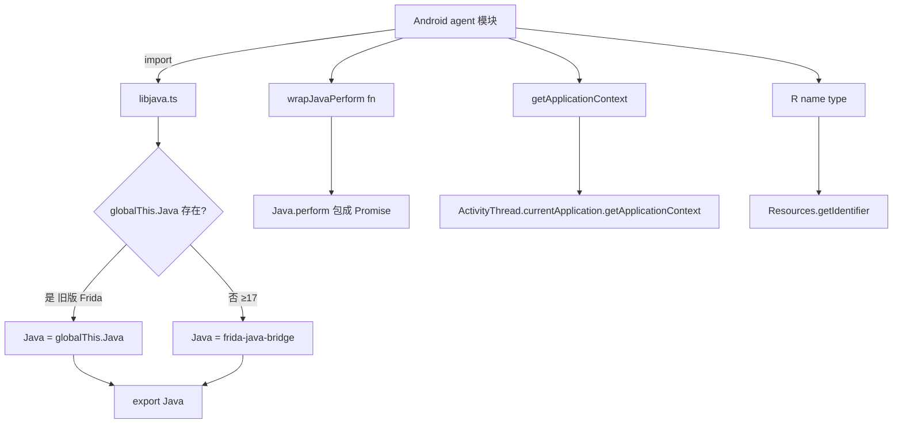

# Java 桥接工具 `agent/src/android/lib/libjava.ts`

封装 Frida Java 桥接的初始化与若干通用 helper：在兼容 Frida <17 与 ≥17 两种环境下正确取得 `Java` 对象、把 `Java.perform` 包成 Promise、提供 `getApplicationContext()` 与 `R(name, type)` 资源 ID 查询。本模块不导出 RPC，是几乎所有 Android agent 模块的基础依赖。

## 📋 模块概览

| 项目 | 值 |
| --- | --- |
| 源码路径 | `agent/src/android/lib/libjava.ts` |
| 平台 | Android（Java 层） |
| 导出的 RPC | 无 |
| 导出的符号 | `Java`（重新导出的运行时对象）、`wrapJavaPerform(fn)`、`getApplicationContext()`、`R(name, type)` |
| 依赖 | `frida-java-bridge`、`../../lib/color.js` |

## 🎯 解决的问题

- Frida 17 起 `Java` 不再挂在 `globalThis`，需要从 `frida-java-bridge` 包显式导入；而旧版 Frida 仍需用 `globalThis.Java`，两者初始化方式不同，需要统一封装。
- 所有 Java 调用必须包在 `Java.perform()` 内，且 RPC 方法需返回 Promise；每个模块各写一遍样板很啰嗦，抽成 `wrapJavaPerform`。
- 多处需要当前 App 的 `Context`（拿 `PackageManager`、资源、包名等），或需要把 `R.id.xxx` 形式的资源引用转成数字 ID，需要统一入口。

## 🏗️ 导出的符号

### `Java` — 兼容性桥接对象

源码：[`agent/src/android/lib/libjava.ts:4`](https://github.com/android-security-engineer/objection-skills/blob/master/agent/src/android/lib/libjava.ts#L4)

模块加载时判断 `globalThis.Java` 是否存在：存在则用旧桥接（并 `send` 一条提示），否则用从 `frida-java-bridge` 导入的默认导出。随后 `export { Java }` 供其它模块 `import { Java } from "./lib/libjava.js"` 使用。

```ts
let Java: typeof Java_bridge;
if (globalThis.Java) {
  send(c.blackBright("Pre-v17 version of Frida detected. Attempting to use old bridge interface."))
  Java = globalThis.Java
} else {
  Java = Java_bridge
}
export { Java }
```

### `wrapJavaPerform(fn)` — Promise 化的 Java.perform

源码：[`agent/src/android/lib/libjava.ts:19`](https://github.com/android-security-engineer/objection-skills/blob/master/agent/src/android/lib/libjava.ts#L19)

把传入的回调放进 `Java.perform`，成功 `resolve`、异常 `reject`。所有 RPC 导出方法（`proxy.set`、`shell.execute`、`root.disable` 等）都通过它把同步的 Java 操作包成 Promise，由 RPC 层 `await`。

```ts
export const wrapJavaPerform = (fn: any): Promise<any> => {
  return new Promise((resolve, reject) => {
    Java.perform(() => {
      try { resolve(fn()); } catch (e) { reject(e); }
    });
  });
};
```

### `getApplicationContext()` — 取当前 App Context

源码：[`agent/src/android/lib/libjava.ts:31`](https://github.com/android-security-engineer/objection-skills/blob/master/agent/src/android/lib/libjava.ts#L31)

通过 `android.app.ActivityThread.currentApplication().getApplicationContext()` 取 Context。调用方需已处于 `Java.perform` 上下文（通常在 `wrapJavaPerform` 回调内）。`intentUtils.ts` 等处直接 `Java.use("android.app.ActivityThread")` 取 Context，本质与此一致。

```ts
export const getApplicationContext = (): any => {
  const ActivityThread = Java.use("android.app.ActivityThread");
  const currentApplication = ActivityThread.currentApplication();
  return currentApplication.getApplicationContext();
};
```

### `R(name, type)` — 资源 ID 查询

源码：[`agent/src/android/lib/libjava.ts:44`](https://github.com/android-security-engineer/objection-skills/blob/master/agent/src/android/lib/libjava.ts#L44)

模拟 App 内 `R.id.content_frame` 这类引用：通过 `Context.getResources().getIdentifier(name, type, packageName)` 把资源名+类型转成数字 ID。典型用法 `R("content_frame", "id")`。

```ts
export const R = (name: string, type: string): any => {
  const context = getApplicationContext();
  return context.getResources().getIdentifier(name, type, context.getPackageName());
};
```



## ⚙️ 实现要点

- **版本探测只做一次**：`Java` 的选择在模块加载时即确定，后续调用零开销；旧版会 `send` 一条 `blackBright` 提示，便于排查环境。
- **复用面广**：`pinning.ts`、`proxy.ts`、`root.ts`、`shell.ts`、`userinterface.ts`、`intentUtils.ts` 等几乎全部 Android 模块都 `import { wrapJavaPerform, Java } from "./lib/libjava.js"`。
- **Promise 桥接**：`wrapJavaPerform` 的 `reject` 会让 RPC 层 `await` 抛错，Python 端 `agent.py` 能捕获并打印——这是 agent 错误回传的主路径之一。
- **`R()` 的局限**：只能查当前 App 自己包名下的资源；查其它包资源需先 `createPackageContext`，本 helper 不支持。
- **不注册 Job、不导出 RPC**：纯基础设施，所有功能通过被其它模块调用间接生效。

## 🔍 源码索引

| 符号 | 位置 |
| --- | --- |
| `Java` 兼容性判断 | [`agent/src/android/lib/libjava.ts:4`](https://github.com/android-security-engineer/objection-skills/blob/master/agent/src/android/lib/libjava.ts#L4) |
| 旧版 Frida 提示 | [`agent/src/android/lib/libjava.ts:7`](https://github.com/android-security-engineer/objection-skills/blob/master/agent/src/android/lib/libjava.ts#L7) |
| `export { Java }` | [`agent/src/android/lib/libjava.ts:13`](https://github.com/android-security-engineer/objection-skills/blob/master/agent/src/android/lib/libjava.ts#L13) |
| `wrapJavaPerform` | [`agent/src/android/lib/libjava.ts:19`](https://github.com/android-security-engineer/objection-skills/blob/master/agent/src/android/lib/libjava.ts#L19) |
| `getApplicationContext` | [`agent/src/android/lib/libjava.ts:31`](https://github.com/android-security-engineer/objection-skills/blob/master/agent/src/android/lib/libjava.ts#L31) |
| `R(name, type)` | [`agent/src/android/lib/libjava.ts:44`](https://github.com/android-security-engineer/objection-skills/blob/master/agent/src/android/lib/libjava.ts#L44) |

## 🔗 相关文档

- [Frida 与 Agent](/guide/frida-agent)
- [RPC 通信机制](/guide/rpc)
- [Agent：SSL Pinning 绕过](/reference/agent/android/pinning)
- [Agent：Shell 命令执行](/reference/agent/android/shell)
- [types 类型别名](/reference/agent/android/lib/types)
- [interfaces 接口定义](/reference/agent/android/lib/interfaces)
