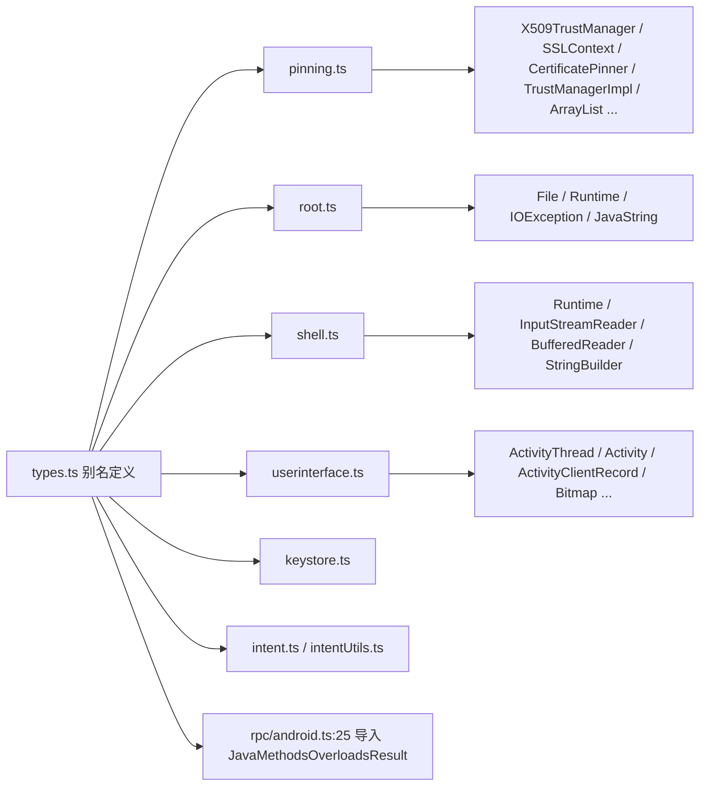

# Java 类类型别名 `agent/src/android/lib/types.ts`

为 agent 各模块通过 `Java.use(...)` 拿到的 Java 类句柄定义统一的 TypeScript 类型别名，避免到处写 `any` 散落。本模块不含运行时逻辑，仅做类型标注，被 `pinning.ts`、`root.ts`、`shell.ts`、`userinterface.ts` 等模块 `import` 后用作变量类型注解。

## 📋 模块概览

| 项目 | 值 |
| --- | --- |
| 源码路径 | `agent/src/android/lib/types.ts` |
| 平台 | Android（仅类型，无运行时代码） |
| 导出的 RPC | 无 |
| 导出的别名 | `JavaClass`、`JavaMethodsOverloadsResult`、以及 29 个具体 Java 类的别名（`File`、`Runtime`、`Intent`、`KeyStore`、`SSLContext`、`CertificatePinner` 等）+ `FridaOverload` |
| 依赖 | 无 |

## 🎯 解决的问题

- `Java.use("java.lang.Runtime")` 返回的对象结构复杂，业务代码只需把它当“Java 类句柄”用，统一别名为 `JavaClass` 后可读性更好。
- 在 `pinning.ts`、`root.ts` 中声明局部变量时给出具体类型名（如 `TrustManagerImpl`、`RootBeer`），让 IDE 跳转与文档自解释更清晰。
- 单点维护“哪些 Java 类被 agent 使用”的清单，新增模块时按需在此追加别名。

## 🏗️ 导出的类型

### 基础别名

| 别名 | 定义 | 位置 |
| --- | --- | --- |
| `JavaClass` | `any` | `agent/src/android/lib/types.ts:1` |
| `JavaMethodsOverloadsResult` | `any` | `agent/src/android/lib/types.ts:3` |
| `FridaOverload` | `{ implementation: (...args: any[]) => any; apply: (thisArg: any, args: any[]) => any }` | `agent/src/android/lib/types.ts:34` |

`FridaOverload` 描述了 `Java.use(...).<method>.overload(...)` 返回的重载对象上可用的两个成员：`implementation`（赋值即替换实现）与 `apply`（以指定 this 调用原实现）。

### 具体 Java 类别名

以下别名均定义为 `JavaClass | any`，对应各模块 `Java.use(...)` 的目标类：

| 别名 | 对应 Java 类 | 主要使用方 |
| --- | --- | --- |
| `ClipboardManager` | `android.content.ClipboardManager` | clipboard.ts |
| `File` | `java.io.File` | root.ts（`fileExistsCheck`）、filesystem.ts |
| `Throwable` | `java.lang.Throwable` | 通用 |
| `PackageManager` | `android.content.pm.PackageManager` | hooking.ts、intentUtils.ts |
| `ArrayMap` | `android.util.ArrayMap` | 通用 |
| `ActivityThread` | `android.app.ActivityThread` | userinterface.ts、intentUtils.ts |
| `Intent` | `android.content.Intent` | intent.ts、intentUtils.ts |
| `KeyStore` | `java.security.KeyStore` | keystore.ts |
| `KeyFactory` | `java.security.KeyFactory` | keystore.ts |
| `KeyInfo` | `android.security.keystore.KeyInfo` | keystore.ts |
| `SecretKeyFactory` | `javax.crypto.SecretKeyFactory` | keystore.ts |
| `X509TrustManager` | `javax.net.ssl.X509TrustManager` | pinning.ts |
| `SSLContext` | `javax.net.ssl.SSLContext` | pinning.ts |
| `CertificatePinner` | `okhttp3.CertificatePinner` | pinning.ts |
| `PinningTrustManager` | `appcelerator.https.PinningTrustManager` | pinning.ts |
| `SSLCertificateChecker` | `nl.xservices.plugins.SSLCertificateChecker` | pinning.ts |
| `TrustManagerImpl` | `com.android.org.conscrypt.TrustManagerImpl` | pinning.ts |
| `ArrayList` | `java.util.ArrayList` | pinning.ts |
| `JavaString` | `java.lang.String` | root.ts（`testKeysCheck`） |
| `Runtime` | `java.lang.Runtime` | root.ts（`execSuCheck`）、shell.ts |
| `IOException` | `java.io.IOException` | root.ts |
| `InputStreamReader` | `java.io.InputStreamReader` | shell.ts |
| `BufferedReader` | `java.io.BufferedReader` | shell.ts |
| `StringBuilder` | `java.lang.StringBuilder` | shell.ts |
| `Activity` | `android.app.Activity` | userinterface.ts |
| `ActivityClientRecord` | `android.app.ActivityThread$ActivityClientRecord` | userinterface.ts |
| `Bitmap` | `android.graphics.Bitmap` | userinterface.ts |
| `ByteArrayOutputStream` | `java.io.ByteArrayOutputStream` | userinterface.ts |
| `CompressFormat` | `android.graphics.Bitmap$CompressFormat` | userinterface.ts |

## ⚙️ 实现要点

- **纯类型、零运行时**：文件全是 `export type`，编译后不产生代码，对 agent 体积无影响。
- **`JavaClass | any` 的双保险**：`JavaClass` 本就是 `any`，再 `| any` 看似冗余，但语义上表明“这是一个 Java 类句柄，可能是任何具体类”，便于阅读。
- **`FridaOverload` 仅标注关键成员**：只列 `implementation` 与 `apply` 两个最常用成员，其余成员（`overload`、`call` 等）隐式落到 `any`，不阻碍使用。
- **与 `interfaces.ts` 互补**：`interfaces.ts` 描述跨 RPC 传递的数据结构（POJO 形状），`types.ts` 描述 Java 类句柄与 Frida 内部对象，两者共同构成 agent 的类型契约层。
- **复用者**：`agent/src/rpc/android.ts:25` 显式 `import { JavaMethodsOverloadsResult }`，作为 `androidHookingGetClassMethodsOverloads` 的返回类型。

## 🔍 源码索引

| 符号 | 位置 |
| --- | --- |
| `JavaClass` | `agent/src/android/lib/types.ts:1` |
| `JavaMethodsOverloadsResult` | `agent/src/android/lib/types.ts:3` |
| `ClipboardManager` | `agent/src/android/lib/types.ts:5` |
| `File` | `agent/src/android/lib/types.ts:6` |
| `Throwable` | `agent/src/android/lib/types.ts:7` |
| `PackageManager` | `agent/src/android/lib/types.ts:8` |
| `ArrayMap` | `agent/src/android/lib/types.ts:9` |
| `ActivityThread` | `agent/src/android/lib/types.ts:10` |
| `Intent` | `agent/src/android/lib/types.ts:11` |
| `KeyStore` / `KeyFactory` / `KeyInfo` / `SecretKeyFactory` | `agent/src/android/lib/types.ts:12-15` |
| `X509TrustManager` / `SSLContext` / `CertificatePinner` / `PinningTrustManager` / `SSLCertificateChecker` / `TrustManagerImpl` / `ArrayList` | `agent/src/android/lib/types.ts:16-22` |
| `JavaString` | `agent/src/android/lib/types.ts:23` |
| `Runtime` / `IOException` / `InputStreamReader` / `BufferedReader` / `StringBuilder` | `agent/src/android/lib/types.ts:24-28` |
| `Activity` / `ActivityClientRecord` / `Bitmap` / `ByteArrayOutputStream` / `CompressFormat` | `agent/src/android/lib/types.ts:29-33` |
| `FridaOverload` | `agent/src/android/lib/types.ts:34` |

## 🔗 相关文档

- [Frida 与 Agent](/guide/frida-agent)
- [RPC 通信机制](/guide/rpc)
- [libjava 工具模块](/reference/agent/android/lib/libjava)
- [interfaces 接口定义](/reference/agent/android/lib/interfaces)
- [Agent：SSL Pinning 绕过](/reference/agent/android/pinning)
