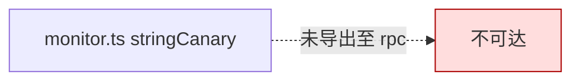

# 监控桩 <code>agent/src/android/monitor.ts</code>

`monitor.ts` 是一个**未实现**的占位模块，仅声明了 `monitor.stringCanary(can)` 函数但函数体为空。当前没有任何 RPC 引用它，属于待开发/废弃代码。

## 📋 模块概览
| 项目 | 值 |
| --- | --- |
| 文件路径 | `agent/src/android/monitor.ts` |
| 平台 | Android |
| 导出 RPC | 无（未被 `rpc/android.ts` 引用） |
| 依赖 | `android/lib/libjava.ts` |

## 🎯 解决的问题
- 预留"字符串金丝雀监控"接口，预期用途是 Hook 某字符串的引用计数变化，但**尚未实现**。

## 🏗️ 导出的方法
| 符号 | 说明 |
| --- | --- |
| `monitor.stringCanary(can)` | 空实现，仅 `wrapJavaPerform(() => {})` |

## ⚙️ 实现要点

```ts
// agent/src/android/monitor.ts:3-9
export namespace monitor {
  export const stringCanary = (can: string): Promise<void> => {
    return wrapJavaPerform(() => {

    });
  };
}
```

- 用 `namespace monitor` 包裹，与 iOS 侧 `ios/crypto.ts` 的 `monitor()` 函数风格不同。
- 函数体只有空的 `wrapJavaPerform`，没有任何 Hook 逻辑。
- 未出现在 `rpc/android.ts` 的导入或 `android` 对象里，因此**Python 侧无法调用**。

## 📐 当前状态



## 🔍 源码索引
| 符号 | 位置 |
| --- | --- |
| `namespace monitor` | `agent/src/android/monitor.ts:3` |
| `stringCanary` | `agent/src/android/monitor.ts:4` |

## 🔗 相关文档
- [Frida 与 Agent](/guide/frida-agent)
- [`monitor.md`](/reference/agent/ios/crypto) （iOS 侧 `crypto.ts` 的 monitor 实现可用）
