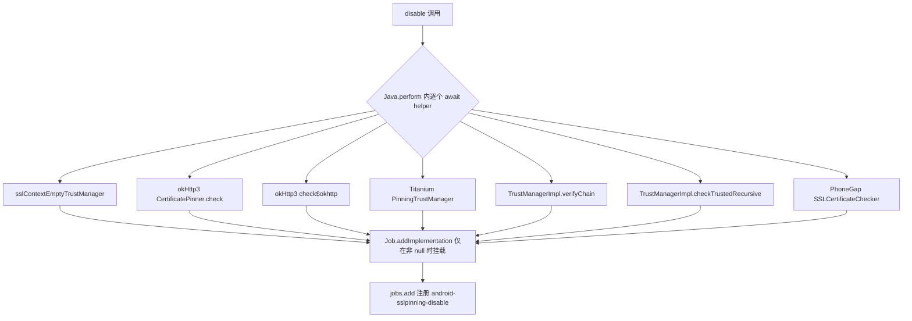

# SSL Pinning 绕过 `agent/src/android/pinning.ts`

在目标 Android 进程内拦截并替换各类 SSL/TLS 证书校验逻辑，使应用不再因证书锁定（SSL Pinning）而拒绝抓包或自签证书。模块以 Frida 注入方式运行于 Java 层，导出一个 `disable()` RPC，把 7 条互相独立的绕过实现注册为一个名为 `android-sslpinning-disable` 的 Job。

## 📋 模块概览

| 项目 | 值 |
| --- | --- |
| 源码路径 | `agent/src/android/pinning.ts` |
| 平台 | Android（Java 层） |
| 导出的 RPC | `disable`（经 [`agent/src/rpc/android.ts:84`](https://github.com/android-security-engineer/objection-skills/blob/master/agent/src/rpc/android.ts#L84) 暴露为 `androidSslPinningDisable`） |
| 依赖 | `../lib/jobs.js`、`../lib/color.js`、`../lib/helpers.js`、`./lib/libjava.js`、`./lib/types.js` |

## 🎯 解决的问题

- OkHttp3 的 `CertificatePinner.check()` / `check$okhttp()` 抛出证书不匹配异常，导致 HTTPS 流量无法被中间人代理捕获。
- Android 7+ 的网络安全配置（Network Security Configuration）通过 `com.android.org.conscrypt.TrustManagerImpl` 强制校验证书链，覆盖用户自签 CA。
- Appcelerator Titanium、PhoneGap/Cordova 等混合开发框架自带独立的 Pinning 逻辑，需逐一定位。
- 应用对 `SSLContext.init()` 传入的自定义 TrustManager 进行二次封装，需在初始化入口替换为“空校验” TrustManager。

## 🏗️ 导出的 RPC 方法

| RPC 名 | 说明 |
| --- | --- |
| `disable(quiet: boolean)` | 注册全部 7 条绕过实现为一个 Job 并加入调度；`quiet=true` 时抑制每次调用的 `send()` 提示 |

### `rpc.disable` — 注册全部 Pinning 绕过

源码：[`agent/src/android/pinning.ts:374`](https://github.com/android-security-engineer/objection-skills/blob/master/agent/src/android/pinning.ts#L374)

`disable()` 先把模块级 `quiet` 标志置位，然后创建 Job 并依次 `await` 每个 helper（每个 helper 在 `Java.perform` 内尝试 `Java.use` 目标类并替换方法实现，类不存在时返回 `null`）。`Job.addImplementation` 只在返回非 `null` 时才把实现挂进 Job，因此即便目标 App 没有引入 OkHttp 或 RootBeer 也不会让整个 Job 失败。

```ts
export const disable = async (q: boolean): Promise<void> => {
  if (q) { send(c.yellow(`Quiet mode enabled. Not reporting invocations.`)); quiet = true; }
  const job: jobs.Job = new jobs.Job(jobs.identifier(), "android-sslpinning-disable");
  job.addImplementation(await sslContextEmptyTrustManager(job.identifier));
  job.addImplementation(await okHttp3CertificatePinnerCheck(job.identifier));
  job.addImplementation(await okHttp3CertificatePinnerCheckOkHttp(job.identifier));
  job.addImplementation(await appceleratorTitaniumPinningTrustManager(job.identifier));
  job.addImplementation(await trustManagerImplVerifyChainCheck(job.identifier));
  job.addImplementation(await trustManagerImplCheckTrustedRecursiveCheck(job.identifier));
  job.addImplementation(await phoneGapSSLCertificateChecker(job.identifier));
  jobs.add(job);
};
```

7 条 helper 的职责与目标类：

| helper 函数 | 目标类/方法 | 行为 |
| --- | --- | --- |
| `sslContextEmptyTrustManager` | `javax.net.ssl.SSLContext.init()` | 用 `Java.registerClass` 动态实现一个“空校验” `X509TrustManager`，在 init 调用时替换原 TrustManager 数组 |
| `okHttp3CertificatePinnerCheck` | `okhttp3.CertificatePinner.check(String, List)` | 替换实现为空函数，吞掉校验异常 |
| `okHttp3CertificatePinnerCheckOkHttp` | `okhttp3.CertificatePinner.check$okhttp` | 处理 OkHttp 内部混淆后的方法名 |
| `appceleratorTitaniumPinningTrustManager` | `appcelerator.https.PinningTrustManager.checkServerTrusted` | Titanium 框架的 pinning 入口 |
| `trustManagerImplVerifyChainCheck` | `com.android.org.conscrypt.TrustManagerImpl.verifyChain` | Android 7+ 网络安全配置的核心校验，直接返回原 `untrustedChain` |
| `trustManagerImplCheckTrustedRecursiveCheck` | `com.android.org.conscrypt.TrustManagerImpl.checkTrustedRecursive` | 同上的递归校验分支，返回空 `ArrayList` |
| `phoneGapSSLCertificateChecker` | `nl.xservices.plugins.SSLCertificateChecker.execute` | PhoneGap 插件，调用 `callBackContext.success("CONNECTION_SECURE")` 并返回 `true` |

### `sslContextEmptyTrustManager` — 动态注册空 TrustManager

源码：[`agent/src/android/pinning.ts:22`](https://github.com/android-security-engineer/objection-skills/blob/master/agent/src/android/pinning.ts#L22)

这是覆盖面最广的一条：不依赖具体框架，而是在 `SSLContext.init()` 被调用时把传入的 TrustManager 数组整体替换为自实现的“全部信任” TrustManager。它还顺手改写 `Java.classFactory.tempFileNaming.prefix`，把默认的 `frida` 改成 `onetwothree`，以规避扫描 `/proc/<pid>/maps` 的反 Frida 检测。

```ts
if (Java.classFactory.tempFileNaming.prefix == 'frida') {
  Java.classFactory.tempFileNaming.prefix = 'onetwothree';
}
const TrustManager: X509TrustManager = Java.registerClass({
  implements: [x509TrustManager],
  methods: {
    checkClientTrusted(chain, authType) { },
    checkServerTrusted(chain, authType) { },
    getAcceptedIssuers() { return []; },
  },
  name: "com.sensepost.test.TrustManager",
});
const SSLContextInit = sSLContext.init.overload(
  "[Ljavax.net.ssl.KeyManager;", "[Ljavax.net.ssl.TrustManager;", "java.security.SecureRandom");
SSLContextInit.implementation = function (keyManager, trustManager, secureRandom) {
  SSLContextInit.call(this, keyManager, TrustManagers, secureRandom);
};
```



## ⚙️ 实现要点

- **类不存在即跳过**：每个 helper 用 `try/catch` 包裹 `Java.use`，捕获到 `java.lang.ClassNotFoundException` 时返回 `null`，配合 `Job.addImplementation` 的非空判断做到“按需挂载”。
- **`qsend(quiet, ...)`**：`quiet` 模式下不输出每次调用的提示，避免高频 HTTPS 请求刷屏；`qsend` 来自 `../lib/helpers.js`。
- **anti-Frida 规避**：`sslContextEmptyTrustManager` 改写 `tempFileNaming.prefix`，源自对 frida-java-bridge `class-factory.js` 的已知行为注释（源码 [`agent/src/android/pinning.ts:44`](https://github.com/android-security-engineer/objection-skills/blob/master/agent/src/android/pinning.ts#L44)）。
- **异步消息**：所有提示走 `send()`，由 Python 端 `agent.py` 接收并打印，Hook 本身不阻塞目标线程。
- **Android 7+ 双保险**：同时 Hook `verifyChain` 与 `checkTrustedRecursive`，覆盖 conscrypt 不同版本的校验路径。

## 🔍 源码索引

| 符号 | 位置 |
| --- | --- |
| `quiet` 模块标志 | [`agent/src/android/pinning.ts:20`](https://github.com/android-security-engineer/objection-skills/blob/master/agent/src/android/pinning.ts#L20) |
| `sslContextEmptyTrustManager` | [`agent/src/android/pinning.ts:22`](https://github.com/android-security-engineer/objection-skills/blob/master/agent/src/android/pinning.ts#L22) |
| 改写 `tempFileNaming.prefix` | [`agent/src/android/pinning.ts:45`](https://github.com/android-security-engineer/objection-skills/blob/master/agent/src/android/pinning.ts#L45) |
| `Java.registerClass` 注册空 TrustManager | [`agent/src/android/pinning.ts:51`](https://github.com/android-security-engineer/objection-skills/blob/master/agent/src/android/pinning.ts#L51) |
| `SSLContextInit.implementation` 替换 | [`agent/src/android/pinning.ts:74`](https://github.com/android-security-engineer/objection-skills/blob/master/agent/src/android/pinning.ts#L74) |
| `okHttp3CertificatePinnerCheck` | [`agent/src/android/pinning.ts:88`](https://github.com/android-security-engineer/objection-skills/blob/master/agent/src/android/pinning.ts#L88) |
| `okHttp3CertificatePinnerCheckOkHttp` | [`agent/src/android/pinning.ts:138`](https://github.com/android-security-engineer/objection-skills/blob/master/agent/src/android/pinning.ts#L138) |
| `appceleratorTitaniumPinningTrustManager` | [`agent/src/android/pinning.ts:194`](https://github.com/android-security-engineer/objection-skills/blob/master/agent/src/android/pinning.ts#L194) |
| `trustManagerImplVerifyChainCheck` | [`agent/src/android/pinning.ts:240`](https://github.com/android-security-engineer/objection-skills/blob/master/agent/src/android/pinning.ts#L240) |
| `trustManagerImplCheckTrustedRecursiveCheck` | [`agent/src/android/pinning.ts:288`](https://github.com/android-security-engineer/objection-skills/blob/master/agent/src/android/pinning.ts#L288) |
| `phoneGapSSLCertificateChecker` | [`agent/src/android/pinning.ts:332`](https://github.com/android-security-engineer/objection-skills/blob/master/agent/src/android/pinning.ts#L332) |
| `export const disable` | [`agent/src/android/pinning.ts:374`](https://github.com/android-security-engineer/objection-skills/blob/master/agent/src/android/pinning.ts#L374) |

## 🔗 相关文档

- [Frida 与 Agent](/guide/frida-agent)
- [RPC 通信机制](/guide/rpc)
- [Android 命令：SSL Pinning 绕过](/reference/commands/android/pinning)
- [Agent Job 调度](/reference/agent/lib/jobs)
