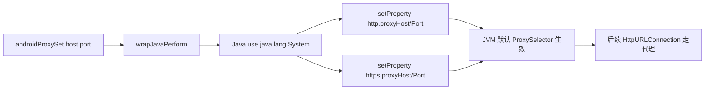

# 代理设置 `agent/src/android/proxy.ts`

在目标 Android 进程内通过 `java.lang.System.setProperty()` 修改 JVM 的 HTTP/HTTPS 代理属性，使应用自身发起的 HTTP/HTTPS 流量走指定代理。模块仅导出一个 `set(host, port)` RPC，不涉及系统级 VPN 或 iptables，仅作用于 JVM 层。

## 📋 模块概览

| 项目 | 值 |
| --- | --- |
| 源码路径 | `agent/src/android/proxy.ts` |
| 平台 | Android（Java 层） |
| 导出的 RPC | `set`（经 [`agent/src/rpc/android.ts:87`](https://github.com/android-security-engineer/objection-skills/blob/master/agent/src/rpc/android.ts#L87) 暴露为 `androidProxySet`） |
| 依赖 | `./lib/libjava.js`、`../lib/color.js` |

## 🎯 解决的问题

- 应用使用 `HttpURLConnection` / `URL.openConnection()` 这类基于 JVM 默认 `ProxySelector` 的 HTTP 客户端，无法直接被系统代理（如 Wi-Fi 代理）覆盖时，需在进程内强制设值。
- 抓包时希望让目标 App 的流量稳定走 Burp/mitmproxy，而不依赖设备全局代理设置。
- 仅需临时、进程内生效的代理，不想改设备配置或重启 App。

## 🏗️ 导出的 RPC 方法

| RPC 名 | 说明 |
| --- | --- |
| `set(host: string, port: string)` | 在 `Java.perform` 内对 `java.lang.System` 写入 4 个代理属性 |

### `rpc.set` — 写入 JVM 代理属性

源码：[`agent/src/android/proxy.ts:7`](https://github.com/android-security-engineer/objection-skills/blob/master/agent/src/android/proxy.ts#L7)

实现极简：拿到 `java.lang.System` 类后，依次调用 `setProperty` 写入 `http.proxyHost/Port` 与 `https.proxyHost/Port`。`System` 未定义时直接跳过，不抛错。由于属性是进程级全局，设置后所有新建的基于默认 `ProxySelector` 的连接都会受影响。

```ts
export const set = (host: string, port: string): Promise<void> => {
  return wrapJavaPerform(() => {
    var System = Java.use("java.lang.System");
    if (System != undefined) {
      System.setProperty("http.proxyHost", host);
      System.setProperty("http.proxyPort", port);
      System.setProperty("https.proxyHost", host);
      System.setProperty("https.proxyPort", port);
    }
  });
};
```

注意 `port` 形参类型为 `string`：`setProperty` 接收字符串，传数字会被 Frida 转成字符串，这里直接以字符串约定避免歧义。



## ⚙️ 实现要点

- **作用范围有限**：仅影响走 JVM 默认 `ProxySelector` 的客户端（`HttpURLConnection`、OkHttp 默认配置等）。自行实现 socket 连接或显式 `Proxy.NO_PROXY` 的客户端不受影响，需配合 SSL Pinning 绕过与抓包工具共同使用。
- **一次性写入**：属性写入后持续生效直到进程退出；模块未提供“取消” RPC，恢复需重启进程。
- **`send()` 反馈**：写入前后各发一条带颜色的提示，便于在 objection 控制台确认。
- **无 Hook、不替换方法**：与 pinning/root 模块不同，这里是直接调用目标类方法而非替换实现，因此不注册 Job。

## 🔍 源码索引

| 符号 | 位置 |
| --- | --- |
| `export const set` | [`agent/src/android/proxy.ts:7`](https://github.com/android-security-engineer/objection-skills/blob/master/agent/src/android/proxy.ts#L7) |
| `Java.use("java.lang.System")` | [`agent/src/android/proxy.ts:12`](https://github.com/android-security-engineer/objection-skills/blob/master/agent/src/android/proxy.ts#L12) |
| 写入 `http.proxyHost/Port` | [`agent/src/android/proxy.ts:16`](https://github.com/android-security-engineer/objection-skills/blob/master/agent/src/android/proxy.ts#L16) |
| 写入 `https.proxyHost/Port` | [`agent/src/android/proxy.ts:19`](https://github.com/android-security-engineer/objection-skills/blob/master/agent/src/android/proxy.ts#L19) |

## 🔗 相关文档

- [Frida 与 Agent](/guide/frida-agent)
- [RPC 通信机制](/guide/rpc)
- [Android 命令：代理设置](/reference/commands/android/proxy)
- [SSL Pinning 绕过](/reference/agent/android/pinning)
