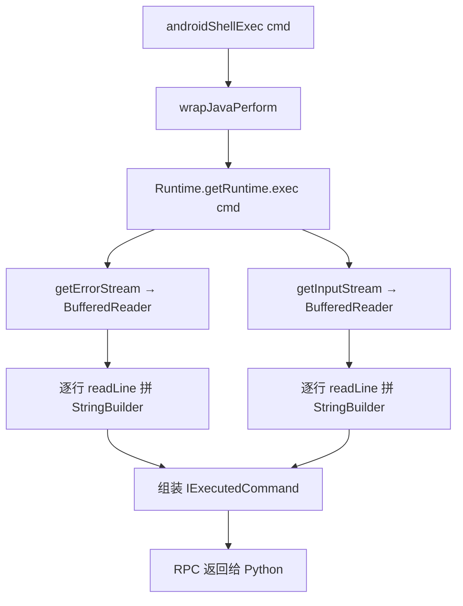

# Shell 命令执行 `agent/src/android/shell.ts`

在目标 Android 进程内通过 `java.lang.Runtime.getRuntime().exec()` 执行 shell 命令，并把 stdout/stderr 读回为字符串返回。模块导出单个 `execute(cmd)` RPC，不依赖系统 `su`，以目标 App 的权限运行命令。

## 📋 模块概览

| 项目 | 值 |
| --- | --- |
| 源码路径 | `agent/src/android/shell.ts` |
| 平台 | Android（Java 层） |
| 导出的 RPC | `execute`（经 `agent/src/rpc/android.ts:35` 暴露为 `androidShellExec`） |
| 依赖 | `./lib/interfaces.js`、`./lib/libjava.js`、`./lib/types.js` |
| 返回类型 | `IExecutedCommand`（`command` / `stdOut` / `stdErr`） |

## 🎯 解决的问题

- 需要以目标 App 的 UID/权限执行命令（如 `ls`、`id`、`cat` 某个私有目录文件），而不通过 `adb shell` 或 `su`。
- 在没有 root 的设备上探测 App 私有目录、运行时环境变量、`/proc/self` 信息。
- 把命令的 stdout 与 stderr 分别捕获，便于区分正常输出与错误信息。

## 🏗️ 导出的 RPC 方法

| RPC 名 | 说明 |
| --- | --- |
| `execute(cmd: string)` | 在 `Java.perform` 内 `Runtime.exec(cmd)`，分别读取 stderr 与 stdout，返回 `IExecutedCommand` |

### `rpc.execute` — 执行并捕获输出

源码：`agent/src/android/shell.ts:15`

实现用 `Runtime.getRuntime().exec(cmd)` 拿到 `Process` 对象，再用 `InputStreamReader` + `BufferedReader` 逐行读取两个流，拼进 `StringBuilder`。先读 stderr 再读 stdout，最后组装成 `IExecutedCommand` 返回。

```ts
export const execute = (cmd: string): Promise<IExecutedCommand> => {
  return wrapJavaPerform(() => {
    const runtime: Runtime = Java.use("java.lang.Runtime");
    const inputStreamReader: InputStreamReader = Java.use("java.io.InputStreamReader");
    const bufferedReader: BufferedReader = Java.use("java.io.BufferedReader");
    const stringBuilder: StringBuilder = Java.use("java.lang.StringBuilder");
    const command = runtime.getRuntime().exec(cmd);

    // 读 stderr
    const stdErrInputStreamReader = inputStreamReader.$new(command.getErrorStream());
    let bufferedReaderInstance = bufferedReader.$new(stdErrInputStreamReader);
    const stdErrStringBuilder = stringBuilder.$new();
    let lineBuffer: string;
    while ((lineBuffer = bufferedReaderInstance.readLine()) != null) {
      stdErrStringBuilder.append(lineBuffer + "\n");
    }
    // 读 stdout（同上流程）
    // ...
    return { command: cmd, stdErr: stdErrStringBuilder.toString(), stdOut: stdOutStringBuilder.toString() };
  });
};
```

`IExecutedCommand` 接口定义在 `agent/src/android/lib/interfaces.ts:10`，三个字段 `command` / `stdOut` / `stdErr` 均为 `string`。



## ⚙️ 实现要点

- **以 App 权限运行**：命令在目标进程内执行，UID 即为 App 的 UID，因此能访问 App 私有目录，但无法访问其他 App 或系统特权目录。
- **单条命令、无 shell 管道**：`Runtime.exec(String)` 不会经过 `/bin/sh` 解析，因此管道符 `|`、重定向 `>`、通配符 `*` 等不会被 shell 解释；需要 shell 特性时应在命令前显式 `sh -c '...'`（但本模块未自动包裹）。
- **同步读取两流**：先读完 stderr 再读 stdout。对输出量很大的命令可能因管道缓冲区写满而阻塞，但在 objection 的典型用法（短命令）下不是问题。
- **行尾保留**：每行 `append(lineBuffer + "\n")`，输出末尾会带一个换行，Python 端展示时按需 trim。
- **不注册 Job**：与 pinning/root 不同，这里是一次性调用，返回结果即结束，无需 `jobs.add`。

## 🔍 源码索引

| 符号 | 位置 |
| --- | --- |
| `export const execute` | `agent/src/android/shell.ts:15` |
| `Java.use("java.lang.Runtime")` | `agent/src/android/shell.ts:32` |
| `runtime.getRuntime().exec(cmd)` | `agent/src/android/shell.ts:38` |
| 读 stderr 循环 | `agent/src/android/shell.ts:48` |
| 读 stdout 循环 | `agent/src/android/shell.ts:60` |
| 返回 `IExecutedCommand` | `agent/src/android/shell.ts:64` |

## 🔗 相关文档

- [Frida 与 Agent](/guide/frida-agent)
- [RPC 通信机制](/guide/rpc)
- [Android 命令：执行命令](/reference/commands/android/command)
- [libjava 工具模块](/reference/agent/android/lib/libjava)
- [interfaces 类型定义](/reference/agent/android/lib/interfaces)
