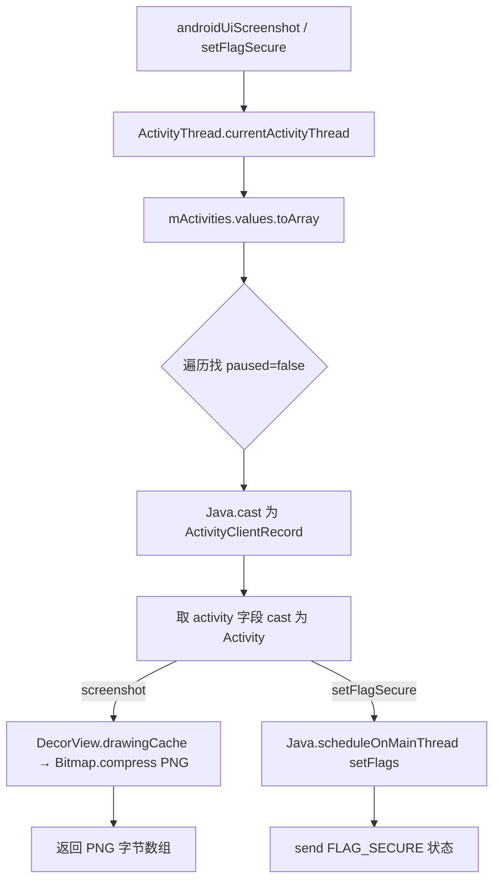

# 用户界面 `agent/src/android/userinterface.ts`

在目标 Android 进程内操作当前 Activity 的窗口：截图当前界面，或动态开关 `FLAG_SECURE` 标志（控制是否允许截屏/录屏）。模块导出 `screenshot()` 与 `setFlagSecure(v)` 两个 RPC，均通过 `ActivityThread` 定位未暂停的当前 Activity 后操作其 `Window`。

## 📋 模块概览

| 项目 | 值 |
| --- | --- |
| 源码路径 | `agent/src/android/userinterface.ts` |
| 平台 | Android（Java 层，主线程操作） |
| 导出的 RPC | `screenshot`（[`agent/src/rpc/android.ts:94`](https://github.com/android-security-engineer/objection-skills/blob/master/agent/src/rpc/android.ts#L94) → `androidUiScreenshot`）、`setFlagSecure`（[`agent/src/rpc/android.ts:95`](https://github.com/android-security-engineer/objection-skills/blob/master/agent/src/rpc/android.ts#L95) → `androidUiSetFlagSecure`） |
| 依赖 | `../lib/color.js`、`./lib/libjava.js`、`./lib/types.js` |

## 🎯 解决的问题

- 银行/支付类 App 设置了 `FLAG_SECURE`，导致 `adb shell screencap` 或录屏得到黑屏，需要进程内临时关闭该标志后再截图。
- 需要在 Frida 脚本里直接拿到当前界面的位图字节，回传给 Python 端保存为 PNG，而不依赖 adb。
- 需要在测试结束后把 `FLAG_SECURE` 重新打开，恢复 App 原始行为。

## 🏗️ 导出的 RPC 方法

| RPC 名 | 说明 |
| --- | --- |
| `screenshot()` | 取当前 Activity 的 DecorView drawing cache，压缩为 PNG 后返回字节数组 |
| `setFlagSecure(v: boolean)` | 在主线程对当前 Activity 的 Window 设置/清除 `FLAG_SECURE` |

### `rpc.screenshot` — 捕获当前界面为 PNG 字节

源码：[`agent/src/android/userinterface.ts:19`](https://github.com/android-security-engineer/objection-skills/blob/master/agent/src/android/userinterface.ts#L19)

先通过 `ActivityThread.currentActivityThread().mActivities` 拿到全部 Activity 记录，`Java.cast` 成 `ActivityThread$ActivityClientRecord` 后找到 `paused == false` 的那条，即为当前可见 Activity。然后取其 `Window.getDecorView().getRootView()`，开启 drawing cache、`Bitmap.createBitmap` 拷贝，再用 `Bitmap.compress(PNG, 100, ByteArrayOutputStream)` 压成 PNG，返回 `outputStream.buf.value` 字节数组。

```ts
const currentActivityThread = activityThread.currentActivityThread();
const activityRecords = currentActivityThread.mActivities.value.values().toArray();
for (const i of activityRecords) {
  const activityRecord = Java.cast(i, activityClientRecord);
  if (!activityRecord.paused.value) {
    currentActivity = Java.cast(Java.cast(activityRecord, activityClientRecord).activity.value, activity);
    break;
  }
}
if (currentActivity) {
  const view = currentActivity.getWindow().getDecorView().getRootView();
  view.setDrawingCacheEnabled(true);
  const bitmapInstance = bitmap.createBitmap(view.getDrawingCache());
  view.setDrawingCacheEnabled(false);
  const outputStream = byteArrayOutputStream.$new();
  bitmapInstance.compress(compressFormat.PNG.value, 100, outputStream);
  bytes = outputStream.buf.value;
}
return bytes;
```

### `rpc.setFlagSecure` — 开关 FLAG_SECURE

源码：[`agent/src/android/userinterface.ts:60`](https://github.com/android-security-engineer/objection-skills/blob/master/agent/src/android/userinterface.ts#L60)

`FLAG_SECURE = 0x00002000`（定义在 [`agent/src/android/userinterface.ts:17`](https://github.com/android-security-engineer/objection-skills/blob/master/agent/src/android/userinterface.ts#L17)，对应 `WindowManager.LayoutParams.FLAG_SECURE`）。定位当前 Activity 的流程同 `screenshot`，随后用 `Java.scheduleOnMainThread` 在主线程调用 `getWindow().setFlags(v ? FLAG_SECURE : 0, FLAG_SECURE)`。

```ts
const FLAG_SECURE = 0x00002000;
// ...
if (currentActivity) {
  currentActivity.getWindow(); // 防止 Frida 抛 abort 错误的“暖机”调用
  Java.scheduleOnMainThread(() => {
    currentActivity.getWindow().setFlags(v ? FLAG_SECURE : 0, FLAG_SECURE);
    send(`FLAG_SECURE set to ${c.green(v.toString())}`);
  });
}
```

源码注释明确指出：不先调用一次 `getWindow()` 会在 `setFlags` 时触发 Frida abort 错误（[`agent/src/android/userinterface.ts:79`](https://github.com/android-security-engineer/objection-skills/blob/master/agent/src/android/userinterface.ts#L79)）。



## ⚙️ 实现要点

- **主线程调度**：`setFlagSecure` 用 `Java.scheduleOnMainThread` 保证 `setFlags` 在 UI 线程执行，避免跨线程操作 View 的崩溃；`screenshot` 取 drawing cache 也依赖 UI 线程已构建好的 View 树。
- **`getWindow()` 暖机**：`setFlagSecure` 在 `scheduleOnMainThread` 之前先在当前线程调一次 `getWindow()`，规避 Frida 在该路径上的 abort，是经验性 workaround。
- **PNG 字节直接回传**：`screenshot` 返回的是 `byte[]`，Python 端 `agent.py` 收到后写文件即可得到 PNG，无需再编码。
- **当前 Activity 定位**：依赖 `ActivityThread$ActivityClientRecord.paused` 字段判断“前台且未暂停”，若 App 处于后台或多 Activity 切换中，可能取到非预期 Activity。
- **drawing cache 已废弃但仍可用**：`getDrawingCache` 在较新 Android 上标记 deprecated，但 Frida 注入场景下仍可工作；如目标 API 完全移除，需改用 `PixelCopy`。

## 🔍 源码索引

| 符号 | 位置 |
| --- | --- |
| `FLAG_SECURE` 常量 | [`agent/src/android/userinterface.ts:17`](https://github.com/android-security-engineer/objection-skills/blob/master/agent/src/android/userinterface.ts#L17) |
| `export const screenshot` | [`agent/src/android/userinterface.ts:19`](https://github.com/android-security-engineer/objection-skills/blob/master/agent/src/android/userinterface.ts#L19) |
| 定位当前 Activity 循环 | [`agent/src/android/userinterface.ts:36`](https://github.com/android-security-engineer/objection-skills/blob/master/agent/src/android/userinterface.ts#L36) |
| drawing cache → Bitmap.compress | [`agent/src/android/userinterface.ts:47`](https://github.com/android-security-engineer/objection-skills/blob/master/agent/src/android/userinterface.ts#L47) |
| 返回字节 `outputStream.buf.value` | [`agent/src/android/userinterface.ts:53`](https://github.com/android-security-engineer/objection-skills/blob/master/agent/src/android/userinterface.ts#L53) |
| `export const setFlagSecure` | [`agent/src/android/userinterface.ts:60`](https://github.com/android-security-engineer/objection-skills/blob/master/agent/src/android/userinterface.ts#L60) |
| `Java.scheduleOnMainThread` 设置标志 | [`agent/src/android/userinterface.ts:82`](https://github.com/android-security-engineer/objection-skills/blob/master/agent/src/android/userinterface.ts#L82) |

## 🔗 相关文档

- [Frida 与 Agent](/guide/frida-agent)
- [RPC 通信机制](/guide/rpc)
- [Android 命令：监控](/reference/commands/android/monitor)
- [libjava 工具模块](/reference/agent/android/lib/libjava)
