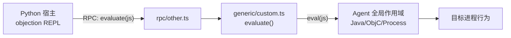

# 自定义代码求值 <code>agent/src/generic/custom.ts</code>

`custom.ts` 是 Agent 端一个极简的“逃逸口”：它把宿主（Python 端）传来的任意 JavaScript 字符串在目标进程的 Agent 上下文里直接 `eval` 执行。它不引入任何 Hook、不依赖任何平台 API，仅导出一个 `evaluate` 函数，被 `rpc/other.ts` 聚合为 `evaluate` RPC 方法，供 `objection` 的 `!eval`/自定义脚本能力调用。

## 📋 模块概览

| 项目 | 值 |
| --- | --- |
| 文件路径 | `agent/src/generic/custom.ts` |
| 适用平台 | 全平台（Android / iOS，不依赖平台运行时） |
| 导出 RPC | `evaluate`（经 `rpc/other.ts` 暴露） |
| 依赖 | 无外部依赖，仅使用 JavaScript 原生 `eval` |
| 代码行数 | 4 行 |

## 🎯 解决的问题

1. **运行时注入任意逻辑**：当 objection 内置命令无法覆盖某个测试场景时，允许安全研究员直接向目标进程注入一段 JS 并立即执行。
2. **快速原型验证**：在不重新打包 Agent 的情况下，验证某段 Frida API 调用或对象探测逻辑是否可行。
3. **桥接宿主与目标进程**：宿主端拼接的脚本字符串通过 RPC 通道下发，由该模块在目标侧落地执行。

## 🏗️ 导出的 RPC 方法

| RPC 名 | 说明 |
| --- | --- |
| `evaluate` | 在 Agent 上下文中执行传入的 JavaScript 字符串 |

### `rpc.evaluate` — 执行任意 JS

源码：`agent/src/generic/custom.ts:1`

`evaluate` 接收一段 JS 字符串 `js`，直接调用原生 `eval` 执行。代码中通过 `// tslint:disable-next-line:no-eval` 显式抑制了 TSLint 对 `eval` 的告警，表明这是有意为之的“后门”式能力。

```ts
// agent/src/generic/custom.ts:1
export const evaluate = (js: string): void => {
  // tslint:disable-next-line:no-eval
  eval(js);
};
```

由于 `eval` 在 Agent 的全局作用域内执行，传入脚本可以访问 `Java`、`ObjC`、`Process`、`Memory` 等 Frida 全局对象，相当于在目标进程内开了一个交互式 JS 控制台。



## ⚙️ 实现要点

- **极简透传**：该模块没有参数校验、没有错误包装、没有返回值，`eval` 的副作用完全由传入脚本决定；脚本若需向宿主回传数据，需自行通过 `send()` 或挂载到全局变量。
- **无返回值设计**：函数签名为 `=> void`，意味着它面向“执行副作用”而非“取回结果”，回传结果这类需求通常由其他专用 RPC（如 `memorySearch`、`androidHookingGetClasses`）承担。
- **聚合位置**：在 `rpc/other.ts:5` 被包装为 `evaluate: (js) => custom.evaluate(js)`，与 HTTP 服务器相关方法一同归入 `other` 命名空间。

## 🔍 源码索引

| 符号 | 位置 |
| --- | --- |
| `evaluate` | `agent/src/generic/custom.ts:1` |
| `eval(js)` 调用 | `agent/src/generic/custom.ts:3` |

## 🔗 相关文档

- [Frida 与 Agent](/guide/frida-agent)
- [RPC 通信机制](/guide/rpc)
- [Agent 入口 index.ts](/reference/agent/index)
