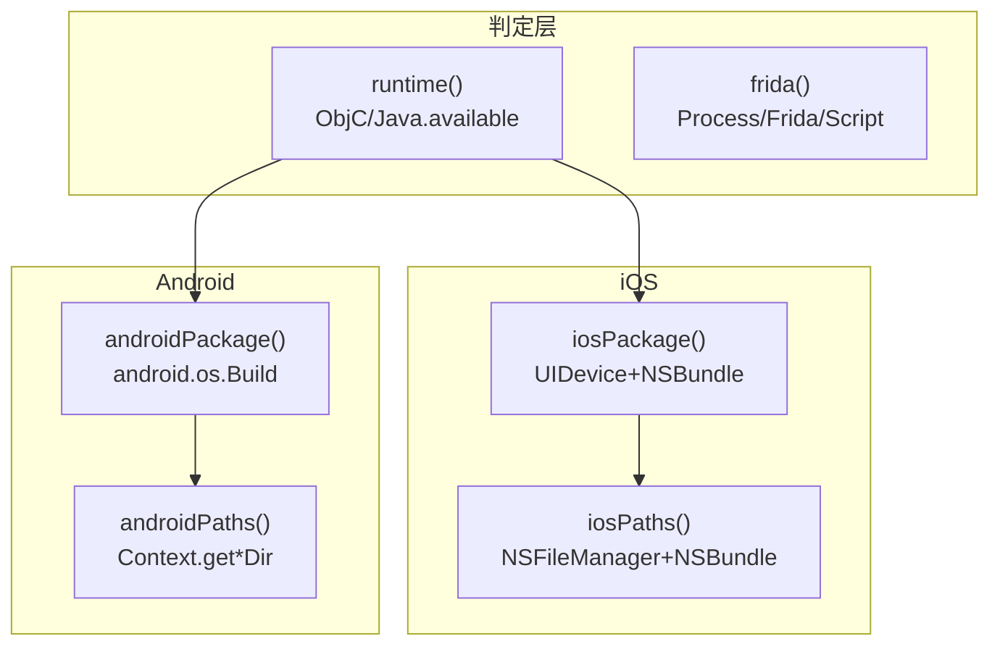

# 环境信息采集 <code>agent/src/generic/environment.ts</code>

`environment.ts` 负责“认识目标进程所处的世界”：判断当前运行时是 iOS 还是 Android、采集 Frida 自身版本与运行参数、读取设备/应用基础信息（包名、机型、系统版本）以及应用在沙盒内的关键目录路径。这些信息既是 objection 启动时识别宿主环境的依据，也通过 `rpc/environment.ts` 暴露为 `env*` 系列 RPC 方法，供 `env` 命令实时查询。

## 📋 模块概览

| 项目 | 值 |
| --- | --- |
| 文件路径 | `agent/src/generic/environment.ts` |
| 适用平台 | 全平台（Android 与 iOS 各有专属导出） |
| 导出 RPC | `envRuntime`、`envFrida`、`envIos`、`envIosPaths`、`envAndroid`、`envAndroidPaths`（经 `rpc/environment.ts`） |
| 依赖 | `ios/lib/libobjc.js`、`android/lib/libjava.js`、`ios/lib/helpers.js`、`ios/lib/constants.js`、`lib/constants.js`、`lib/interfaces.js` |
| 导出函数数 | 6 个（`runtime`、`frida`、`iosPackage`、`iosPaths`、`androidPackage`、`androidPaths`） |

## 🎯 解决的问题

1. **运行时识别**：Agent 注入后第一件事是判断自己落在 iOS 还是 Android，从而决定后续走 ObjC 还是 Java 分支——`runtime()` 即承担此判定。
2. **Frida 自检**：在排查“Agent 是否真的注入成功”“Frida 版本是否匹配”“是否被反调试”时，`frida()` 提供权威的进程级元数据。
3. **应用与设备画像**：`iosPackage`/`androidPackage` 输出包名、机型、系统版本，便于在多设备测试中标识目标。
4. **沙盒路径定位**：`iosPaths`/`androidPaths` 给出 Documents、Caches、Files 等目录绝对路径，是文件类命令（下载/上传/遍历）的基础。

## 🏗️ 导出的 RPC 方法

| RPC 名 | 说明 |
| --- | --- |
| `envRuntime` | 返回当前运行时类型（`ios` / `android` / `unknown`） |
| `envFrida` | 返回 Frida 与进程的元数据（架构、版本、堆大小等） |
| `envIos` | 返回 iOS 设备与应用信息（包名、机型、系统版本） |
| `envIosPaths` | 返回 iOS 应用沙盒关键目录路径 |
| `envAndroid` | 返回 Android 设备 Build 信息与应用包名 |
| `envAndroidPaths` | 返回 Android 应用沙盒关键目录路径 |

### `runtime` — 运行时判定

源码：`agent/src/generic/environment.ts:36`

通过 `ObjC.available` 与 `Java.available` 两个 Frida 全局判断当前进程支持哪种运行时，返回 `DeviceType` 常量。优先判断 iOS，否则判断 Android，二者皆不可用则返回 `unknown`。

```ts
// agent/src/generic/environment.ts:36
export const runtime = (): string => {
  if (ObjC.available) { return DeviceType.IOS; }
  if (Java.available) { return DeviceType.ANDROID; }
  return DeviceType.UNKNOWN;
};
```

### `frida` — Frida 元数据

源码：`agent/src/generic/environment.ts:43`

直接读取 `Process` 与 `Frida` 全局对象，组装成 `IFridaInfo` 结构返回，包含架构、是否附调试器、堆大小、平台、脚本运行时与 Frida 版本。

```ts
// agent/src/generic/environment.ts:43
export const frida = (): IFridaInfo => {
  return {
    arch: Process.arch,
    debugger: Process.isDebuggerAttached(),
    heap: Frida.heapSize,
    platform: Process.platform,
    runtime: Script.runtime,
    version: Frida.version,
  };
};
```

### `iosPackage` — iOS 设备与应用画像

源码：`agent/src/generic/environment.ts:54`

读取 `UIDevice` 与主 `NSBundle`，返回应用 Bundle Identifier、设备名、型号、系统名与系统版本，以及 vendor 标识符。

```ts
// agent/src/generic/environment.ts:54
export const iosPackage = (): IIosPackage => {
  const { UIDevice } = ObjC.classes;
  const mb: NSBundle = getNSMainBundle();
  return {
    applicationName: mb.objectForInfoDictionaryKey_("CFBundleIdentifier").toString(),
    deviceName: UIDevice.currentDevice().name().toString(),
    identifierForVendor: UIDevice.currentDevice().identifierForVendor().toString(),
    model: UIDevice.currentDevice().model().toString(),
    systemName: UIDevice.currentDevice().systemName().toString(),
    systemVersion: UIDevice.currentDevice().systemVersion().toString(),
  };
};
```

### `iosPaths` — iOS 沙盒目录

源码：`agent/src/generic/environment.ts:77`

通过内部 helper `getPathForNSLocation`（第 26 行）调用 `NSFileManager` 的 `URLsForDirectory:inDomains:` 查询 Caches / Document / Library 目录，再叠加 `NSBundle` 的 `bundlePath`，返回 `IIosBundlePaths`。

```ts
// agent/src/generic/environment.ts:77
export const iosPaths = (): IIosBundlePaths => {
  const mb: NSBundle = getNSMainBundle();
  return {
    BundlePath: mb.bundlePath().toString(),
    CachesDirectory: getPathForNSLocation(NSSearchPaths.NSCachesDirectory),
    DocumentDirectory: getPathForNSLocation(NSSearchPaths.NSDocumentDirectory),
    LibraryDirectory: getPathForNSLocation(NSSearchPaths.NSLibraryDirectory),
  };
};
```

### `androidPackage` — Android Build 信息

源码：`agent/src/generic/environment.ts:88`

在 `wrapJavaPerform` 内读取 `android.os.Build` 的静态字段（BOARD、BRAND、DEVICE、MODEL 等），叠加 `getApplicationContext().getPackageName()` 与 `Java.androidVersion`，返回 `IAndroidPackage`。

```ts
// agent/src/generic/environment.ts:88
export const androidPackage = (): Promise<IAndroidPackage> => {
  return wrapJavaPerform(() => {
    const Build: any = Java.use("android.os.Build");
    return {
      application_name: getApplicationContext().getPackageName(),
      board: Build.BOARD.value.toString(),
      brand: Build.BRAND.value.toString(),
      // ...其余 Build 字段
      version: Java.androidVersion,
    };
  });
};
```

### `androidPaths` — Android 沙盒目录

源码：`agent/src/generic/environment.ts:109`

同样在 `wrapJavaPerform` 内，通过 `Context` 的 `getCacheDir`、`getFilesDir`、`getExternalCacheDir`、`getObbDir`、`getPackageCodePath` 等方法拼装 Android 端目录集合，并对 `getCodeCacheDir` 做了能力探测（旧系统无此方法时回退为 `"n/a"`）。

```ts
// agent/src/generic/environment.ts:109
export const androidPaths = (): Promise<any> => {
  return wrapJavaPerform(() => {
    const context = getApplicationContext();
    return {
      cacheDirectory: context.getCacheDir().getAbsolutePath().toString(),
      codeCacheDirectory: "getCodeCacheDir" in context ? context.getCodeCacheDir()
        .getAbsolutePath().toString() : "n/a",
      externalCacheDirectory: context.getExternalCacheDir().getAbsolutePath().toString(),
      filesDirectory: context.getFilesDir().getAbsolutePath().toString(),
      obbDir: context.getObbDir().getAbsolutePath().toString(),
      packageCodePath: context.getPackageCodePath().toString(),
    };
  });
};
```



## ⚙️ 实现要点

- **平台分流而非抽象**：模块并未把 iOS / Android 抽象成统一接口，而是各自暴露独立函数，由上层 `rpc/environment.ts` 用 `envIos` / `envAndroid` 分别命名暴露，调用方按运行时自行选择。
- **Android 一律走 `wrapJavaPerform`**：所有 Java 调用都包裹在该 helper 中，确保在 Frida Java 桥尚未 attach 时安全等待，避免空指针。
- **iOS 路径查询复用 helper**：`getPathForNSLocation`（第 26 行）把 `NSFileManager` 的目录查询封装为按 `NSSearchPaths` 枚举取 `lastObject().path()` 的统一动作，`iosPaths` 只需传三个常量即可。
- **能力探测**：`androidPaths` 对 `getCodeCacheDir` 用 `in` 操作符做存在性判断，体现对旧 Android 版本的兼容。

## 🔍 源码索引

| 符号 | 位置 |
| --- | --- |
| `getPathForNSLocation` | `agent/src/generic/environment.ts:26` |
| `runtime` | `agent/src/generic/environment.ts:36` |
| `frida` | `agent/src/generic/environment.ts:43` |
| `iosPackage` | `agent/src/generic/environment.ts:54` |
| `iosPaths` | `agent/src/generic/environment.ts:77` |
| `androidPackage` | `agent/src/generic/environment.ts:88` |
| `androidPaths` | `agent/src/generic/environment.ts:109` |

## 🔗 相关文档

- [Frida 与 Agent](/guide/frida-agent)
- [RPC 通信机制](/guide/rpc)
- [Agent 入口 index.ts](/reference/agent/index)
