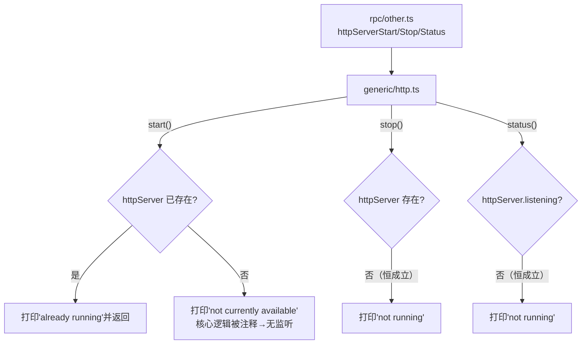

# HTTP 文件服务器（当前禁用） <code>agent/src/generic/http.ts</code>

`http.ts` 设计为在目标进程内启动一个迷你 HTTP 服务器，把设备沙盒里的文件通过浏览器直接拉取回主机，便于在不依赖 objection 文件传输命令的情况下浏览目录与下载文件。但当前版本中该模块被刻意禁用：`start()` 一进入就打印 `httpServer module not currently available.`，真正的 `createServer` 逻辑全部被注释掉。它仍导出 `start`/`stop`/`status` 三个函数，经 `rpc/other.ts` 暴露为 `httpServer*` RPC，但运行时只产生日志输出。

## 📋 模块概览

| 项目 | 值 |
| --- | --- |
| 文件路径 | `agent/src/generic/http.ts` |
| 适用平台 | 全平台（依赖 `frida-fs` 读取文件） |
| 导出 RPC | `httpServerStart`、`httpServerStop`、`httpServerStatus`（经 `rpc/other.ts`） |
| 依赖 | `frida-fs`、Node `http`、`url`、`lib/color.js` |
| 当前状态 | **已禁用**，核心逻辑被注释，仅保留接口与日志 |

## 🎯 解决的问题（设计意图）

1. **进程内文件浏览**：在目标设备上跑一个 HTTP server，研究员用浏览器即可遍历沙盒目录、点击下载文件，省去逐条敲 `file download` 命令。
2. **跨网络取回数据**：当 USB/ADB 通道受限时，只要能与设备端口互通，就能通过 HTTP 拉文件。
3. **目录可视化**：`dirListingHTML` 会为目录生成简易 HTML 索引，目录名自动补斜杠，提供类 FTP 的浏览体验。

> 注意：以上为设计目标，**当前实现并未生效**，详见下文。

## 🏗️ 导出的 RPC 方法

| RPC 名 | 说明 |
| --- | --- |
| `httpServerStart` | 预期：在指定路径与端口启动 HTTP 服务器；实际：仅打印禁用提示 |
| `httpServerStop` | 关闭已运行的服务器并清理状态 |
| `httpServerStatus` | 打印当前服务器运行状态（端口、服务路径） |

### `start` — 启动入口（已禁用）

源码：`agent/src/generic/http.ts:42`

`start()` 第一行就调用 `log(c.redBright("httpServer module not currently available."))`，随后仅保留对“服务器已在运行”的提前返回判断，而 `createServer`、`httpServer.listen` 等真正建站逻辑全部以注释形式存在。即使传入 `pwd` 与 `port`，也不会有任何网络监听发生。

```ts
// agent/src/generic/http.ts:42
export const start = (pwd: string, port: number = 9000): void => {
  log(c.redBright(`httpServer module not currently available.`))

  if (httpServer) {
    log(c.redBright(`Server appears to already be running`));
    return;
  }
  // 以下 createServer / listen 逻辑全部被注释
};
```

### `dirListingHTML` — 目录索引生成（设计参考）

源码：`agent/src/generic/http.ts:14`

该函数未被注释、仍是“活代码”，但鉴于 `start` 不再调用它，目前实际不会执行。其逻辑是用 `fs.list` 列目录，对目录名补斜杠，并按当前路径拼接 `<a href>` 链接，返回一段 HTML。

```ts
// agent/src/generic/http.ts:14
const dirListingHTML = (pwd: string, path: string): string => {
  let h = `<html><body><h2 ...>Index Of ${path}</h2>{file_listing}</body></html>`;
  h = h.replace(`{file_listing}`, () => {
    return fs.list(pwd + decodeURIComponent(path)).map((f) => {
      // ...拼接 <a href>
    }).join("<br>");
  });
  return h;
};
```

### `stop` / `status` — 状态管理

源码：`agent/src/generic/http.ts:103` / `agent/src/generic/http.ts:117`

`stop` 检查 `httpServer` 是否存在，存在则调用 `close()` 并在 `close` 事件里清空变量；`status` 根据 `httpServer.listening` 打印运行端口与服务路径，或提示未运行。由于 `start` 不再赋值 `httpServer`，这两个方法在当前版本下永远走“未运行”分支。

```ts
// agent/src/generic/http.ts:103
export const stop = (): void => {
  if (!httpServer) {
    log(c.yellowBright(`Server does not appear to be running.`));
    return;
  }
  log(c.blackBright(`Waiting for client connections to close then stopping...`));
  httpServer.close()
    .once("close", () => {
      log(c.blackBright(`Server closed.`));
      httpServer = undefined;
    });
};
```



## ⚙️ 实现要点

- **禁用现状如实交代**：`start` 开头即红字告警 `not currently available`，且模块级变量 `httpServer` / `listenPort` / `servePath` 永远不会被赋值，因此 `stop`/`status` 的“已运行”分支在当前版本是死代码。
- **注释保留设计**：被注释的 `createServer` 回调展示了原本的请求处理流程——解析 URL、判断目录则返回 `dirListingHTML`，否则以 `application/octet-stream` 流式回写文件，并对空文件、404、500 分别处理。
- **依赖 `frida-fs`**：`fs.list` / `fs.statSync` / `fs.readFileSync` 来自 `frida-fs`，这是 Frida 提供的进程内文件系统能力，是该 HTTP 服务器能直接读设备文件的根基。
- **聚合位置**：在 `rpc/other.ts:8-10` 与 `evaluate` 一同归入 `other` 命名空间，作为 `httpServerStart`/`httpServerStop`/`httpServerStatus` 暴露。

## 🔍 源码索引

| 符号 | 位置 |
| --- | --- |
| 模块变量 `httpServer`/`listenPort`/`servePath` | `agent/src/generic/http.ts:6` |
| `log` | `agent/src/generic/http.ts:10` |
| `dirListingHTML` | `agent/src/generic/http.ts:14` |
| `start` | `agent/src/generic/http.ts:42` |
| `stop` | `agent/src/generic/http.ts:103` |
| `status` | `agent/src/generic/http.ts:117` |

## 🔗 相关文档

- [Frida 与 Agent](/guide/frida-agent)
- [RPC 通信机制](/guide/rpc)
- [Agent 入口 index.ts](/reference/agent/index)
