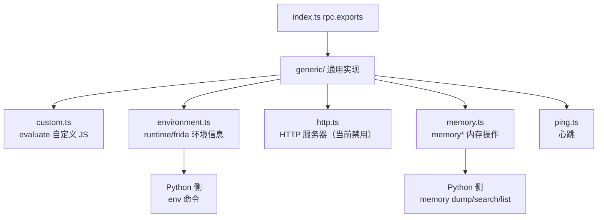

# 🔄 Agent · 通用实现

`agent/src/generic/` 下的模块是**平台无关**的：内存操作、环境信息、自定义 JS 求值、心跳。它们在 Android 与 iOS 上都可用。

## 🗺️ 通用模块与 RPC

## 📂 文件清单

| 文档 | 源码 | 主要导出 |
| --- | --- | --- |
| [custom](/reference/agent/generic/custom) | `generic/custom.ts` | `evaluate` |
| [environment](/reference/agent/generic/environment) | `generic/environment.ts` | `runtime`/`frida`/`iosPackage`/`androidPackage` 等 |
| [http](/reference/agent/generic/http) | `generic/http.ts` | HTTP 服务器（**当前禁用**） |
| [memory](/reference/agent/generic/memory) | `generic/memory.ts` | `memory*` |
| [ping](/reference/agent/generic/ping) | `generic/ping.ts` | `ping` |

## 🔗 相关文档

- [Agent 总览](/reference/agent/)
- [rpc/memory 聚合](/reference/agent/rpc/memory)
- [Frida 与 Agent](/guide/frida-agent)
