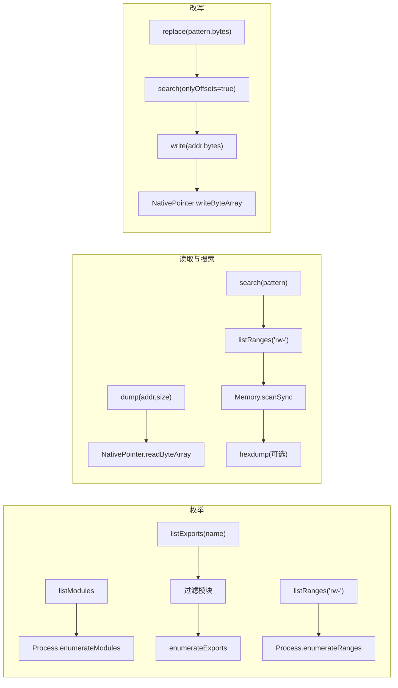

# 进程内存操作 <code>agent/src/generic/memory.ts</code>

`memory.ts` 封装了对目标进程地址空间的低级操作：枚举已加载模块、模块导出、内存范围；按地址 dump 字节；按模式（pattern）搜索可读写内存；把命中位置改写或替换为指定字节。它是 objection `memory` 命令族在 Agent 侧的唯一实现，被 `rpc/memory.ts` 逐方法包装为 `memory*` RPC 暴露给宿主。

## 📋 模块概览

| 项目 | 值 |
| --- | --- |
| 文件路径 | `agent/src/generic/memory.ts` |
| 适用平台 | 全平台（直接使用 Frida `Process`/`Memory`/`NativePointer` 全局） |
| 导出 RPC | `memoryListModules`、`memoryListExports`、`memoryListRanges`、`memoryDump`、`memorySearch`、`memoryReplace`、`memoryWrite`（经 `rpc/memory.ts`） |
| 依赖 | `lib/color.js`（仅 `search` 用于 hexdump 着色） |
| 导出函数数 | 7 个 |

## 🎯 解决的问题

1. **模块与导出盘点**：在不知目标二进制结构时，先列出所有模块及其导出符号，定位关键函数地址。
2. **内存取证**：给定地址与长度，dump 出原始字节供离线分析（替代 Frida 12 之后移除的内置 dump）。
3. **敏感数据定位**：用 `memorySearch` 在 `rw-` 内存里扫描密钥、Token、明文密码等模式串。
4. **运行时改写**：用 `memoryReplace`/`memoryWrite` 直接修改命中字节，实现就地 patch（如替换证书指纹、绕过校验）。

## 🏗️ 导出的 RPC 方法

| RPC 名 | 说明 |
| --- | --- |
| `memoryListModules` | 枚举进程已加载的全部模块 |
| `memoryListExports` | 枚举指定模块的导出符号 |
| `memoryListRanges` | 枚举满足某保护属性（默认 `rw-`）的内存范围 |
| `memoryDump` | 读取指定地址开始的若干字节 |
| `memorySearch` | 在 `rw-` 内存中按模式搜索，可选打印 hexdump |
| `memoryReplace` | 搜索模式并把命中处改写为给定字节 |
| `memoryWrite` | 向指定地址写入字节数组 |

### `listModules` / `listExports` / `listRanges` — 枚举类

源码：[`agent/src/generic/memory.ts:3`](https://github.com/android-security-engineer/objection-skills/blob/master/agent/src/generic/memory.ts#L3) / `:7` / `:15`

三者都是对 Frida `Process` 枚举 API 的薄封装。`listExports` 先按模块名过滤 `enumerateModules()` 结果，再对该模块调 `enumerateExports()`；找不到模块则返回空数组。`listRanges` 默认保护属性为 `"rw-"`。

```ts
// agent/src/generic/memory.ts:3
export const listModules = (): Module[] => {
  return Process.enumerateModules();
};

// agent/src/generic/memory.ts:7
export const listExports = (name: string): ModuleExportDetails[] => {
  const mod: Module[] = Process.enumerateModules().filter((m) => m.name === name);
  if (mod.length <= 0) { return []; }
  return mod[0].enumerateExports();
};

// agent/src/generic/memory.ts:15
export const listRanges = (protection: string = "rw-"): RangeDetails[] => {
  return Process.enumerateRanges(protection);
};
```

### `dump` — 字节读取

源码：[`agent/src/generic/memory.ts:19`](https://github.com/android-security-engineer/objection-skills/blob/master/agent/src/generic/memory.ts#L19)

注释说明该能力原属 Frida ≤11，在 12 中被移除，因此这里用 `NativePointer(address).readByteArray(size)` 自行实现。读取失败时返回空 `ArrayBuffer`，保证调用方不会拿到 `null`。

```ts
// agent/src/generic/memory.ts:19
export const dump = (address: string, size: number): ArrayBuffer => {
  // Originally part of Frida <=11 but got removed in 12.
  const data = new NativePointer(address).readByteArray(size);
  if (data) {
    return data;
  } else {
    return new ArrayBuffer(0);
  }
};
```

### `search` — 模式搜索

源码：[`agent/src/generic/memory.ts:31`](https://github.com/android-security-engineer/objection-skills/blob/master/agent/src/generic/memory.ts#L31)

先取所有 `rw-` 范围，对每个范围调 `Memory.scanSync` 搜索模式；若 `onlyOffsets` 为假，则用 `colors.log(hexdump(...))` 在 Agent 控制台打印 48 字节的 hexdump；最后把所有命中的地址字符串扁平化返回。

```ts
// agent/src/generic/memory.ts:31
export const search = (pattern: string, onlyOffsets: boolean = false): string[] => {
  const addresses = listRanges("rw-")
    .map((range) => {
      return Memory.scanSync(range.base, range.size, pattern)
        .map((match) => {
          if (!onlyOffsets) {
            colors.log(hexdump(match.address, { ansi: true, header: false, length: 48 }));
          }
          return match.address.toString();
        });
    }).filter((m) => m.length !== 0);

  if (addresses.length <= 0) { return []; }
  return addresses.reduce((a, b) => a.concat(b));
};
```

### `replace` / `write` — 改写类

源码：[`agent/src/generic/memory.ts:54`](https://github.com/android-security-engineer/objection-skills/blob/master/agent/src/generic/memory.ts#L54) / `:61`

`replace` 复用 `search(pattern, true)`（仅返回地址、不打印 hexdump），对每个命中地址调 `write` 写入新字节；`write` 直接用 `NativePointer(address).writeByteArray(value)` 落盘。

```ts
// agent/src/generic/memory.ts:54
export const replace = (pattern: string, replace: number[]): string[] => {
  return search(pattern, true).map((match) => {
    write(match, replace);
    return match;
  })
};

// agent/src/generic/memory.ts:61
export const write = (address: string, value: number[]): void => {
  new NativePointer(address).writeByteArray(value);
};
```



## ⚙️ 实现要点

- **全平台无分支**：模块不区分 iOS/Android，全部基于 Frida 通用全局，因此在任意进程上都可直接使用。
- **搜索范围锁定 `rw-`**：`search` 硬编码 `listRanges("rw-")`，只扫可读写段——这既避免命中只读代码段导致误报，也保证 `replace`/`write` 不会因只读页失败。
- **`onlyOffsets` 双模式**：同一个 `search` 既能给人看（带 hexdump），也能给机器用（纯地址），`replace` 复用后者避免重复打印。
- **空结果兜底**：`dump` 失败返回空 `ArrayBuffer`，`search` 无命中返回空数组，调用方无需处理 `null`。
- **聚合位置**：在 `rpc/memory.ts:5-11` 被 1:1 包装为 `memoryDump`/`memoryListExports`/... 等 RPC 名。

## 🔍 源码索引

| 符号 | 位置 |
| --- | --- |
| `listModules` | [`agent/src/generic/memory.ts:3`](https://github.com/android-security-engineer/objection-skills/blob/master/agent/src/generic/memory.ts#L3) |
| `listExports` | [`agent/src/generic/memory.ts:7`](https://github.com/android-security-engineer/objection-skills/blob/master/agent/src/generic/memory.ts#L7) |
| `listRanges` | [`agent/src/generic/memory.ts:15`](https://github.com/android-security-engineer/objection-skills/blob/master/agent/src/generic/memory.ts#L15) |
| `dump` | [`agent/src/generic/memory.ts:19`](https://github.com/android-security-engineer/objection-skills/blob/master/agent/src/generic/memory.ts#L19) |
| `search` | [`agent/src/generic/memory.ts:31`](https://github.com/android-security-engineer/objection-skills/blob/master/agent/src/generic/memory.ts#L31) |
| `replace` | [`agent/src/generic/memory.ts:54`](https://github.com/android-security-engineer/objection-skills/blob/master/agent/src/generic/memory.ts#L54) |
| `write` | [`agent/src/generic/memory.ts:61`](https://github.com/android-security-engineer/objection-skills/blob/master/agent/src/generic/memory.ts#L61) |

## 🔗 相关文档

- [Frida 与 Agent](/guide/frida-agent)
- [RPC 通信机制](/guide/rpc)
- [Agent 入口 index.ts](/reference/agent/index)
