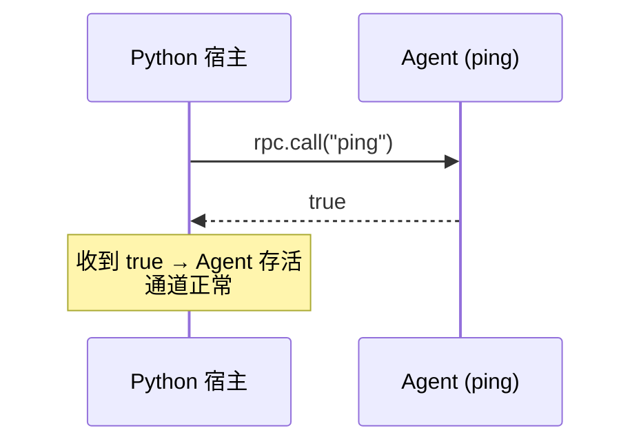

# 心跳探活 <code>agent/src/generic/ping.ts</code>

`ping.ts` 是整个 Agent 里最小的模块，仅一行有效代码。它导出一个 `ping` 函数，无条件返回 `true`，作为“Agent 是否还活着”的最小探针。该函数被 `index.ts` 聚合到 RPC 后，宿主端可通过周期性调用 `ping` 来判断注入的 Agent 是否仍在响应、RPC 通道是否畅通。

## 📋 模块概览

| 项目 | 值 |
| --- | --- |
| 文件路径 | `agent/src/generic/ping.ts` |
| 适用平台 | 全平台（不依赖任何运行时） |
| 导出 RPC | `ping`（在 `index.ts` 聚合层暴露） |
| 依赖 | 无 |
| 代码行数 | 1 行 |

## 🎯 解决的问题

1. **注入存活检测**：Agent 注入后，宿主需要一个零副作用的方法确认它已就绪，`ping` 即此用途。
2. **通道健康检查**：长时间运行的任务期间，周期性 `ping` 可探测 RPC 通道是否仍可用，及时发现进程崩溃或 Agent 被卸载。
3. **最小开销基准**：函数不读任何对象、不触发任何 Hook，返回值固定，可作为 RPC 往返延迟的测量基准。

## 🏗️ 导出的 RPC 方法

| RPC 名 | 说明 |
| --- | --- |
| `ping` | 返回布尔 `true`，用作存活与通道探针 |

### `ping` — 存活探针

源码：[`agent/src/generic/ping.ts:1`](https://github.com/android-security-engineer/objection-skills/blob/master/agent/src/generic/ping.ts#L1)

函数体为 `() => true`，无参数、无副作用，调用即返回 `true`。其存在本身就是目的——只要宿主能拿到 `true` 回包，说明 Agent 已注入且 RPC 通道工作正常。

```ts
// agent/src/generic/ping.ts:1
export const ping = (): boolean => true;
```



## ⚙️ 实现要点

- **零依赖**：不 import 任何模块，既不依赖 `Java`/`ObjC`，也不依赖 `Process`，因此在 Agent 加载的最早期即可被调用。
- **恒真语义**：返回值恒为 `true`，调用方只需判断“能否收到回包”而非“回包内容”，简化了宿主侧的状态机。
- **聚合方式**：与 `generic/*` 其他模块不同，`ping` 通常由 `index.ts` 直接挂载为顶层 RPC（而非经 `rpc/*` 聚合层重命名），因为它是基础探针，不属于任何业务命名空间。

## 🔍 源码索引

| 符号 | 位置 |
| --- | --- |
| `ping` | [`agent/src/generic/ping.ts:1`](https://github.com/android-security-engineer/objection-skills/blob/master/agent/src/generic/ping.ts#L1) |

## 🔗 相关文档

- [Frida 与 Agent](/guide/frida-agent)
- [RPC 通信机制](/guide/rpc)
- [Agent 入口 index.ts](/reference/agent/index)
