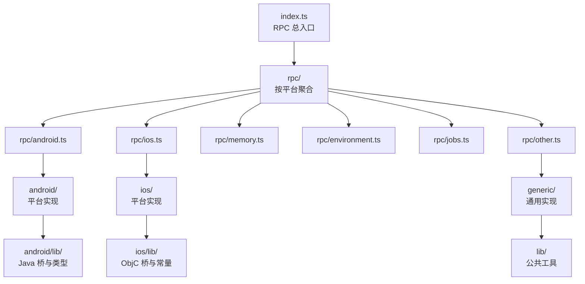
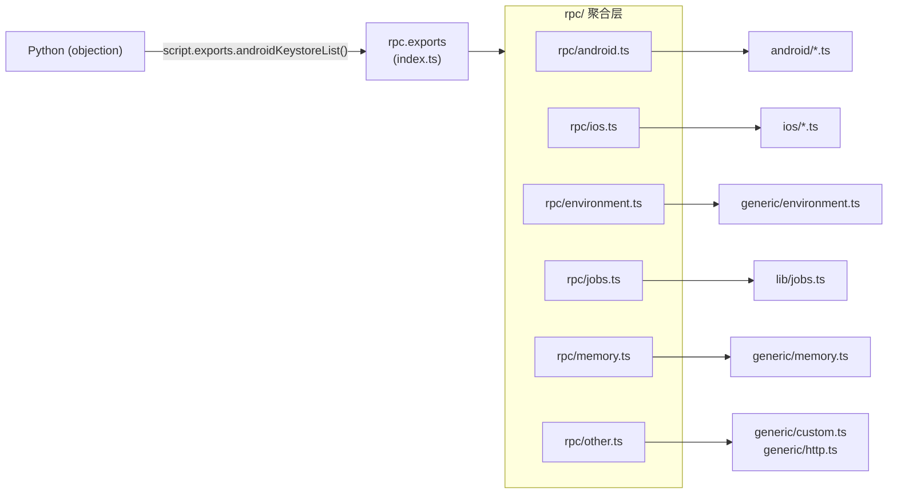

# 🪝 Frida Agent 文档

objection 的 Agent 是一段 TypeScript（`agent/src/`），编译成 `agent.js` 后由 Frida 注入目标 App 进程。它通过 `rpc.exports` 暴露方法供 Python 侧调用，通过 `send()` 把异步事件回传。本分区按源码结构逐文件讲解。

## 🗺️ 目录结构



## 🚪 Agent 入口 <code>agent/src/index.ts</code>

`index.ts` 是整个 Agent 的入口与 RPC 注册中心。它把分散在各平台模块（Android / iOS / 通用环境 / 内存 / 任务管理 / 其它）中的 RPC 句柄汇聚到同一个全局 `rpc.exports` 对象上，再由 Frida 暴露给宿主进程（Python 侧 `objection.utils.agent.Agent`）通过 `script.exports.*` 调用。

### 📋 模块概览
| 项目 | 值 |
| --- | --- |
| 文件路径 | `agent/src/index.ts` |
| 平台 | 通用（Android + iOS） |
| 导出 RPC | 由 `rpc/` 下 6 个聚合文件 + `ping` 合并而成 |
| 依赖 | `rpc/android`、`rpc/ios`、`rpc/environment`、`rpc/jobs`、`rpc/memory`、`rpc/other`、`generic/ping` |

### 🎯 解决的问题
- 在 Agent 加载后**一次性**把所有平台能力注册为 RPC 方法，无需各平台模块各自写 `rpc.exports`。
- 让 Python 侧用 `agent.rpc_exports("androidKeystoreList")` 这样的统一入口调用任意平台功能。
- 提供最小心跳方法 `ping`，供宿主确认 Agent 已就绪。

### 🏗️ 导出的 RPC 方法

`index.ts` 自身只有 17 行，其核心是对象展开：

```ts
// agent/src/index.ts:9-17
rpc.exports = {
  ...android,
  ...ios,
  ...env,
  ...jobs,
  ...memory,
  ...other,
  ping: (): boolean => ping(),
};
```

各聚合文件注入的方法名前缀：

| 来源 | 前缀 | 说明 |
| --- | --- | --- |
| `rpc/android.ts` | `android*` | clipboard / filesystem / heap / hooking / intent / keystore / pinning / root / shell / ui / proxy / deoptimize |
| `rpc/ios.ts` | `ios*` | binary / cookies / credentialstorage / filesystem / heap / hooking / crypto / jailbreak / keychain / nsuserdefaults / pasteboard / pinning / plist / bundles / ui |
| `rpc/environment.ts` | `env*` | Frida 信息、设备信息、运行时识别、bundle 路径 |
| `rpc/jobs.ts` | `jobs*` | 列出与杀掉 Hook 任务 |
| `rpc/memory.ts` | `memory*` | 模块 / 导出 / 内存段枚举、dump、扫描、写入 |
| `rpc/other.ts` | (http / evaluate) | 自定义 JS 求值、HTTP 服务器（不可用） |
| 内联 | `ping` | 心跳 |

### `rpc.ping` — 心跳
源码：[`agent/src/index.ts:16`](https://github.com/android-security-engineer/objection-skills/blob/master/agent/src/index.ts#L16)
最简单的 RPC，返回 `true`。Python 侧在 Agent 启动后用它确认脚本已注入并运行。

### ⚙️ 实现要点

- **聚合策略**：使用 ES 对象展开 `...` 把 6 个子聚合对象合并到 `rpc.exports`。每个子聚合对象只是把平台模块的具名导出包装成箭头函数（例如 `androidKeystoreList: () => keystore.list()`），起到**重命名 + 透传**作用，见 `rpc/android.ts`。
- **消息处理**：`index.ts` 不直接处理 `send()` 消息。所有平台模块用全局 `send()` 把 Hook 日志推给 Frida，由 Python 侧 `Agent` 的 `on_message` 回调统一接收并打印到 REPL。
- **平台兼容**：`rpc/android.ts` 与 `rpc/ios.ts` 在同一 Agent 里同时展开。由于它们的实现内部用 `ObjC.available` / `Java.available` 守卫（见 `generic/environment.ts:36-41`），在错误平台上调用会自然失败而非崩溃 Agent。
- **构建产物**：该文件经 `tsc` 编译为 `index.js`，由 objection 打包进 `objection/agent.js`，注入目标进程。

### 📐 调用关系



### 🔍 源码索引
| 符号 | 位置 |
| --- | --- |
| `rpc.exports = { ... }` | [`agent/src/index.ts:9`](https://github.com/android-security-engineer/objection-skills/blob/master/agent/src/index.ts#L9) |
| `ping` 内联 | [`agent/src/index.ts:16`](https://github.com/android-security-engineer/objection-skills/blob/master/agent/src/index.ts#L16) |
| `import android` | [`agent/src/index.ts:2`](https://github.com/android-security-engineer/objection-skills/blob/master/agent/src/index.ts#L2) |
| `import ios` | [`agent/src/index.ts:4`](https://github.com/android-security-engineer/objection-skills/blob/master/agent/src/index.ts#L4) |
| `import env` | [`agent/src/index.ts:3`](https://github.com/android-security-engineer/objection-skills/blob/master/agent/src/index.ts#L3) |
| `import jobs` | [`agent/src/index.ts:5`](https://github.com/android-security-engineer/objection-skills/blob/master/agent/src/index.ts#L5) |
| `import memory` | [`agent/src/index.ts:6`](https://github.com/android-security-engineer/objection-skills/blob/master/agent/src/index.ts#L6) |
| `import other` | [`agent/src/index.ts:7`](https://github.com/android-security-engineer/objection-skills/blob/master/agent/src/index.ts#L7) |
| `import ping` | [`agent/src/index.ts:1`](https://github.com/android-security-engineer/objection-skills/blob/master/agent/src/index.ts#L1) |

## 📂 分区入口

| 分区 | 内容 | 入口 |
| --- | --- | --- |
| 🤖 Android 实现 | `agent/src/android/*.ts` + `lib/` | [/reference/agent/android/](/reference/agent/android/) |
| 🍎 iOS 实现 | `agent/src/ios/*.ts` + `lib/` | [/reference/agent/ios/](/reference/agent/ios/) |
| 🔄 通用实现 | `agent/src/generic/*.ts` | [/reference/agent/generic/](/reference/agent/generic/) |
| 📡 RPC 聚合 | `agent/src/rpc/*.ts` | [/reference/agent/rpc/](/reference/agent/rpc/) |
| 🧰 公共库 | `agent/src/lib/*.ts` | [/reference/agent/lib/](/reference/agent/lib/) |

## 🔗 相关文档

- [Frida 与 Agent](/guide/frida-agent)
- [RPC 通信机制](/guide/rpc)
- [整体架构](/guide/architecture)
