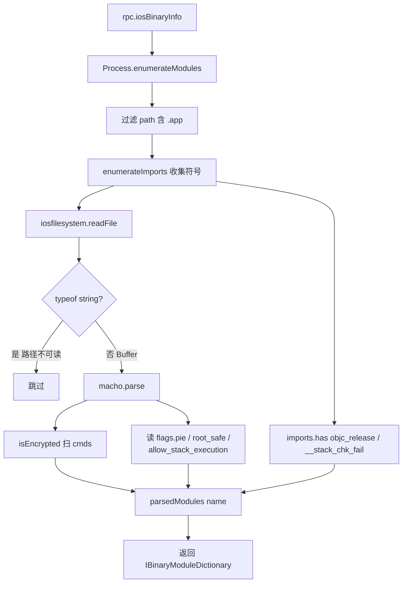

# 二进制信息 <code>agent/src/ios/binary.ts</code>

`binary.ts` 在 iOS 目标进程里枚举所有带 `.app` 的可执行模块，用 `macho-ts` 解析其 Mach-O 头，判断 App 是否加密、是否启用 PIE / ARC / 栈 canary / rootSafe / 栈执行保护等安全特性，结果通过 `iosBinaryInfo` RPC 返回。它是静态安全自检的运行时对应物。

## 📋 模块概览
| 项目 | 值 |
| --- | --- |
| 文件路径 | `agent/src/ios/binary.ts` |
| 平台 | iOS |
| 导出 RPC | `iosBinaryInfo` |
| 依赖 | `macho-ts`、`ios/filesystem.ts`、`ios/lib/interfaces.ts` |

## 🎯 解决的问题
- 判断主二进制是否仍处 FairPlay 加密（`cryptid != 0`），加密状态会阻止静态分析。
- 一次性报告 PIE、ARC（`objc_release` 导入）、栈 canary（`__stack_chk_fail`）、rootSafe、栈执行等加固标志。
- 只关注 `.app` 目录下的可执行模块，过滤掉系统 dylib 噪声。

## 🏗️ 导出的 RPC 方法
| RPC 名 | 说明 |
| --- | --- |
| `iosBinaryInfo` | 返回 `IBinaryModuleDictionary`，按模块名索引二进制加固特性 |

### `rpc.iosBinaryInfo` — 解析 .app 模块的 Mach-O 头
源码：[`agent/src/ios/binary.ts:23`](https://github.com/android-security-engineer/objection-skills/blob/master/agent/src/ios/binary.ts#L23)

遍历 `Process.enumerateModules()`，对路径含 `.app` 的模块先用 `enumerateImports()` 收集导入符号集合，再借 `iosfilesystem.readFile` 把文件读进 `Buffer`，交给 `macho.parse`：
```ts
// agent/src/ios/binary.ts:27-49
modules.forEach((a) => {
  if (!a.path.includes(".app")) { return; }
  const imports: Set<string> = new Set(a.enumerateImports().map((i) => i.name));
  const fb = iosfilesystem.readFile(a.path);
  if (typeof(fb) == 'string') { return; }
  try {
    const exe = macho.parse(fb);
    parsedModules[a.name] = {
      arc: imports.has("objc_release"),
      canary: imports.has("__stack_chk_fail"),
      encrypted: isEncrypted(exe.cmds),
      pie: exe.flags.pie ? true : false,
      rootSafe: exe.flags.root_safe ? true : false,
      stackExec: exe.flags.allow_stack_execution ? true : false,
      type: exe.filetype,
    };
  } catch (e) { /* 非 mach-o 时忽略 */ }
});
```
加密判断由私有 `isEncrypted` 完成，扫描 load commands 中的 `encryption_info` / `encryption_info_64`，`cmd.id !== 0` 即视为加密（`:7-21`）。



## ⚙️ 实现要点
- **导入符号判 ARC / canary**：不解析整个符号表，只看 `objc_release`（ARC 自动插入的释放调用）与 `__stack_chk_fail`（栈保护）是否出现在导入表里。
- **复用 filesystem.readFile**：文件读取走 `frida-fs`，`readFile` 返回 `string | Buffer`，类型为 `string` 表示读取失败（异常文本），直接跳过（`:34-36`）。
- **容错**：`macho.parse` 对非 Mach-O 文件会抛异常，用 try/catch 静默忽略（`:51-54`），保证一个模块出错不影响其余模块。

## 🔍 源码索引
| 符号 | 位置 |
| --- | --- |
| `isEncrypted` | [`agent/src/ios/binary.ts:7`](https://github.com/android-security-engineer/objection-skills/blob/master/agent/src/ios/binary.ts#L7) |
| `info` | [`agent/src/ios/binary.ts:23`](https://github.com/android-security-engineer/objection-skills/blob/master/agent/src/ios/binary.ts#L23) |

## 🔗 相关文档
- [Frida 与 Agent](/guide/frida-agent)
- [RPC 通信机制](/guide/rpc)
- 文件读取实现：[`filesystem.md`](/reference/agent/ios/filesystem)
- 命令文档：[/reference/commands/ios/binary](/reference/commands/ios/binary)
