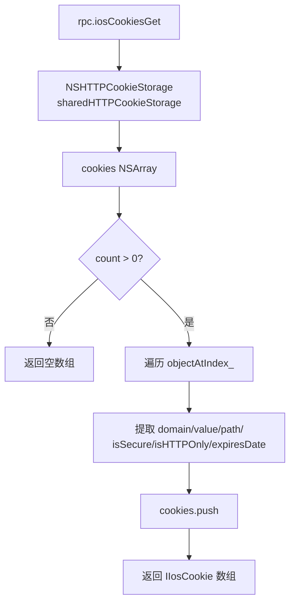

# Cookie 读取 <code>agent/src/ios/binarycookies.ts</code>

`binarycookies.ts` 在 iOS 目标进程中读取 `NSHTTPCookieStorage` 共享存储里的全部 HTTP Cookie，把每条 Cookie 的域名、路径、值、过期、安全/HTTPOnly 标志整理成结构化数组，通过 `iosCookiesGet` RPC 返回给 Python 侧。它只做"读"，不 Hook、不写入。

## 📋 模块概览
| 项目 | 值 |
| --- | --- |
| 文件路径 | `agent/src/ios/binarycookies.ts` |
| 平台 | iOS |
| 导出 RPC | `iosCookiesGet` |
| 依赖 | `ios/lib/libobjc.ts`、`ios/lib/interfaces.ts`、`ios/lib/types.ts` |

## 🎯 解决的问题
- 获取 App 当前持有的全部 HTTP Cookie（含会话 Cookie 与持久化 Cookie）。
- 提取每条 Cookie 的 `domain / path / value / expiresDate / isSecure / isHTTPOnly / version`，便于离线分析。
- 不依赖磁盘上的 `Cookies.binarycookies` 文件，直接在进程内拿活对象，避免沙盒读取限制。

## 🏗️ 导出的 RPC 方法
| RPC 名 | 说明 |
| --- | --- |
| `iosCookiesGet` | 返回 `IIosCookie[]`，枚举 `NSHTTPCookieStorage` 共享存储 |

### `rpc.iosCookiesGet` — 枚举共享 Cookie 存储
源码：`agent/src/ios/binarycookies.ts:10`

通过 `ObjC.classes.NSHTTPCookieStorage` 拿到共享存储，调用 `sharedHTTPCookieStorage()` 后取 `cookies()` 数组逐项提取：
```ts
// agent/src/ios/binarycookies.ts:18-26
const HTTPCookieStorage = ObjC.classes.NSHTTPCookieStorage;
const cookieStore: NSHTTPCookieStorage = HTTPCookieStorage.sharedHTTPCookieStorage();
const cookieJar: NSArray = cookieStore.cookies();

if (cookieJar.count() <= 0) {
  return cookies;
}
```
每个 cookie 项的字段在 `:34-43` 装配，`expiresDate()` 为 `null` 时以字符串 `"null"` 占位（会话 Cookie 没有过期时间）。



## ⚙️ 实现要点
- **纯 ObjC 桥，无 Hook**：只用 `ObjC.classes.*` 调方法，不挂 `Interceptor`，调用结束即返回，不留副作用。
- **类型宽放**：`cookieJar` 声明为 `NSArray`，元素取出来标注为 `NSData`，实际是 `NSHTTPCookie` 实例；类型注释仅为开发提示，运行时由 Frida ObjC 桥统一处理。
- **null 安全**：`expiresDate()` 可能返回 `null`（会话 Cookie），三元运算转字符串避免 `toString()` 报错（`:36`）。

## 🔍 源码索引
| 符号 | 位置 |
| --- | --- |
| `get` | `agent/src/ios/binarycookies.ts:10` |

## 🔗 相关文档
- [Frida 与 Agent](/guide/frida-agent)
- [RPC 通信机制](/guide/rpc)
- 命令文档：[/reference/commands/ios/cookies](/reference/commands/ios/cookies)
