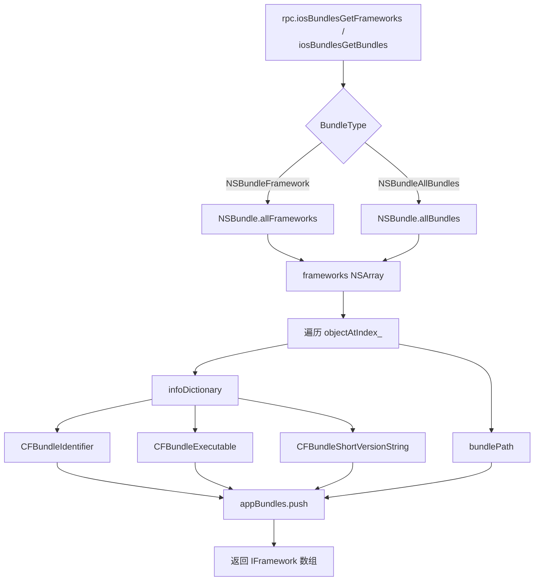

# Bundle 枚举 <code>agent/src/ios/bundles.ts</code>

`bundles.ts` 在 iOS 目标进程里枚举 `NSBundle` 的 `allFrameworks()` 与 `allBundles()`，提取每个 bundle 的 `CFBundleIdentifier`、`CFBundleExecutable`、`CFBundleShortVersionString` 与 `bundlePath`，分别通过 `iosBundlesGetFrameworks` 与 `iosBundlesGetBundles` 两个 RPC 返回。用于摸清 App 加载了哪些第三方框架与 bundle。

## 📋 模块概览
| 项目 | 值 |
| --- | --- |
| 文件路径 | `agent/src/ios/bundles.ts` |
| 平台 | iOS |
| 导出 RPC | `iosBundlesGetBundles`、`iosBundlesGetFrameworks` |
| 依赖 | `ios/lib/libobjc.ts`、`ios/lib/constants.ts`、`ios/lib/interfaces.ts`、`ios/lib/types.ts` |

## 🎯 解决的问题
- 列出 App 链接的全部 framework，发现嵌入的第三方 SDK（埋点、热更新、加密库等）。
- 列出全部 NSBundle，定位资源 bundle 与插件 bundle 的磁盘路径。
- 同时给出 bundle 的可执行文件名与版本号，便于版本比对与已知漏洞匹配。

## 🏗️ 导出的 RPC 方法
| RPC 名 | 说明 |
| --- | --- |
| `iosBundlesGetBundles` | 调 `getBundles(BundleType.NSBundleAllBundles)` |
| `iosBundlesGetFrameworks` | 调 `getBundles(BundleType.NSBundleFramework)` |

### `rpc.iosBundlesGetFrameworks` / `iosBundlesGetBundles` — 按 type 枚举 Bundle
源码：`agent/src/ios/bundles.ts:13`

入口 `getBundles(type)` 依据传入的 `BundleType` 选择 `NSBundle.allFrameworks()` 或 `allBundles()`，然后遍历数组取 `infoDictionary`：
```ts
// agent/src/ios/bundles.ts:25-30
let frameworks: NSArray;
if (type === BundleType.NSBundleFramework) {
  frameworks = ObjC.classes.NSBundle.allFrameworks();
} else if (type === BundleType.NSBundleAllBundles) {
  frameworks = ObjC.classes.NSBundle.allBundles();
}
```
每个 bundle 项的字段在 `:42-52` 装配，`infoDictionary` 中取不到的 key 返回 `null`：
```ts
// agent/src/ios/bundles.ts:47-52
appBundles.push({
  bundle: CFBundleIdentifier ? CFBundleIdentifier.toString() : null,
  executable: CFBundleExecutable ? CFBundleExecutable.toString() : null,
  path: bundlePath.toString(),
  version: CFBundleShortVersionString ? CFBundleShortVersionString.toString() : null,
});
```



## ⚙️ 实现要点
- **类型参数来自枚举**：`BundleType` 定义于 `ios/lib/constants.ts:100-103`，`1=Framework`、`2=AllBundles`，由 `rpc/ios.ts` 在调用处固定传入。
- **纯 ObjC 桥，无 Hook**：只读 `NSBundle` 类方法，不挂拦截器，调用即返回。
- **null 容错**：`objectForKey_` 取不到 key 返回 `null`，三元运算转 `null` 字符串字段，避免 `toString()` 报错（`:48-51`）。

## 🔍 源码索引
| 符号 | 位置 |
| --- | --- |
| `getBundles` | `agent/src/ios/bundles.ts:13` |

## 🔗 相关文档
- [Frida 与 Agent](/guide/frida-agent)
- [RPC 通信机制](/guide/rpc)
- 常量定义：[`constants.md`](/reference/agent/ios/lib/constants)
- 命令文档：[/reference/commands/ios/bundles](/reference/commands/ios/bundles)
