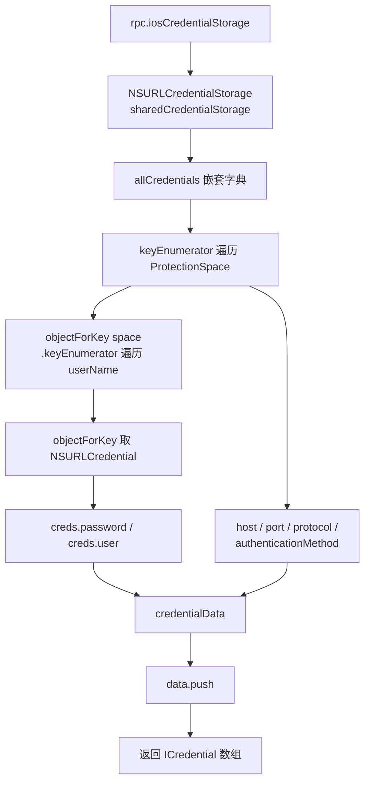

# NSURLCredentialStorage Dump <code>agent/src/ios/credentialstorage.ts</code>

`credentialstorage.ts` 在 iOS 目标进程里 dump `NSURLCredentialStorage` 共享存储中的全部凭据。该存储以 `NSURLProtectionSpace` 为外层 key、用户名为内层 key、`NSURLCredential` 为值构成嵌套字典，模块遍历两层枚举器，把 host / port / protocol / authMethod / user / password 拆成扁平数组，通过 `iosCredentialStorage` RPC 返回。

## 📋 模块概览
| 项目 | 值 |
| --- | --- |
| 文件路径 | `agent/src/ios/credentialstorage.ts` |
| 平台 | iOS |
| 导出 RPC | `iosCredentialStorage` |
| 依赖 | `ios/lib/libobjc.ts`、`ios/lib/interfaces.ts`、`ios/lib/types.ts` |

## 🎯 解决的问题
- 提取 App 持久化的 HTTP/HTTPS 基本认证凭据（用户名 + 明文密码）。
- 还原每条凭据所属的 `NSURLProtectionSpace`（host / port / protocol / 认证方式），定位凭据归属的站点。
- 进程内直接读共享存储，绕过沙盒对磁盘凭据的保护。

## 🏗️ 导出的 RPC 方法
| RPC 名 | 说明 |
| --- | --- |
| `iosCredentialStorage` | 返回 `ICredential[]`，扁平化两层凭据字典 |

### `rpc.iosCredentialStorage` — 两层枚举器遍历
源码：[`agent/src/ios/credentialstorage.ts:10`](https://github.com/android-security-engineer/objection-skills/blob/master/agent/src/ios/credentialstorage.ts#L10)

`allCredentials()` 返回嵌套 `NSDictionary`。先用 `keyEnumerator()` 遍历外层 protection space，再对每个 space 取内层字典的 `keyEnumerator()` 遍历用户名：
```ts
// agent/src/ios/credentialstorage.ts:33-45
const protectionSpaceEnumerator = credentialsDict.keyEnumerator();
let urlProtectionSpace;
while ((urlProtectionSpace = protectionSpaceEnumerator.nextObject()) !== null) {
  const userNameEnumerator = credentialsDict.objectForKey_(urlProtectionSpace).keyEnumerator();
  let userName;
  while ((userName = userNameEnumerator.nextObject()) !== null) {
    const creds: NSData = credentialsDict.objectForKey_(urlProtectionSpace).objectForKey_(userName);
```
每个凭据项在 `:48-55` 装配，`password()` 与 `user()` 直接从 `NSURLCredential` 取明文：
```ts
// agent/src/ios/credentialstorage.ts:48-55
const credentialData: ICredential = {
  authMethod: urlProtectionSpace.authenticationMethod().toString(),
  host: urlProtectionSpace.host().toString(),
  password: creds.password().toString(),
  port: urlProtectionSpace.port(),
  protocol: urlProtectionSpace.protocol().toString(),
  user: creds.user().toString(),
};
```



## ⚙️ 实现要点
- **两层 while + 赋值表达式**：`while ((x = enum.nextObject()) !== null)` 是 Frida 里遍历 ObjC 枚举器的惯用法，`tslint:disable-next-line:no-conditional-assignment` 显式放过（`:36`、`:42`）。
- **空存储早退**：`credentialsDict.count() <= 0` 直接返回空数组，避免空枚举（`:29-31`）。
- **纯 ObjC 桥，无 Hook**：只读共享存储，不挂拦截器，调用即返回；`port` 字段未 `toString()`，直接传 `NSNumber` 对象。

## 🔍 源码索引
| 符号 | 位置 |
| --- | --- |
| `dump` | [`agent/src/ios/credentialstorage.ts:10`](https://github.com/android-security-engineer/objection-skills/blob/master/agent/src/ios/credentialstorage.ts#L10) |

## 🔗 相关文档
- [Frida 与 Agent](/guide/frida-agent)
- [RPC 通信机制](/guide/rpc)
- 命令文档：[/reference/commands/ios/nsurlcredentialstorage](/reference/commands/ios/nsurlcredentialstorage)
