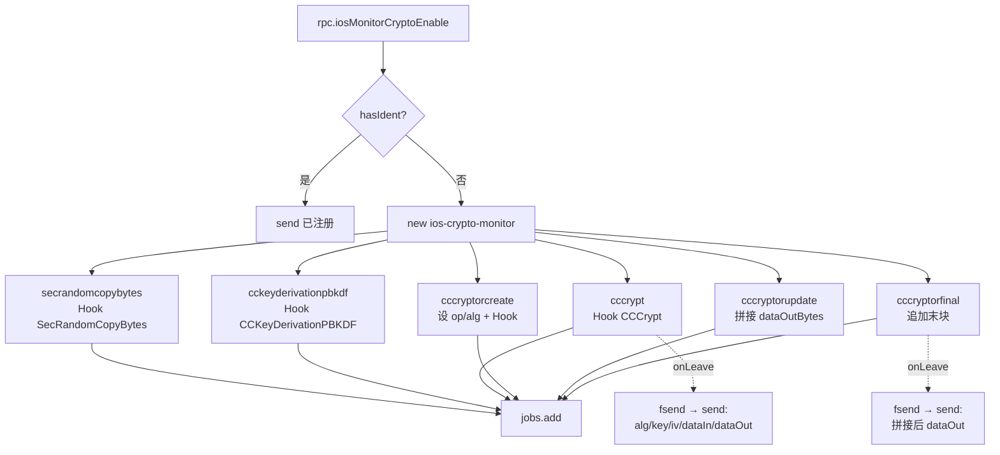

# Crypto 监控 <code>agent/src/ios/crypto.ts</code>

`crypto.ts` 在 iOS 目标进程里 Hook CommonCrypto 与 BoringSSL 相关的 6 个 C 函数，监控随机数生成、PBKDF2 派生、单步 `CCCrypt` 与分步 `CCCryptorCreate/Update/Final` 加解密流程，捕获算法、密钥、IV、明文/密文。通过 `iosMonitorCryptoEnable` RPC 一次性挂上全部 Hook，结果以 `send()` 异步事件回传。

## 📋 模块概览
| 项目 | 值 |
| --- | --- |
| 文件路径 | `agent/src/ios/crypto.ts` |
| 平台 | iOS |
| 导出 RPC | `iosMonitorCryptoEnable` |
| 依赖 | `lib/color.ts`、`lib/helpers.ts`、`lib/jobs.ts`、`ios/lib/helpers.ts` |

## 🎯 解决的问题
- 还原 App 使用的对称加密算法（AES/DES/3DES/CAST/RC4/RC2）、操作方向（加/解密）、padding/模式。
- 捕获密钥、IV、明文输入、密文输出，定位硬编码密钥与弱算法。
- 监听 `SecRandomCopyBytes` 随机数与 `CCKeyDerivationPBKDF` 派生参数（password/salt/rounds/prf/derivedKey）。
- 把分步 `CCCryptorCreate → Update → Final` 的多段输出拼接还原完整明文/密文。

## 🏗️ 导出的 RPC 方法
| RPC 名 | 说明 |
| --- | --- |
| `iosMonitorCryptoEnable` | 注册一个 `ios-crypto-monitor` 任务，挂 6 个 Hook |

### `rpc.iosMonitorCryptoEnable` — 注册监控任务
源码：[`agent/src/ios/crypto.ts:342`](https://github.com/android-security-engineer/objection-skills/blob/master/agent/src/ios/crypto.ts#L342)

`monitor()` 先查 `jobs.hasIdent` 防重，再建 `ios-crypto-monitor` 任务，依次把 6 个 `Interceptor.attach` 结果加入任务：
```ts
// agent/src/ios/crypto.ts:342-361
export const monitor = (): void => {
  if (jobs.hasIdent(cryptoidentifier)) {
    send(`${c.greenBright("Job already registered")}: ${c.blueBright(cryptoidentifier.toString())}`);
    return;
  }
  const job: jobs.Job = new jobs.Job(jobs.identifier(), "ios-crypto-monitor");
  cryptoidentifier = job.identifier;
  job.addInvocation(secrandomcopybytes(job.identifier));
  job.addInvocation(cckeyderivationpbkdf(job.identifier));
  job.addInvocation(cccrypt(job.identifier));
  job.addInvocation(cccryptorcreate(job.identifier));
  job.addInvocation(cccryptorupdate(job.identifier));
  job.addInvocation(cccryptorfinal(job.identifier));
  jobs.add(job);
};
```

### `cccrypt` — 单步加解密
源码：[`agent/src/ios/crypto.ts:150`](https://github.com/android-security-engineer/objection-skills/blob/master/agent/src/ios/crypto.ts#L150)

Hook `CCCrypt`，`onEnter` 里按 11 个参数位置读取 op/alg/options/key/iv/dataIn，`onLeave` 读 `dataOut`。解密输出转字符串、加密输出留 hex：
```ts
// agent/src/ios/crypto.ts:159-194
this.op = args[0].toInt32();
this.cccrpyt.op = CCOperation[this.op];
this.alg = args[1].toInt32();
this.cccrpyt.alg = CCAlgorithm[alg].name;
this.cccrpyt.options = CCOption[args[2].toInt32()];
const key = args[3];
this.cccrpyt.keyLength = args[4].toInt32();
this.cccrpyt.key = arrayBufferToHex(key.readByteArray(this.cccrpyt.keyLength));
const iv = args[5];
this.cccrpyt.iv = arrayBufferToHex(iv.readByteArray(CCAlgorithm[alg].blocksize));
// ...
this.cccrpyt.dataIn = this.op ? dataInHex : hexToString(dataInHex);
```
`onLeave` 中 `dataOut` 同样按 op 决定 hex/字符串（`:212-216`）。

### `cccryptorupdate` + `cccryptorfinal` — 分步拼接
源码：[`agent/src/ios/crypto.ts:267`](https://github.com/android-security-engineer/objection-skills/blob/master/agent/src/ios/crypto.ts#L267)、`:310`

分步加密时单次 `Update` 只产出一个 block 的输出，模块用模块级变量 `dataOutBytes` 把 `Update` 与后续 `Final` 的输出拼接。`Update` 在输入长于一个 block 时截断 padding（hacky，源码注释 `:299-301`），`Final` 把末块追加：
```ts
// agent/src/ios/crypto.ts:331-337
dataOutBytes += arrayBufferToHex(this.dataOutPtr.readByteArray(this.dataOutAvailable));
this.cccryptorfinal.dataOut = this.op ? hexToString(dataOutBytes) : dataOutBytes;
```
`op` / `alg` 由 `CCCryptorCreate` 在 `:230-235` 写入模块级变量，跨调用共享。

### `cckeyderivationpbkdf` — PBKDF2 派生
源码：[`agent/src/ios/crypto.ts:96`](https://github.com/android-security-engineer/objection-skills/blob/master/agent/src/ios/crypto.ts#L96)

Hook `CCKeyDerivationPBKDF`，`onEnter` 读 password/salt/prf/rounds/derivedKey 指针，`onLeave` 读派生出的密钥。password 先尝试 `hexToString` 还原为可读文本，失败则留 hex（`:117-121`）。

### `secrandomcopybytes` — 随机数
源码：[`agent/src/ios/crypto.ts:76`](https://github.com/android-security-engineer/objection-skills/blob/master/agent/src/ios/crypto.ts#L76)

Hook `SecRandomCopyBytes`，记录 count 与生成的随机字节 hex（`:88-89`）。



## ⚙️ 实现要点
- **Frida < 16.7 兼容**：`Module.getGlobalExportByName` 在老版本不存在，运行时打补丁回退到 `getExportByName`（`:70-74`），其余 Hook 全部经此统一入口拿函数地址。
- **算法常量表**：`CCAlgorithm` 表带 `blocksize`，供 `CCCryptorCreate` 与 `CCCrypt` 读 IV 长度、供 `Update` 判断是否多 block（`:18-25`）。
- **模块级状态跨调用**：`op`、`alg`、`dataOutBytes` 是模块级变量，`Create` 写入后 `Update`/`Final` 复用，前提是同一 `Cryptor` 的调用顺序固定；源码注释承认多 block padding 处理 hacky（`:299-301`）。
- **异步消息**：每个 Hook 的 `onLeave` 调 `fsend(ident, hook, payload)`，经 `lib/helpers.ts` 带任务 id 与 hook 名格式化后 `send()` 给 Python 侧。

## 🔍 源码索引
| 符号 | 位置 |
| --- | --- |
| `secrandomcopybytes` | [`agent/src/ios/crypto.ts:76`](https://github.com/android-security-engineer/objection-skills/blob/master/agent/src/ios/crypto.ts#L76) |
| `cckeyderivationpbkdf` | [`agent/src/ios/crypto.ts:96`](https://github.com/android-security-engineer/objection-skills/blob/master/agent/src/ios/crypto.ts#L96) |
| `cccrypt` | [`agent/src/ios/crypto.ts:150`](https://github.com/android-security-engineer/objection-skills/blob/master/agent/src/ios/crypto.ts#L150) |
| `cccryptorcreate` | [`agent/src/ios/crypto.ts:221`](https://github.com/android-security-engineer/objection-skills/blob/master/agent/src/ios/crypto.ts#L221) |
| `cccryptorupdate` | [`agent/src/ios/crypto.ts:267`](https://github.com/android-security-engineer/objection-skills/blob/master/agent/src/ios/crypto.ts#L267) |
| `cccryptorfinal` | [`agent/src/ios/crypto.ts:310`](https://github.com/android-security-engineer/objection-skills/blob/master/agent/src/ios/crypto.ts#L310) |
| `monitor` | [`agent/src/ios/crypto.ts:342`](https://github.com/android-security-engineer/objection-skills/blob/master/agent/src/ios/crypto.ts#L342) |

## 🔗 相关文档
- [Frida 与 Agent](/guide/frida-agent)
- [RPC 通信机制](/guide/rpc)
- 任务管理：[`/reference/agent/lib/jobs`](/reference/agent/lib/jobs)
- 命令文档：[/reference/commands/ios/monitor](/reference/commands/ios/monitor)
