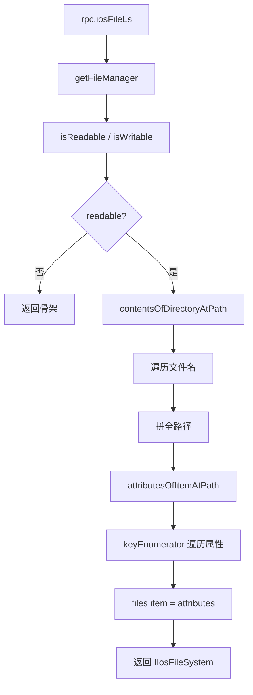

# 文件系统 <code>agent/src/ios/filesystem.ts</code>

`filesystem.ts` 在 iOS 目标进程里封装 `NSFileManager` 与 `frida-fs`，提供 `pwd / ls / exists / readable / writable / readFile / writeFile / deleteFile / pathIsFile` 一组文件操作，分别对应 9 个 RPC 方法。它是 objection `ios fs` 子命令集的运行时实现。

## 📋 模块概览
| 项目 | 值 |
| --- | --- |
| 文件路径 | `agent/src/ios/filesystem.ts` |
| 平台 | iOS |
| 导出 RPC | `iosFileCwd`、`iosFileLs`、`iosFileExists`、`iosFileReadable`、`iosFileWritable`、`iosFilePathIsFile`、`iosFileDownload`、`iosFileUpload`、`iosFileDelete` |
| 依赖 | `frida-fs`、`buffer`、`lib/helpers.ts`、`ios/lib/helpers.ts`、`ios/lib/interfaces.ts`、`ios/lib/types.ts` |

## 🎯 解决的问题
- 在沙盒内列出目录、判断读写权限、读取/写入/删除文件，支撑 `ios fs ls/cp/rm/cat` 等命令。
- `pwd` 以 `NSBundle.mainBundle().bundlePath()` 作为起点，给 Python 侧提供默认工作目录。
- `ls` 不仅列文件名，还附带每项的 `NSFileManager.attributesOfItemAtPath` 属性与读写权限。
- `readFile`/`writeFile` 走 `frida-fs` 直接读写磁盘，支持二进制，用于下载 App 数据库、plist 等文件。

## 🏗️ 导出的 RPC 方法
| RPC 名 | 说明 |
| --- | --- |
| `iosFileCwd` | 返回 mainBundle bundlePath 作为默认 pwd |
| `iosFileLs` | 列目录，返回 `IIosFileSystem`（含读写权限 + 每文件属性） |
| `iosFileExists` | `fileExistsAtPath:` 判断 |
| `iosFileReadable` / `iosFileWritable` | `isReadableFileAtPath:` / `isWritableFileAtPath:` |
| `iosFilePathIsFile` | 通过 `isDir` 指针判断是文件还是目录 |
| `iosFileDownload` | `frida-fs.readFileSync` 读文件返回 Buffer |
| `iosFileUpload` | `frida-fs.createWriteStream` 写入 hex 还原的字节 |
| `iosFileDelete` | `removeItemAtPath:error:` 删除 |

### `rpc.iosFileLs` — 带属性的目录列举
源码：[`agent/src/ios/filesystem.ts:121`](https://github.com/android-security-engineer/objection-skills/blob/master/agent/src/ios/filesystem.ts#L121)

`ls` 先建响应骨架并填入当前目录读写权限，不可读则早退；可读时 `contentsOfDirectoryAtPath:error:` 取文件名数组，逐项拼全路径再取属性：
```ts
// agent/src/ios/filesystem.ts:137-148
const response: IIosFileSystem = {
  files: {},
  path: `${path}`,
  readable: fm.isReadableFileAtPath_(p),
  writable: fm.isWritableFileAtPath_(p),
};
if (!response.readable) { return response; }
const pathContents: NSDictionary = fm.contentsOfDirectoryAtPath_error_(path, NULL);
const fileCount: number = pathContents.count();
```
属性字典用 `keyEnumerator` 遍历，全部 `toString()` 存入 `pathFileData.attributes`（`:181-190`）。

### `rpc.iosFileDownload` / `iosFileUpload` — frida-fs 读写
源码：[`agent/src/ios/filesystem.ts:92`](https://github.com/android-security-engineer/objection-skills/blob/master/agent/src/ios/filesystem.ts#L92)、`:99`

读走 `frida-fs.statSync` 判空后 `readFileSync`，0 字节文件返回空 `Buffer`：
```ts
// agent/src/ios/filesystem.ts:92-96
export const readFile = (path: string): string | Buffer => {
  if (fs.statSync(path).size == 0) return Buffer.alloc(0);
  return fs.readFileSync(path);
};
```
写走 `createWriteStream`，Python 侧传 hex，`hexStringToBytes` 还原为字节后写入（`:99-108`）。

### `rpc.iosFilePathIsFile` — isDir 指针解引用
源码：[`agent/src/ios/filesystem.ts:67`](https://github.com/android-security-engineer/objection-skills/blob/master/agent/src/ios/filesystem.ts#L67)

`fileExistsAtPath:isDirectory:` 的第二参数是 `BOOL*`，模块 `Memory.alloc` 一个指针传入，再 `readInt()` 解引用判断是否目录（`*isDir === 1` 表示目录，故 `readInt() === 0` 即文件）：
```ts
// agent/src/ios/filesystem.ts:70-75
const isDir: NativePointer = Memory.alloc(Process.pointerSize);
fm.fileExistsAtPath_isDirectory_(path, isDir);
return isDir.readInt() === 0;
```



## ⚙️ 实现要点
- **NSFileManager 单例缓存**：`fileManager` 为模块级变量，首次 `getFileManager()` 经 `getNSFileManager()`（`ios/lib/helpers.ts:131`）取 `defaultManager()`，之后复用（`:20-27`）。
- **frida-fs 做重活**：`readFile/writeFile` 不走 `NSFileManager`，直接用 `frida-fs` 的同步流，绕过 ObjC 桥的开销，支持任意二进制。
- **BOOL* 参数处理**：`pathIsFile` 与 `deleteFile` 都用 `Memory.alloc(Process.pointerSize)` 接收 `BOOL*`/`NSError**` 出参，再 `readInt()` 解引用（`:70-75`、`:113-118`）。
- **NSString 桥接**：路径字符串经 `ObjC.classes.NSString.stringWithString_(path)` 转 `NSString` 再传给 `NSFileManager`（`:38-40` 等）。

## 🔍 源码索引
| 符号 | 位置 |
| --- | --- |
| `getFileManager` | [`agent/src/ios/filesystem.ts:20`](https://github.com/android-security-engineer/objection-skills/blob/master/agent/src/ios/filesystem.ts#L20) |
| `exists` | [`agent/src/ios/filesystem.ts:29`](https://github.com/android-security-engineer/objection-skills/blob/master/agent/src/ios/filesystem.ts#L29) |
| `readable` | [`agent/src/ios/filesystem.ts:43`](https://github.com/android-security-engineer/objection-skills/blob/master/agent/src/ios/filesystem.ts#L43) |
| `writable` | [`agent/src/ios/filesystem.ts:55`](https://github.com/android-security-engineer/objection-skills/blob/master/agent/src/ios/filesystem.ts#L55) |
| `pathIsFile` | [`agent/src/ios/filesystem.ts:67`](https://github.com/android-security-engineer/objection-skills/blob/master/agent/src/ios/filesystem.ts#L67) |
| `pwd` | [`agent/src/ios/filesystem.ts:82`](https://github.com/android-security-engineer/objection-skills/blob/master/agent/src/ios/filesystem.ts#L82) |
| `readFile` | [`agent/src/ios/filesystem.ts:92`](https://github.com/android-security-engineer/objection-skills/blob/master/agent/src/ios/filesystem.ts#L92) |
| `writeFile` | [`agent/src/ios/filesystem.ts:99`](https://github.com/android-security-engineer/objection-skills/blob/master/agent/src/ios/filesystem.ts#L99) |
| `deleteFile` | [`agent/src/ios/filesystem.ts:110`](https://github.com/android-security-engineer/objection-skills/blob/master/agent/src/ios/filesystem.ts#L110) |
| `ls` | [`agent/src/ios/filesystem.ts:121`](https://github.com/android-security-engineer/objection-skills/blob/master/agent/src/ios/filesystem.ts#L121) |

## 🔗 相关文档
- [Frida 与 Agent](/guide/frida-agent)
- [RPC 通信机制](/guide/rpc)
- 辅助函数：[`helpers.md`](/reference/agent/ios/lib/helpers)
- 命令文档：[/reference/commands/filemanager](/reference/commands/filemanager)
