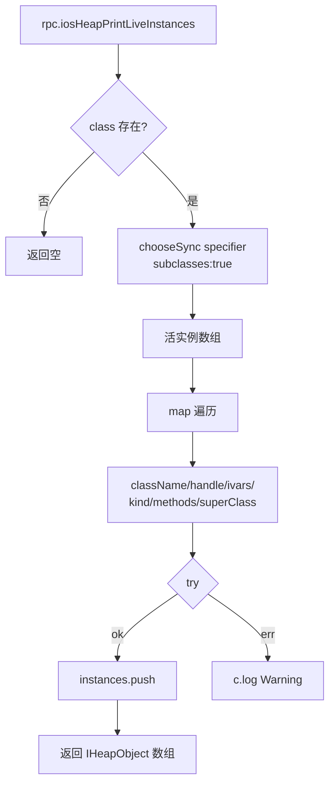

# 堆对象探查 <code>agent/src/ios/heap.ts</code>

`heap.ts` 在 iOS 目标进程里枚举 ObjC 类的活实例、按指针解析对象、dump ivar / 方法、调用实例方法、在对象上下文里 `eval` JS。它支撑 objection 的 `ios heap inspect` 系列命令，是运行时对象级分析的核心。

## 📋 模块概览
| 项目 | 值 |
| --- | --- |
| 文件路径 | `agent/src/ios/heap.ts` |
| 平台 | iOS |
| 导出 RPC | `iosHeapPrintLiveInstances`、`iosHeapPrintIvars`、`iosHeapPrintMethods`、`iosHeapExecMethod`、`iosHeapEvaluateJs` |
| 依赖 | `ios/lib/libobjc.ts`、`frida-objc-bridge`、`lib/color.ts`、`ios/lib/helpers.ts`、`ios/lib/interfaces.ts` |

## 🎯 解决的问题
- 在堆上找出某 ObjC 类（含子类）的全部活实例，用于定位持有敏感数据的对象（如 `NSURLSession`、自定义 model）。
- 给定一个对象指针，dump 它的实例变量、方法、类名，无需符号文件。
- 在目标对象上下文里直接调用其方法或 `eval` JS，做运行时交互式探索。

## 🏗️ 导出的 RPC 方法
| RPC 名 | 说明 |
| --- | --- |
| `iosHeapPrintLiveInstances` | `ObjC.chooseSync` 枚举类（含子类）活实例 |
| `iosHeapPrintIvars` | 解析指针，返回类名 + ivar 字典（可选 UTF8 转换） |
| `iosHeapPrintMethods` | 解析指针，返回类名 + `$ownMethods` |
| `iosHeapExecMethod` | 在对象上调用指定方法，可选返回字符串 |
| `iosHeapEvaluateJs` | 在对象上下文 `eval` 任意 JS |

### `rpc.iosHeapPrintLiveInstances` — 枚举活实例
源码：[`agent/src/ios/heap.ts:22`](https://github.com/android-security-engineer/objection-skills/blob/master/agent/src/ios/heap.ts#L22)

`enumerateInstances` 用 `ObjC.chooseSync` 配合 `DetailedChooseSpecifier`（`subclasses: true`）抓子类实例，每个实例取 `$className / handle / $ivars / $kind / $ownMethods / $superClass`：
```ts
// agent/src/ios/heap.ts:8-19
const specifier: ObjCTypes.DetailedChooseSpecifier = {
  class: ObjC.classes[clazz],
  subclasses: true,
};
return ObjC.chooseSync(specifier);
```
实例信息在 `:27-36` 装配为 `IHeapObject`，单实例出错用 try/catch 跳过。

### `rpc.iosHeapPrintIvars` — 指针解析 + ivar dump
源码：[`agent/src/ios/heap.ts:52`](https://github.com/android-security-engineer/objection-skills/blob/master/agent/src/ios/heap.ts#L52)

`resolvePointer` 用 `new ObjC.Object(new NativePointer(pointer))` 把字符串指针还原为 ObjC 对象。`toUTF8` 为真时克隆 ivar 字典，逐项用 `bytesToUTF8` 转字符串（避免直接改 `$ivars` 的访问错误）：
```ts
// agent/src/ios/heap.ts:59-69
if (toUTF8) {
  const $clonedIvars: {[name: string]: any} = {};
  for (const k in $ivars) {
    if ($ivars.hasOwnProperty(k)) {
      $clonedIvars[k] = bytesToUTF8($ivars[k]);
    }
  }
  return [$className, $clonedIvars];
}
```

### `rpc.iosHeapExecMethod` — 调用实例方法
源码：[`agent/src/ios/heap.ts:80`](https://github.com/android-security-engineer/objection-skills/blob/master/agent/src/ios/heap.ts#L80)

直接 `i[method]()` 调用对象方法，`returnString` 为真时把返回值 `toString()`：
```ts
// agent/src/ios/heap.ts:84-89
const result = i[method]();
if (returnString) { return result.toString(); }
return i[method]();
```

### `rpc.iosHeapEvaluateJs` — 对象上下文 eval
源码：[`agent/src/ios/heap.ts:92`](https://github.com/android-security-engineer/objection-skills/blob/master/agent/src/ios/heap.ts#L92)

`resolvePointer` 后 `eval(js)`，`ptr` 变量在 eval 作用域内可见，可写 `ptr.$ivars.foo` 等表达式（`:93-95`，带 `no-eval` tslint 注释）。



## ⚙️ 实现要点
- **chooseSync 含子类**：`subclasses: true` 确保抓到目标类及其子类的实例，不漏派生类（`:17`）。
- **指针解析共享**：`getIvars / getMethods / callInstanceMethod / evaluate` 都经 `resolvePointer` 把字符串指针转 `ObjC.Object`，统一打印类名（`:45-50`）。
- **ivars 转码容错**：`bytesToUTF8`（`ios/lib/helpers.ts:98`）处理 NSData 类 ivar，转成可读 UTF8；不转码时直接返回 `$ivars` 原始对象，由 Python 侧自行处理。
- **类不存在早退**：`enumerateInstances` 检查 `hasOwnProperty`，未知类返回空数组并 `c.log` 警告（`:9-12`）。

## 🔍 源码索引
| 符号 | 位置 |
| --- | --- |
| `enumerateInstances` | [`agent/src/ios/heap.ts:8`](https://github.com/android-security-engineer/objection-skills/blob/master/agent/src/ios/heap.ts#L8) |
| `getInstances` | [`agent/src/ios/heap.ts:22`](https://github.com/android-security-engineer/objection-skills/blob/master/agent/src/ios/heap.ts#L22) |
| `resolvePointer` | [`agent/src/ios/heap.ts:45`](https://github.com/android-security-engineer/objection-skills/blob/master/agent/src/ios/heap.ts#L45) |
| `getIvars` | [`agent/src/ios/heap.ts:52`](https://github.com/android-security-engineer/objection-skills/blob/master/agent/src/ios/heap.ts#L52) |
| `getMethods` | [`agent/src/ios/heap.ts:75`](https://github.com/android-security-engineer/objection-skills/blob/master/agent/src/ios/heap.ts#L75) |
| `callInstanceMethod` | [`agent/src/ios/heap.ts:80`](https://github.com/android-security-engineer/objection-skills/blob/master/agent/src/ios/heap.ts#L80) |
| `evaluate` | [`agent/src/ios/heap.ts:92`](https://github.com/android-security-engineer/objection-skills/blob/master/agent/src/ios/heap.ts#L92) |

## 🔗 相关文档
- [Frida 与 Agent](/guide/frida-agent)
- [RPC 通信机制](/guide/rpc)
- 辅助函数：[`helpers.md`](/reference/agent/ios/lib/helpers)
- 命令文档：[/reference/commands/ios/heap](/reference/commands/ios/heap)
