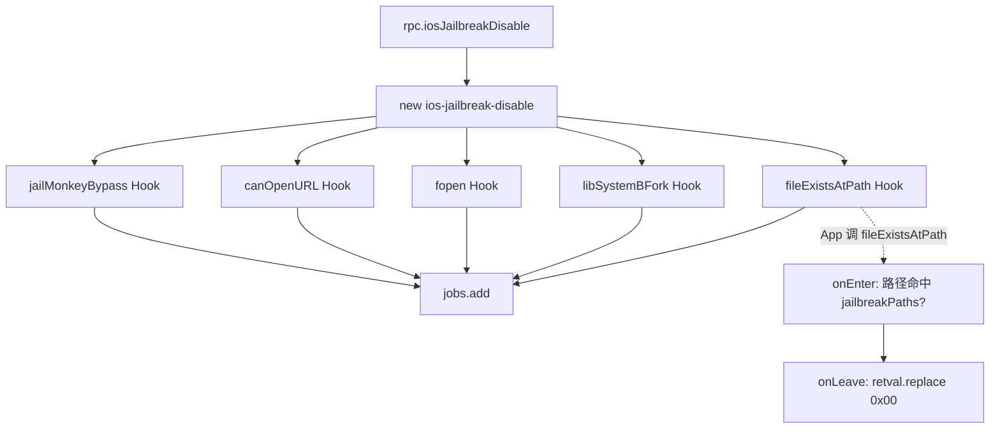

# 越狱检测对抗 <code>agent/src/ios/jailbreak.ts</code>

`jailbreak.ts` 在 iOS 目标进程里 Hook `NSFileManager.fileExistsAtPath:`、`fopen`、`UIApplication.canOpenURL:`、`libSystem.B.dylib::fork` 以及 `JailMonkey.isJailBroken`，对一组常见越狱路径与 Cydia 深链翻转返回值。`disable()` 让检测"看起来没越狱"，`enable()` 反向恢复。两个 RPC 对应开关。

## 📋 模块概览
| 项目 | 值 |
| --- | --- |
| 文件路径 | `agent/src/ios/jailbreak.ts` |
| 平台 | iOS |
| 导出 RPC | `iosJailbreakDisable`、`iosJailbreakEnable` |
| 依赖 | `ios/lib/libobjc.ts`、`lib/color.ts`、`lib/jobs.ts` |

## 🎯 解决的问题
- App 用 `fileExistsAtPath:` 探测 `/Applications/Cydia.app` 等越狱路径，模块把这些探测的返回值改成"不存在"。
- `fopen` 探测 `/bin/bash`、`/usr/bin/ssh` 等，同样翻转。
- `canOpenURL:` 探测 `cydia://` 深链，翻转避免被识别。
- `fork()` 探测与 `JailMonkey.isJailBroken` 第三方库检测一并处理。
- `enable` 反向把"失败"翻转成"成功"，用于在非越狱设备上模拟越狱环境做测试。

## 🏗️ 导出的 RPC 方法
| RPC 名 | 说明 |
| --- | --- |
| `iosJailbreakDisable` | 注册 `ios-jailbreak-disable` 任务，5 个 Hook 翻转检测为"未越狱" |
| `iosJailbreakEnable` | 注册 `ios-jailbreak-enable` 任务，反向翻转检测为"已越狱" |

### `rpc.iosJailbreakDisable` — 注册一组翻转 Hook
源码：[`agent/src/ios/jailbreak.ts:308`](https://github.com/android-security-engineer/objection-skills/blob/master/agent/src/ios/jailbreak.ts#L308)

`disable()` 建一个任务，依次挂 5 个 Hook（`success=false` 表示把成功探测改成失败）：
```ts
// agent/src/ios/jailbreak.ts:308-318
export const disable = (): void => {
  const job: jobs.Job = new jobs.Job(jobs.identifier(), "ios-jailbreak-disable");
  job.addInvocation(fileExistsAtPath(false, job.identifier));
  job.addInvocation(libSystemBFork(false, job.identifier));
  job.addInvocation(fopen(false, job.identifier));
  job.addInvocation(canOpenURL(false, job.identifier));
  job.addInvocation(jailMonkeyBypass(false, job.identifier));
  jobs.add(job);
};
```
`enable()` 结构相同，传入 `true`（`:320-330`）。

### `fileExistsAtPath` — 路径探测翻转
源码：[`agent/src/ios/jailbreak.ts:52`](https://github.com/android-security-engineer/objection-skills/blob/master/agent/src/ios/jailbreak.ts#L52)

Hook `-[NSFileManager fileExistsAtPath:]`，`onEnter` 取 args[2] 路径字符串，若命中 `jailbreakPaths` 列表则标记 `is_common_path`，`onLeave` 按 `success` 翻转 `retval`：
```ts
// agent/src/ios/jailbreak.ts:63-70
this.path = new ObjC.Object(args[2]).toString();
if (jailbreakPaths.indexOf(this.path) >= 0) {
  this.is_common_path = true;
}
```
`onLeave` 中 `success=false` 时把非空 retval 改成 0（`:96-108`），`success=true` 时把空 retval 改成 1（`:82-94`）。

### `canOpenURL` — Cydia 深链翻转
源码：[`agent/src/ios/jailbreak.ts:191`](https://github.com/android-security-engineer/objection-skills/blob/master/agent/src/ios/jailbreak.ts#L191)

Hook `-[UIApplication canOpenURL:]`，按 `cydia` / `Cydia` 前缀判断是否目标深链（`:202-204`），命中则按 `success` 翻转 retval。

### `jailMonkeyBypass` — 第三方库特判
源码：[`agent/src/ios/jailbreak.ts:294`](https://github.com/android-security-engineer/objection-skills/blob/master/agent/src/ios/jailbreak.ts#L294)

针对 Gantix JailMonkey 库，直接 Hook `-[JailMonkey isJailBroken]`，`onLeave` 强制 `retval.replace(0x00)`（`:298-305`）。类不存在返回 `null`，由 `addInvocation` 跳过。



## ⚙️ 实现要点
- **onEnter 标记 + onLeave 翻转**：不在 `onEnter` 改返回值，而是用 `this.is_common_path` 标记，`onLeave` 据此决定是否 `retval.replace`，避免对非目标路径的误伤。
- **硬编码路径表**：`jailbreakPaths`（`:14-48`）覆盖 Cydia、MobileSubstrate、apt、ssh、cycript 等常见越狱痕迹。
- **fopen 兼容老 Frida**：`Module.findGlobalExportByName` 在 Frida < 16.7 不存在，运行时打补丁回退（`:120-124`），找不到 `fopen` 导出时返回 `null` 跳过。
- **libSystem.B.dylib::fork**：`Process.findModuleByName("libSystem.B.dylib").findExportByName("fork")` 定位，找不到返回 `null`（`:251-255`）。
- **翻转值**：`success=true` → `replace(0x01)`，`success=false` → `replace(0x00)`，对应 BOOL 的 YES/NO。

## 🔍 源码索引
| 符号 | 位置 |
| --- | --- |
| `jailbreakPaths` | [`agent/src/ios/jailbreak.ts:14`](https://github.com/android-security-engineer/objection-skills/blob/master/agent/src/ios/jailbreak.ts#L14) |
| `fileExistsAtPath` | [`agent/src/ios/jailbreak.ts:52`](https://github.com/android-security-engineer/objection-skills/blob/master/agent/src/ios/jailbreak.ts#L52) |
| `fopen` | [`agent/src/ios/jailbreak.ts:117`](https://github.com/android-security-engineer/objection-skills/blob/master/agent/src/ios/jailbreak.ts#L117) |
| `canOpenURL` | [`agent/src/ios/jailbreak.ts:191`](https://github.com/android-security-engineer/objection-skills/blob/master/agent/src/ios/jailbreak.ts#L191) |
| `libSystemBFork` | [`agent/src/ios/jailbreak.ts:248`](https://github.com/android-security-engineer/objection-skills/blob/master/agent/src/ios/jailbreak.ts#L248) |
| `jailMonkeyBypass` | [`agent/src/ios/jailbreak.ts:294`](https://github.com/android-security-engineer/objection-skills/blob/master/agent/src/ios/jailbreak.ts#L294) |
| `disable` | [`agent/src/ios/jailbreak.ts:308`](https://github.com/android-security-engineer/objection-skills/blob/master/agent/src/ios/jailbreak.ts#L308) |
| `enable` | [`agent/src/ios/jailbreak.ts:320`](https://github.com/android-security-engineer/objection-skills/blob/master/agent/src/ios/jailbreak.ts#L320) |

## 🔗 相关文档
- [Frida 与 Agent](/guide/frida-agent)
- [RPC 通信机制](/guide/rpc)
- 任务管理：[`/reference/agent/lib/jobs`](/reference/agent/lib/jobs)
- 命令文档：[/reference/commands/ios/jailbreak](/reference/commands/ios/jailbreak)
