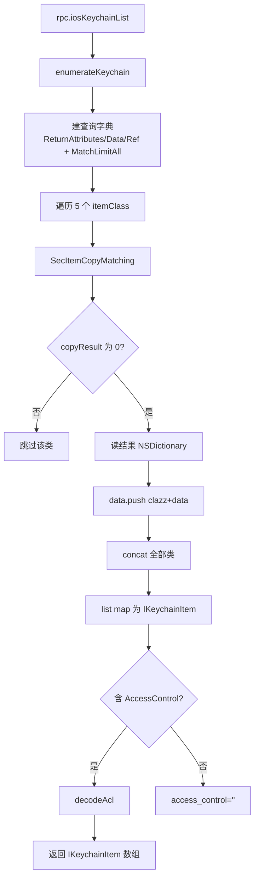

# Keychain 操作 <code>agent/src/ios/keychain.ts</code>

`keychain.ts` 在 iOS 目标进程里通过 `SecItemCopyMatching / SecItemAdd / SecItemUpdate / SecItemDelete` 对 Keychain 做 CRUD，枚举 5 类条目（Key/Identity/Certificate/GenericPassword/InternetPassword）并解码 ACL 约束。它支撑 objection `ios keychain` 全部子命令。

## 📋 模块概览
| 项目 | 值 |
| --- | --- |
| 文件路径 | `agent/src/ios/keychain.ts` |
| 平台 | iOS |
| 导出 RPC | `iosKeychainList`、`iosKeychainListRaw`、`iosKeychainAdd`、`iosKeychainRemove`、`iosKeychainUpdate`、`iosKeychainEmpty` |
| 依赖 | `lib/color.ts`、`lib/helpers.ts`、`ios/lib/constants.ts`、`ios/lib/helpers.ts`、`ios/lib/interfaces.ts`、`ios/lib/libobjc.ts`、`ios/lib/types.ts` |

## 🎯 解决的问题
- dump 当前 App 可访问的全部 Keychain 条目，解码 account/service/data/ACL/accessible 属性等 20+ 字段。
- 区分 5 类条目，GenericPassword/InternetPassword 取明文 data，Key 类不显示数据。
- 支持新增/删除/更新 GenericPassword 条目，用于凭据注入与清理。
- 解码 `SecAccessControlGetConstraints` 返回的未文档化 ACL 字典，输出 `kSecAccessControlUserPresence` 等可读标志。

## 🏗️ 导出的 RPC 方法
| RPC 名 | 说明 |
| --- | --- |
| `iosKeychainList` | dump 全部条目为 `IKeychainItem[]`，`smartDecode` 控制是否智能解码 data |
| `iosKeychainListRaw` | 用 Frida 原生 `c.log` 打印每条原始对象 |
| `iosKeychainAdd` | 新增 GenericPassword 条目 |
| `iosKeychainRemove` | 按 account+service 删除全部类条目 |
| `iosKeychainUpdate` | 按 account+service 更新 GenericPassword 数据 |
| `iosKeychainEmpty` | 清空全部类条目 |

### `rpc.iosKeychainList` — 枚举 + 解码
源码：`agent/src/ios/keychain.ts:130`

`enumerateKeychain` 建查询字典（`kSecReturnAttributes/Data/Ref = True`、`kSecMatchLimitAll`、`kSecAttrSynchronizableAny`），对 5 类 `itemClasses` 逐类调 `SecItemCopyMatching`：
```ts
// agent/src/ios/keychain.ts:78-92
const searchDictionary: NSMutableDictionaryType = ObjC.classes.NSMutableDictionary.alloc().init();
searchDictionary.setObject_forKey_(kCFBooleanTrue, kSec.kSecReturnAttributes);
searchDictionary.setObject_forKey_(kCFBooleanTrue, kSec.kSecReturnData);
searchDictionary.setObject_forKey_(kCFBooleanTrue, kSec.kSecReturnRef);
searchDictionary.setObject_forKey_(kSec.kSecMatchLimitAll, kSec.kSecMatchLimit);
searchDictionary.setObject_forKey_(kSec.kSecAttrSynchronizableAny, kSec.kSecAttrSynchronizable);
// ...
const copyResult: NativePointer = libObjc.SecItemCopyMatching(searchDictionary, resultsPointer);
```
`list` 把每条结果映射成 `IKeychainItem`，`data` 字段对 Key 类返回 `(Key data not displayed)`，其余按 `smartDecode` 选 `smartDataToString` 或 `bytesToUTF8`（`:143-147`），并附 `dataHex`。

### `decodeAcl` — ACL 约束解码
源码：`agent/src/ios/keychain.ts:238`

调未文档化 `SecAccessControlGetConstraints` 拿 ACL 字典，遍历 `dacl/osgn/od/prp` 等 key，按 `cpo/cup/pkofn/cbio` 翻译成 `kSecAccessControlUserPresence` 等标志：
```ts
// agent/src/ios/keychain.ts:280-290
case "cbio":
  constraints.objectForKey_("cbio").count().valueOf() === 1 ?
    flags.push("kSecAccessControlBiometryAny") :
    flags.push("kSecAccessControlBiometryCurrentSet");
  break;
```

### `rpc.iosKeychainAdd` — SecItemAdd
源码：`agent/src/ios/keychain.ts:211`

建 `kSecClassGenericPassword` 字典，account/service/data 转 `NSData` 后 `SecItemAdd(itemDict, NULL)`，返回 `result.isNull()`（`true` 表示成功，`errSecSuccess=0`）：
```ts
// agent/src/ios/keychain.ts:229-231
const result: any = libObjc.SecItemAdd(itemDict, NULL);
return result.isNull();
```

### `rpc.iosKeychainEmpty` — SecItemDelete 全清
源码：`agent/src/ios/keychain.ts:166`

对 5 类逐类设 `kSecClass` 后 `SecItemDelete(searchDictionary)`，不指定 account/service 即全删（`:167-174`）。



## ⚙️ 实现要点
- **libObjc 代理懒加载**：`SecItemCopyMatching/Add/Update/Delete` 等原生函数经 `ios/lib/libobjc.ts` 的 `Proxy` 懒加载，首次访问才 `findExportByName`（见 `libobjc.md`）。
- **kSec 枚举字符串值**：`kSec` 枚举（`ios/lib/constants.ts`）存的是 Keychain API 内部四字符码的反查值（如 `acct`、`v_Data`），直接作为字典 key 传入。
- **kCFBooleanTrue**：用 `ObjC.classes.__NSCFBoolean.numberWithBool_(true)` 构造真值对象塞进查询字典（`:75`），避免 JS `true` 与 ObjC BOOL 不兼容。
- **smartDecode 链**：`smartDataToString`（`ios/lib/helpers.ts:54`）依次尝试 NSKeyedUnarchiver、readUtf8String、toString，处理 NSData/NSNumber/NSString/NSDate 等异构值。
- **Key 类不显示数据**：`clazz === "keys"` 时 `data` 字段返回占位字符串，避免误展示密钥材料（`:143-147`）。

## 🔍 源码索引
| 符号 | 位置 |
| --- | --- |
| `itemClasses` | `agent/src/ios/keychain.ts:29` |
| `enumerateKeychain` | `agent/src/ios/keychain.ts:39` |
| `listRaw` | `agent/src/ios/keychain.ts:122` |
| `list` | `agent/src/ios/keychain.ts:130` |
| `empty` | `agent/src/ios/keychain.ts:166` |
| `remove` | `agent/src/ios/keychain.ts:178` |
| `update` | `agent/src/ios/keychain.ts:191` |
| `add` | `agent/src/ios/keychain.ts:211` |
| `decodeAcl` | `agent/src/ios/keychain.ts:238` |

## 🔗 相关文档
- [Frida 与 Agent](/guide/frida-agent)
- [RPC 通信机制](/guide/rpc)
- 常量：[`constants.md`](/reference/agent/ios/lib/constants)
- 原生桥：[`libobjc.md`](/reference/agent/ios/lib/libobjc)
- 辅助函数：[`helpers.md`](/reference/agent/ios/lib/helpers)
- 命令文档：[/reference/commands/ios/keychain](/reference/commands/ios/keychain)
