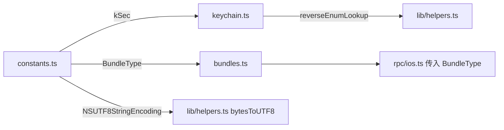

# iOS 常量 <code>agent/src/ios/lib/constants.ts</code>

`constants.ts` 定义 iOS 平台专用的枚举与标量常量：`kSec`（Keychain 属性四字符码）、`NSSearchPaths`、`NSUserDomainMask`、`NSUTF8StringEncoding`、`BundleType`。被 `keychain.ts` 与 `bundles.ts` 复用，是 iOS ObjC 桥与 Security 框架 API 之间的"魔法字符串"对照表。

## 📋 模块概览
| 项目 | 值 |
| --- | --- |
| 文件路径 | `agent/src/ios/lib/constants.ts` |
| 平台 | iOS |
| 导出 RPC | 无（常量库） |
| 依赖 | 无 |

## 🎯 解决的问题
- 把 Keychain API 内部的四字符码（如 `acct`、`v_Data`、`m_LimitAll`）集中成可读枚举，避免散落硬编码。
- 提供 `BundleType` 枚举让 `bundles.ts` 选择 `allFrameworks` / `allBundles`。
- 提供 `NSUTF8StringEncoding = 4` 给 keychain / helpers 在 NSString 转码时使用。

## 🏗️ 导出的方法
| 符号 | 说明 |
| --- | --- |
| `enum kSec` | Keychain 查询/属性 key 与 item class 的字符串值 |
| `enum NSSearchPaths` | `NSSearchPathDirectory` 枚举镜像 |
| `NSUserDomainMask` | `= 1` |
| `NSUTF8StringEncoding` | `= 4` |
| `enum BundleType` | `NSBundleFramework=1`、`NSBundleAllBundles=2` |

## ⚙️ 实现要点

`kSec` 枚举存的不是数字而是字符串，因为这些常量在 Security 框架内部就是字符串 key（通过 `NSLog` echo 得到，源码注释 `:8-10`）：
```ts
// agent/src/ios/lib/constants.ts:12-22
export enum kSec {
  kSecReturnAttributes = "r_Attributes",
  kSecReturnData = "r_Data",
  kSecReturnRef = "r_Ref",
  kSecMatchLimit = "m_Limit",
  kSecMatchLimitAll = "m_LimitAll",
  kSecClass = "class",
  kSecClassKey = "keys",
  kSecClassIdentity = "idnt",
  kSecClassCertificate = "cert",
  kSecClassGenericPassword = "genp",
  kSecClassInternetPassword = "inet",
  // ... 属性 key 继续
}
```
`keychain.ts` 把这些枚举值作为 `NSMutableDictionary` 的 key 传入 `SecItemCopyMatching` / `SecItemAdd` / `SecItemDelete` / `SecItemUpdate`（见 `keychain.ts:79-83`、`:215` 等）。`reverseEnumLookup(kSec, value)` 还能把查到的值反查为可读 key 名，用于 `accessible_attribute` 字段（`keychain.ts:135-136`）。

`BundleType` 由 `rpc/ios.ts:93-94` 在调用 `bundles.getBundles` 时固定传入：
```ts
// agent/src/ios/lib/constants.ts:100-103
export enum BundleType {
  NSBundleFramework = 1,
  NSBundleAllBundles,
}
```

## 📐 调用关系



## 🔍 源码索引
| 符号 | 位置 |
| --- | --- |
| `kSec` | `agent/src/ios/lib/constants.ts:3` |
| `NSSearchPaths` | `agent/src/ios/lib/constants.ts:80` |
| `NSUserDomainMask` | `agent/src/ios/lib/constants.ts:97` |
| `NSUTF8StringEncoding` | `agent/src/ios/lib/constants.ts:98` |
| `BundleType` | `agent/src/ios/lib/constants.ts:100` |

## 🔗 相关文档
- [Frida 与 Agent](/guide/frida-agent)
- 复用方：[`keychain.md`](/reference/agent/ios/keychain)、[`bundles.md`](/reference/agent/ios/bundles)、[`helpers.md`](/reference/agent/ios/lib/helpers)
