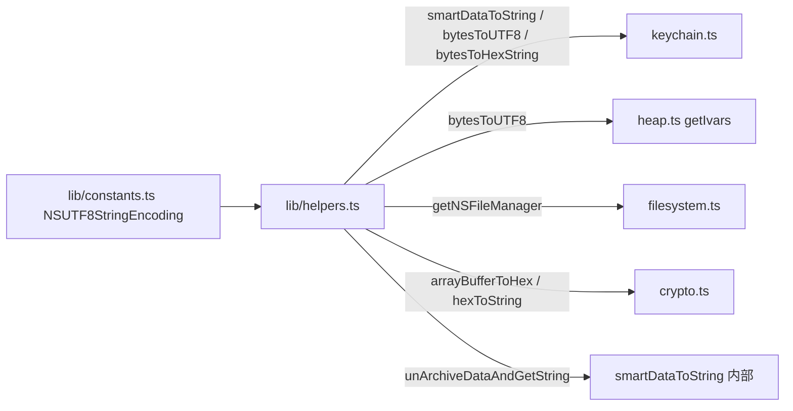

# iOS 辅助函数 <code>agent/src/ios/lib/helpers.ts</code>

`helpers.ts` 是 iOS 平台内部复用的工具函数集合，提供 NSData/NSString/NSNumber 的智能字符串解码、字节转 UTF8/hex、NSKeyedUnarchiver 反序列化、NSFileManager/NSBundle 单例获取、ArrayBuffer 与 hex 互转等能力。被 `crypto.ts`、`heap.ts`、`keychain.ts`、`filesystem.ts` 复用。

## 📋 模块概览
| 项目 | 值 |
| --- | --- |
| 文件路径 | `agent/src/ios/lib/helpers.ts` |
| 平台 | iOS |
| 导出 RPC | 无（工具库） |
| 依赖 | `ios/lib/libobjc.ts`、`ios/lib/constants.ts`、`ios/lib/types.ts`、`frida-objc-bridge` |

## 🎯 解决的问题
- 把 Keychain 里异构的 NSData/NSNumber/NSString/NSDate 值统一解码为可读字符串。
- 尝试 NSKeyedUnarchiver 反序列化归档数据，还原嵌套字典。
- 把 `NSData.bytes()` 的 ArrayBuffer 转 UTF8 字符串或 hex 字符串。
- 提供 `NSFileManager.defaultManager()` 与 `NSBundle.mainBundle()` 的单例获取入口。

## 🏗️ 导出的方法
| 符号 | 说明 |
| --- | --- |
| `smartDataToString(raw)` | 按 `$className` 分支智能解码为字符串 |
| `unArchiveDataAndGetString(data)` | NSKeyedUnarchiver 反序列化为 JSON 字符串 |
| `bytesToUTF8(data)` | NSData → UTF8 字符串 |
| `bytesToHexString(data)` | NSData → hex 字符串 |
| `getNSFileManager()` | 返回 `defaultManager()` |
| `getNSMainBundle()` | 返回 `mainBundle()` |
| `arrayBufferToHex(arrayBuffer)` | ArrayBuffer → hex |
| `hexToString(hexx)` | hex → 字符串（遇 `00` 截断） |

## ⚙️ 实现要点

`smartDataToString` 按 `$className` 分发：`__NSCFData` 先试反序列化再试 readUtf8String，`__NSCFNumber` 取 `integerValue`，字符串/日期类直接 `toString`，其余给出 `could not get string` 占位：
```ts
// agent/src/ios/lib/helpers.ts:62-91
switch (dataObject.$className) {
  case "__NSCFData":
    try {
      const unarchivedData: string = unArchiveDataAndGetString(dataObject);
      if (unarchivedData.length > 0) { return unarchivedData; }
    } catch (e) { }
    try {
      const data: string = dataObject.readUtf8String(dataObject.length());
      if (data.length > 0) { return data; }
    } catch (e) { }
  case "__NSCFNumber":
    return dataObject.integerValue();
  case "NSTaggedPointerString":
  case "__NSDate":
  case "__NSCFString":
  case "__NSTaggedDate":
    return dataObject.toString();
  default:
    return `(could not get string for class: ${dataObject.$className})`;
}
```
被 `keychain.ts:144-145` 的 `data` 字段在 `smartDecode=true` 时调用。

`bytesToUTF8` 用 `NSString.alloc().initWithBytes:length:encoding:` 把 NSData 转字符串，被 `keychain.ts` 大量复用（account/service/label 等字段）：
```ts
// agent/src/ios/lib/helpers.ts:112-119
const s: NSStringType = ObjC.classes.NSString.alloc().initWithBytes_length_encoding_(
  data.bytes(), data.length(), NSUTF8StringEncoding);
if (s) { return s.UTF8String(); }
return "";
```

`arrayBufferToHex` / `hexToString` 被 `crypto.ts` 复用：前者把 `readByteArray` 结果转 hex 给密钥/IV/密文，后者把 hex 还原为可读明文（解密输出场景，`:158-163`）。

`getNSFileManager` 被 `filesystem.ts:22` 缓存复用，`getNSMainBundle` 提供主 bundle 访问入口。

## 📐 调用关系



## 🔍 源码索引
| 符号 | 位置 |
| --- | --- |
| `unArchiveDataAndGetString` | `agent/src/ios/lib/helpers.ts:13` |
| `smartDataToString` | `agent/src/ios/lib/helpers.ts:54` |
| `bytesToUTF8` | `agent/src/ios/lib/helpers.ts:98` |
| `bytesToHexString` | `agent/src/ios/lib/helpers.ts:122` |
| `getNSFileManager` | `agent/src/ios/lib/helpers.ts:131` |
| `getNSMainBundle` | `agent/src/ios/lib/helpers.ts:136` |
| `arrayBufferToHex` | `agent/src/ios/lib/helpers.ts:141` |
| `hexToString` | `agent/src/ios/lib/helpers.ts:158` |

## 🔗 相关文档
- [Frida 与 Agent](/guide/frida-agent)
- 复用方：[`crypto.md`](/reference/agent/ios/crypto)、[`heap.md`](/reference/agent/ios/heap)、[`keychain.md`](/reference/agent/ios/keychain)、[`filesystem.md`](/reference/agent/ios/filesystem)
- 公共工具：[`/reference/agent/lib/helpers`](/reference/agent/lib/helpers)
