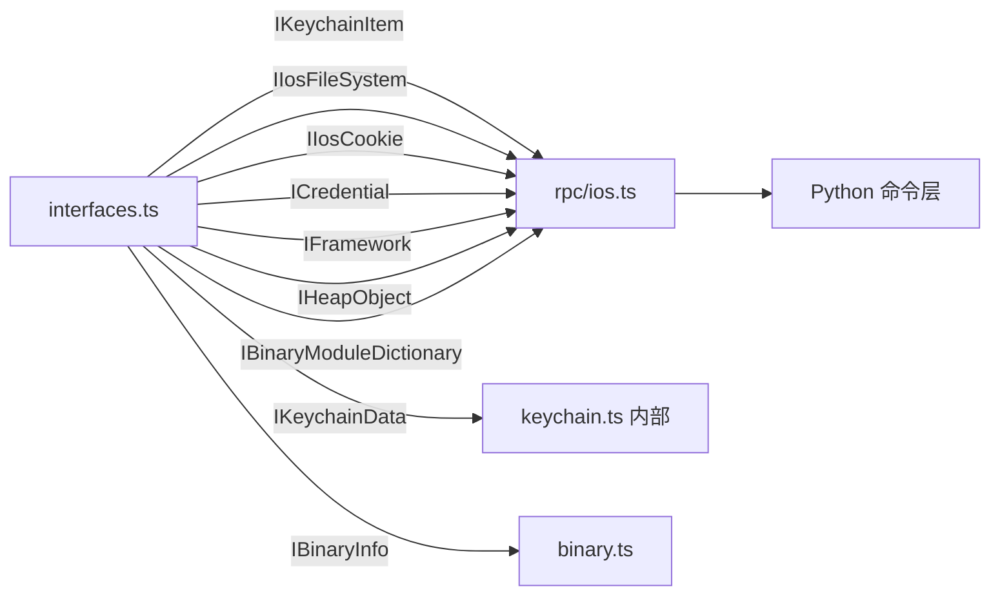

# iOS 接口定义 <code>agent/src/ios/lib/interfaces.ts</code>

`interfaces.ts` 定义 iOS 平台各模块对外交换数据的 TypeScript 接口：Keychain 条目、文件系统、Cookie、凭据、Bundle、堆对象、二进制信息。这些接口是 Agent 内部数据契约，也是 `rpc/ios.ts` 中 RPC 方法返回值的类型标注来源。

## 📋 模块概览
| 项目 | 值 |
| --- | --- |
| 文件路径 | `agent/src/ios/lib/interfaces.ts` |
| 平台 | iOS |
| 导出 RPC | 无（类型库） |
| 依赖 | `ios/lib/types.ts` |

## 🎯 解决的问题
- 给 `rpc/ios.ts` 的 RPC 返回值提供精确类型标注，便于 IDE 检查与 Python 侧序列化约定。
- 统一各数据结构字段名（如 Keychain 条目的 `account/service/data/dataHex/access_control`），避免模块间命名漂移。
- 把 ObjC 动态类型对象收窄为可序列化的纯数据结构，方便 `send()` 与 RPC 跨语言传递。

## 🏗️ 导出的方法
| 符号 | 说明 |
| --- | --- |
| `IKeychainData` | 单条 Keychain 原始结果（clazz + NSDictionary） |
| `IKeychainItem` | 解码后的 Keychain 条目（20+ 字段） |
| `IIosFileSystem` / `IIosFilePath` | `ls` 返回结构 |
| `IIosCookie` | Cookie 字段 |
| `ICredential` | NSURLCredential 凭据字段 |
| `IFramework` | Bundle/Framework 字段 |
| `IHeapObject` | 堆实例快照 |
| `IBinaryModuleDictionary` / `IBinaryInfo` | 二进制加固特性 |

## ⚙️ 实现要点

`IKeychainItem` 是最复杂的接口，对应 `keychain.ts:list` 返回的每一条目，字段名与 Python 侧 `objection/commands/ios/keychain.py` 的列定义对齐：
```ts
// agent/src/ios/lib/interfaces.ts:8-31
export interface IKeychainItem {
  item_class: string;
  create_date: string;
  modification_date: string;
  description: string;
  comment: string;
  creator: string;
  type: string;
  script_code: string;
  alias: string;
  invisible: string;
  negative: string;
  custom_icon: string;
  protected: string;
  access_control: string;
  accessible_attribute: string;
  entitlement_group: string;
  generic: string;
  service: string;
  account: string;
  label: string;
  data: string;
  dataHex: string;
}
```

`IBinaryInfo` 对应 `binary.ts` 的解析结果，7 个布尔/字符串字段描述加固特性：
```ts
// agent/src/ios/lib/interfaces.ts:87-95
export interface IBinaryInfo {
  arc: boolean;
  canary: boolean;
  encrypted: boolean;
  pie: boolean;
  rootSafe: boolean;
  stackExec: boolean;
  type: string;
}
```

`IHeapObject` 对应 `heap.ts:getInstances` 返回，`handle` 是指针字符串便于 Python 侧回传：
```ts
// agent/src/ios/lib/interfaces.ts:74-81
export interface IHeapObject {
  className: string;
  handle: string;
  ivars: any[string];
  kind: string;
  methods: string[];
  superClass: string;
}
```

## 📐 调用关系



## 🔍 源码索引
| 符号 | 位置 |
| --- | --- |
| `IKeychainData` | [`agent/src/ios/lib/interfaces.ts:3`](https://github.com/android-security-engineer/objection-skills/blob/master/agent/src/ios/lib/interfaces.ts#L3) |
| `IKeychainItem` | [`agent/src/ios/lib/interfaces.ts:8`](https://github.com/android-security-engineer/objection-skills/blob/master/agent/src/ios/lib/interfaces.ts#L8) |
| `IIosFileSystem` | [`agent/src/ios/lib/interfaces.ts:33`](https://github.com/android-security-engineer/objection-skills/blob/master/agent/src/ios/lib/interfaces.ts#L33) |
| `IIosFilePath` | [`agent/src/ios/lib/interfaces.ts:40`](https://github.com/android-security-engineer/objection-skills/blob/master/agent/src/ios/lib/interfaces.ts#L40) |
| `IIosCookie` | [`agent/src/ios/lib/interfaces.ts:47`](https://github.com/android-security-engineer/objection-skills/blob/master/agent/src/ios/lib/interfaces.ts#L47) |
| `ICredential` | [`agent/src/ios/lib/interfaces.ts:58`](https://github.com/android-security-engineer/objection-skills/blob/master/agent/src/ios/lib/interfaces.ts#L58) |
| `IFramework` | [`agent/src/ios/lib/interfaces.ts:67`](https://github.com/android-security-engineer/objection-skills/blob/master/agent/src/ios/lib/interfaces.ts#L67) |
| `IHeapObject` | [`agent/src/ios/lib/interfaces.ts:74`](https://github.com/android-security-engineer/objection-skills/blob/master/agent/src/ios/lib/interfaces.ts#L74) |
| `IBinaryModuleDictionary` | [`agent/src/ios/lib/interfaces.ts:83`](https://github.com/android-security-engineer/objection-skills/blob/master/agent/src/ios/lib/interfaces.ts#L83) |
| `IBinaryInfo` | [`agent/src/ios/lib/interfaces.ts:87`](https://github.com/android-security-engineer/objection-skills/blob/master/agent/src/ios/lib/interfaces.ts#L87) |

## 🔗 相关文档
- [Frida 与 Agent](/guide/frida-agent)
- 类型别名：[`types.md`](/reference/agent/ios/lib/types)
- 公共接口：[`/reference/agent/lib/interfaces`](/reference/agent/lib/interfaces)
