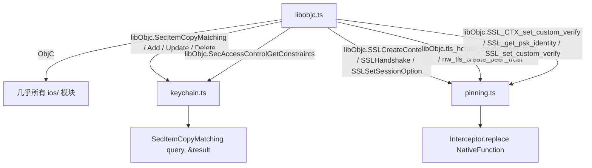

# iOS ObjC 桥与原生函数 <code>agent/src/ios/lib/libobjc.ts</code>

`libobjc.ts` 是 iOS 平台的底层桥梁，做两件事：(1) 选择 Frida 内建 `ObjC` 桥（Frida < 17 用 `frida-objc-bridge` 包，>= 17 用 `globalThis.ObjC`）；(2) 用 `Proxy` 懒加载 Security / libnetwork / libcoretls / libboringssl 中的原生 C 函数为 `NativeFunction`，供 `keychain.ts`、`pinning.ts` 调用。

## 📋 模块概览
| 项目 | 值 |
| --- | --- |
| 文件路径 | `agent/src/ios/lib/libobjc.ts` |
| 平台 | iOS |
| 导出 RPC | 无（桥接库） |
| 依赖 | `frida-objc-bridge` |

## 🎯 解决的问题
- 统一 `ObjC` 全局对象来源，兼容新旧 Frida 运行时。
- 把分散在多个 dylib 中的 Security/TLS 原生函数集中声明（参数类型/返回类型/模块名/导出名），按需懒加载为 `NativeFunction`。
- 避免 Agent 启动时一次性解析全部导出，只在真正调用时才 `findExportByName`，减少启动开销与缺失导出时的报错。

## 🏗️ 导出的方法
| 符号 | 说明 |
| --- | --- |
| `ObjC` | 桥接对象，含 `classes / Object / Block / schedule / chooseSync / selectorAsString` 等 |
| `libObjc` | `Proxy`，按 key 懒加载并缓存 `NativeFunction` |

## ⚙️ 实现要点

`ObjC` 选择逻辑：Frida >= 17 内建 `globalThis.ObjC`，优先用；否则回退到 npm 包 `frida-objc-bridge`：
```ts
// agent/src/ios/lib/libobjc.ts:3-11
let ObjC: typeof ObjC_bridge;
if (globalThis.ObjC) {
  ObjC = globalThis.ObjC
} else {
  ObjC = ObjC_bridge
}
export { ObjC }
```

`nativeExports` 是一张声明表，每项含 `argTypes / retType / exportName / moduleName`，覆盖 Keychain 5 个函数 + SSL 3 个 + TLS 2 个 + BoringSSL 3 个：
```ts
// agent/src/ios/lib/libobjc.ts:13-25（节选）
const nativeExports: any = {
  SecAccessControlGetConstraints: {
    argTypes: ["pointer"],
    exportName: "SecAccessControlGetConstraints",
    moduleName: "Security",
    retType: "pointer",
  },
  SecItemAdd: { argTypes: ["pointer", "pointer"], exportName: "SecItemAdd", moduleName: "Security", retType: "pointer" },
  // ... SecItemCopyMatching / SecItemDelete / SecItemUpdate
  SSLCreateContext: { argTypes: ["pointer", "int", "int"], exportName: "SSLCreateContext", moduleName: "Security", retType: "pointer" },
  // ... nw_tls_create_peer_trust (libnetwork.dylib) / tls_helper_create_peer_trust (libcoretls_cfhelpers.dylib)
  // ... SSL_CTX_set_custom_verify / SSL_get_psk_identity / SSL_set_custom_verify (libboringssl.dylib)
};
```

`libObjc` 是 `Proxy`，`get` 时若 `target[key] === null` 则 `Process.findModuleByName` + `findExportByName` 解析地址并构造 `NativeFunction`，缓存后返回；模块不存在或导出找不到时地址为 `0x00`，调用方据此判 `isNull()` 跳过：
```ts
// agent/src/ios/lib/libobjc.ts:124-140
export const libObjc = new Proxy(api, {
  get: (target, key) => {
    if (target[key] === null) {
      const mod = Process.findModuleByName(nativeExports[key].moduleName)
      var tgt = new NativePointer(0x00);
      if (mod != null) {
        tgt = mod.findExportByName(nativeExports[key].exportName) || new NativePointer(0x00);
      }
      target[key] = new NativeFunction(tgt, nativeExports[key].retType, nativeExports[key].argTypes);
    }
    return target[key];
  },
});
```

## 📐 调用关系



## 🔍 源码索引
| 符号 | 位置 |
| --- | --- |
| `ObjC` 选择 | `agent/src/ios/lib/libobjc.ts:3` |
| `nativeExports` | `agent/src/ios/lib/libobjc.ts:13` |
| `api` 缓存表 | `agent/src/ios/lib/libobjc.ts:103` |
| `libObjc` Proxy | `agent/src/ios/lib/libobjc.ts:124` |

## 🔗 相关文档
- [Frida 与 Agent](/guide/frida-agent)
- 复用方：[`keychain.md`](/reference/agent/ios/keychain)、[`pinning.md`](/reference/agent/ios/pinning)
- 常量：[`constants.md`](/reference/agent/ios/lib/constants)
