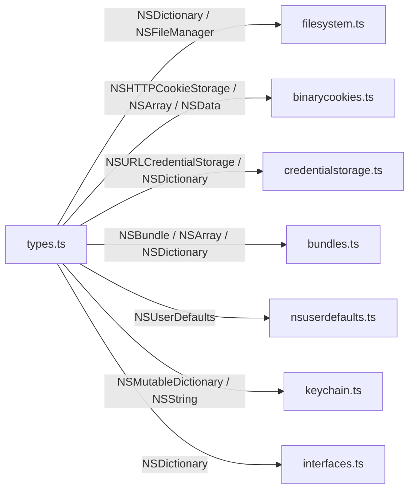

# iOS 类型别名 <code>agent/src/ios/lib/types.ts</code>

`types.ts` 把 Frida ObjC 桥返回的动态对象收窄为一组 TypeScript 类型别名（`NSDictionary`、`NSString`、`NSFileManager`、`NSBundle`、`NSUserDefaults`、`NSHTTPCookieStorage`、`NSURLCredentialStorage`、`NSArray`、`NSData`、`NSMutableDictionary` 等），供各模块在参数与变量标注时复用，统一类型表达。

## 📋 模块概览
| 项目 | 值 |
| --- | --- |
| 文件路径 | `agent/src/ios/lib/types.ts` |
| 平台 | iOS |
| 导出 RPC | 无（类型库） |
| 依赖 | `frida-objc-bridge` |

## 🎯 解决的问题
- 给 ObjC 动态对象提供统一的类型别名，避免每个模块各自写 `ObjCTypes.Object | any`。
- 兼顾类型提示与运行时弹性：所有别名都是 `ObjCTypes.Object | any`，既能在 IDE 里提示 `$className / objectForKey_` 等成员，又不阻止任意方法调用。
- 集中维护 CoreFoundation 类型（`CFDictionaryRef` / `CFTypeRef`）的标注。

## 🏗️ 导出的方法
| 符号 | 说明 |
| --- | --- |
| `NSDictionary` / `NSMutableDictionary` | Foundation 字典类型别名 |
| `NSString` | Foundation 字符串别名 |
| `NSFileManager` / `NSBundle` / `NSUserDefaults` | Foundation 管理类别名 |
| `NSHTTPCookieStorage` / `NSURLCredentialStorage` | 网络/Cred 存储别名 |
| `NSArray` / `NSData` | 集合/数据别名 |
| `CFDictionaryRef` / `CFTypeRef` | CoreFoundation 桥接类型 |

## ⚙️ 实现要点

全部别名都落到 `ObjCTypes.Object | any`，`any` 是关键——Frida ObjC 桥对象的方法是动态分派的，TS 无法静态枚举，`any` 让任意 `.method_()` 调用合法：
```ts
// agent/src/ios/lib/types.ts:3-12
export type NSDictionary = ObjCTypes.Object | any;
export type NSMutableDictionary = ObjCTypes.Object | any;
export type NSString = ObjCTypes.Object | any;
export type NSFileManager = ObjCTypes.Object | any;
export type NSBundle = ObjCTypes.Object | any;
export type NSUserDefaults = ObjCTypes.Object | any;
export type NSHTTPCookieStorage = ObjCTypes.Object | any;
export type NSURLCredentialStorage = ObjCTypes.Object | any;
export type NSArray = ObjCTypes.Object | any;
export type NSData = ObjCTypes.Object | any;
```

`binarycookies.ts` 用 `NSData` 标注从 `NSArray` 取出的元素（实际是 `NSHTTPCookie`，源码 `:29`），类型注释仅为开发提示，运行时不约束。`filesystem.ts` 用 `NSStringType` 别名（局部 `import { NSString as NSStringType }`）避免与变量名冲突。

## 📐 调用关系



## 🔍 源码索引
| 符号 | 位置 |
| --- | --- |
| `NSDictionary` 等 10 个别名 | [`agent/src/ios/lib/types.ts:3`](https://github.com/android-security-engineer/objection-skills/blob/master/agent/src/ios/lib/types.ts#L3) |
| `CFDictionaryRef` / `CFTypeRef` | [`agent/src/ios/lib/types.ts:14`](https://github.com/android-security-engineer/objection-skills/blob/master/agent/src/ios/lib/types.ts#L14) |

## 🔗 相关文档
- [Frida 与 Agent](/guide/frida-agent)
- 接口定义：[`interfaces.md`](/reference/agent/ios/lib/interfaces)
- ObjC 桥：[`libobjc.md`](/reference/agent/ios/lib/libobjc)
