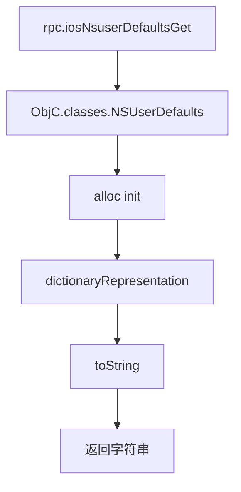

# NSUserDefaults 读取 <code>agent/src/ios/nsuserdefaults.ts</code>

`nsuserdefaults.ts` 在 iOS 目标进程里读取 `NSUserDefaults` 的完整字典表示并 `toString()` 返回。App 的偏好设置、配置开关、首次启动标志等通常存在这里，是轻量配置审计的入口。

## 📋 模块概览
| 项目 | 值 |
| --- | --- |
| 文件路径 | `agent/src/ios/nsuserdefaults.ts` |
| 平台 | iOS |
| 导出 RPC | `iosNsuserDefaultsGet` |
| 依赖 | `ios/lib/libobjc.ts`、`ios/lib/types.ts` |

## 🎯 解决的问题
- 一次性 dump App 的全部 NSUserDefaults 键值对，发现隐藏开关、调试标志、上一次登录时间等。
- 进程内直接读 `dictionaryRepresentation`，比读磁盘上的 plist 更准确（含运行时写入的未持久化值）。
- 返回字符串形式，Python 侧直接展示。

## 🏗️ 导出的 RPC 方法
| RPC 名 | 说明 |
| --- | --- |
| `iosNsuserDefaultsGet` | 返回 `NSUserDefaults.dictionaryRepresentation()` 的 `toString()` |

### `rpc.iosNsuserDefaultsGet` — 字典表示转字符串
源码：`agent/src/ios/nsuserdefaults.ts:8`

`alloc().init()` 创建标准 `NSUserDefaults` 实例（非 `standardUserDefaults`，确保拿到完整字典），`dictionaryRepresentation()` 合并所有域的键值，最后 `toString()`：
```ts
// agent/src/ios/nsuserdefaults.ts:14-17
const defaults: NSUserDefaults = ObjC.classes.NSUserDefaults;
const data: NSDictionary = defaults.alloc().init().dictionaryRepresentation();
return data.toString();
```



## ⚙️ 实现要点
- **用 alloc+init 而非 standardUserDefaults**：`alloc().init()` 创建的是不带 `NSUserDefaults` 全局单例包袱的标准实例，`dictionaryRepresentation` 会合并 registration domain、argument domain、application domain 等，拿到最全的键值。
- **返回类型 `NSUserDefaults | any`**：TS 签名标 `NSUserDefaults | any`，实际返回的是字符串（`toString()` 后），`any` 是为了兼容 Python 侧直接消费。
- **纯 ObjC 桥，无 Hook**：只读不写，不挂拦截器，调用即返回。

## 🔍 源码索引
| 符号 | 位置 |
| --- | --- |
| `get` | `agent/src/ios/nsuserdefaults.ts:8` |

## 🔗 相关文档
- [Frida 与 Agent](/guide/frida-agent)
- [RPC 通信机制](/guide/rpc)
- 命令文档：[/reference/commands/ios/nsuserdefaults](/reference/commands/ios/nsuserdefaults)
