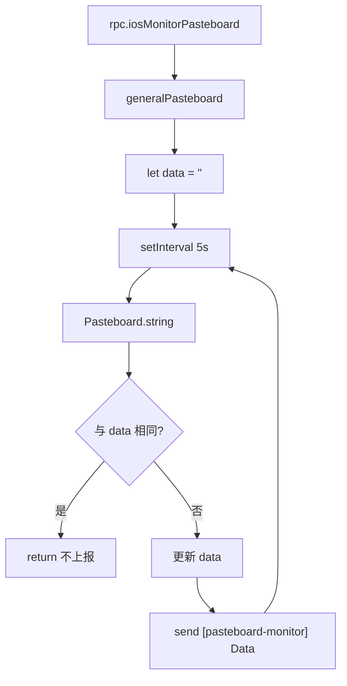

# 剪贴板监控 <code>agent/src/ios/pasteboard.ts</code>

`pasteboard.ts` 在 iOS 目标进程里轮询 `UIPasteboard.generalPasteboard().string()`，每 5 秒取一次，与上次不同则 `send()` 给 Python 侧。用于捕获 App 复制的敏感文本（Token、验证码、密码）。

## 📋 模块概览
| 项目 | 值 |
| --- | --- |
| 文件路径 | `agent/src/ios/pasteboard.ts` |
| 平台 | iOS |
| 导出 RPC | `iosMonitorPasteboard` |
| 依赖 | `ios/lib/libobjc.ts`、`lib/color.ts` |

## 🎯 解决的问题
- 监听系统剪贴板变化，捕获 App 写入的敏感字符串。
- 只在内容变化时上报，避免重复刷屏。
- 不依赖 Hook，纯轮询，对 App 无侵入。

## 🏗️ 导出的 RPC 方法
| RPC 名 | 说明 |
| --- | --- |
| `iosMonitorPasteboard` | 启动 5 秒轮询 `setInterval`，变化时 `send()` |

### `rpc.iosMonitorPasteboard` — 轮询剪贴板
源码：`agent/src/ios/pasteboard.ts:5`

取 `UIPasteboard.generalPasteboard()`，`setInterval` 每 5 秒读 `string()`，与本地变量 `data` 比对，不同则更新并 `send`：
```ts
// agent/src/ios/pasteboard.ts:12-30
const UIPasteboard = ObjC.classes.UIPasteboard;
const Pasteboard = UIPasteboard.generalPasteboard();
let data: string = "";
setInterval(() => {
  const currentString = Pasteboard.string().toString();
  if (currentString === data) { return; }
  data = currentString;
  send(`${c.blackBright(`[pasteboard-monitor]`)} Data: ${c.greenBright(data.toString())}`);
}, 1000 * 5);
```



## ⚙️ 实现要点
- **纯轮询，无 Hook**：用 `setInterval` 而非 Hook `UIPasteboard.setString:`，实现简单且不干扰 App 行为，代价是 5 秒粒度的延迟。
- **去重上报**：本地 `data` 变量缓存上次值，相同则 `return`，避免每 5 秒重复 `send` 同一内容。
- **只监听 string**：只取 `string()`，不处理 `image` / `URL` / `color` 等其他剪贴板类型，专注于文本泄露场景。
- **无任务管理**：不像 crypto/jailbreak 那样建 `jobs.Job`，`setInterval` 句柄不进任务表，无法通过 `jobs kill` 停止（需断开 session）。

## 🔍 源码索引
| 符号 | 位置 |
| --- | --- |
| `monitor` | `agent/src/ios/pasteboard.ts:5` |

## 🔗 相关文档
- [Frida 与 Agent](/guide/frida-agent)
- [RPC 通信机制](/guide/rpc)
- 命令文档：[/reference/commands/ios/pasteboard](/reference/commands/ios/pasteboard)
