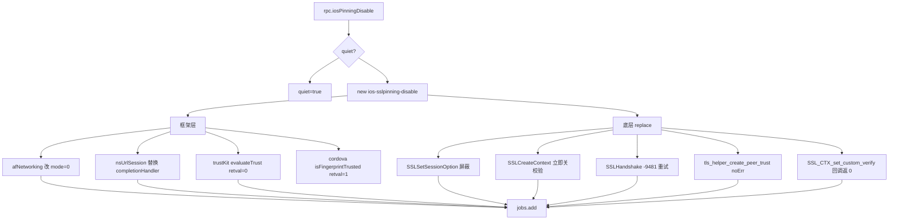

# SSL Pinning 绕过 <code>agent/src/ios/pinning.ts</code>

`pinning.ts` 在 iOS 目标进程里多管齐下绕过 SSL 证书校验：Hook AFNetworking、NSURLSession、TrustKit、Cordova SSLCertificateChecker 等上层框架，再 `Interceptor.replace` 替换 iOS 9/10/11/13 各版本的底层 `SSLSetSessionOption` / `SSLCreateContext` / `SSLHandshake` / `tls_helper_create_peer_trust` / `SSL_CTX_set_custom_verify` 等函数。通过 `iosPinningDisable` RPC 一次性挂上全部 Hook，思路源于 SSL-Kill-Switch2。

## 📋 模块概览
| 项目 | 值 |
| --- | --- |
| 文件路径 | `agent/src/ios/pinning.ts` |
| 平台 | iOS |
| 导出 RPC | `iosPinningDisable` |
| 依赖 | `lib/color.ts`、`lib/helpers.ts`、`lib/jobs.ts`、`ios/lib/libobjc.ts`、`frida-objc-bridge` |

## 🎯 解决的问题
- 绕过 AFNetworking 的 `setSSLPinningMode` / `policyWithPinningMode`，把 pinning 模式改成 `None (0x0)`。
- 绕过 NSURLSession 的 `URLSession:didReceiveChallenge:completionHandler:`，替换 completionHandler 直接放行。
- 绕过 TrustKit 的 `evaluateTrust:forHostname:`、Cordova `isFingerprintTrusted:`。
- 替换底层 SecureTransport / BoringSSL 函数，禁用 `kSSLSessionOptionBreakOnServerAuth`、让 `SSLHandshake` 重试跳过 `-9481`、让 `tls_helper_create_peer_trust` 返回 `noErr`、替换 `SSL_CTX_set_custom_verify` 回调为永远返回 `SSL_VERIFY_NONE`。

## 🏗️ 导出的 RPC 方法
| RPC 名 | 说明 |
| --- | --- |
| `iosPinningDisable` | 注册 `ios-sslpinning-disable` 任务，挂框架 Hook + 底层 replace |

### `rpc.iosPinningDisable` — 一次性挂全部绕过
源码：`agent/src/ios/pinning.ts:500`

`disable(q)` 先按 `q` 设 `quiet` 标志，再建任务，依次挂框架 Hook 与底层 replace：
```ts
// agent/src/ios/pinning.ts:500-541
export const disable = (q: boolean): void => {
  if (q) { send(`Quiet mode enabled. Not reporting invocations.`); quiet = true; }
  const job: jobs.Job = new jobs.Job(jobs.identifier(), "ios-sslpinning-disable");
  afNetworking(job.identifier).forEach((i) => { job.addInvocation(i); });
  nsUrlSession(job.identifier).forEach((i) => { job.addInvocation(i); });
  job.addInvocation(trustKit(job.identifier));
  job.addInvocation(cordovaCustomURLConnectionDelegate(job.identifier));
  job.addReplacement(sSLSetSessionOption(job.identifier));
  job.addReplacement(sSLCreateContext(job.identifier));
  job.addReplacement(sSLHandshake(job.identifier));
  job.addReplacement(tlsHelperCreatePeerTrust(job.identifier));
  job.addInvocation(nwTlsCreatePeerTrust(job.identifier));
  sSLCtxSetCustomVerify(job.identifier).forEach((i) => { job.addReplacement(i); });
  jobs.add(job);
};
```

### `afNetworking` — 改 pinning 模式为 None
源码：`agent/src/ios/pinning.ts:51`

Hook `-[AFSecurityPolicy setSSLPinningMode:]` 等 4 个方法，`onEnter` 把 `args[2]` 改成 `0x0`（`AFSSLPinningModeNone`）：
```ts
// agent/src/ios/pinning.ts:76-86
if (!args[2].isNull()) {
  args[2] = new NativePointer(0x0);
}
```
`setAllowInvalidCertificates:` 则把 `0x0` 改成 `0x1`（`:100-109`）。AFNetworking 不存在时返回空数组。

### `nsUrlSession` — 替换 completionHandler
源码：`agent/src/ios/pinning.ts:181`

用 `ApiResolver` 搜 `-[* URLSession:didReceiveChallenge:completionHandler:]`，对每个匹配 `Interceptor.attach`，`onEnter` 把 args[4] 的 block 实现替换成"用 serverTrust 建 credential 并调 `useCredential` + disposition 0"：
```ts
// agent/src/ios/pinning.ts:220-249
completionHandler.implementation = () => {
  const credential = NSURLCredential.credentialForTrust_(challenge.protectionSpace().serverTrust());
  challenge.sender().useCredential_forAuthenticationChallenge_(credential, challenge);
  savedCompletionHandler(0, credential);
};
```

### `sSLCreateContext` / `sSLHandshake` — 底层 replace
源码：`agent/src/ios/pinning.ts:345`、`:370`

`SSLCreateContext` 替换为先调原函数拿 context，再立即 `SSLSetSessionOption(ctx, 0, 1)` 关闭服务端证书校验（`:350-356`）。`SSLHandshake` 替换为：返回 `-9481`（errSSLServerAuthCompared）时再调一次跳过校验（`:374-385`）。

### `sSLCtxSetCustomVerify` — BoringSSL 回调替换
源码：`agent/src/ios/pinning.ts:451`

替换 `SSL_set_custom_verify`（iOS 13+，回退 `SSL_CTX_set_custom_verify`），把传入的回调换成永远返回 `0`（`SSL_VERIFY_NONE`）的 `NativeCallback`；同时替换 `SSL_get_psk_identity` 返回假 PSK 标识（`:464-491`）。



## ⚙️ 实现要点
- **Interceptor.replace 而非 attach**：底层 C 函数没有 ObjC 桥，用 `Interceptor.replace` + `NativeCallback` 完整替换实现，原函数通过闭包捕获的 `libObjc.SSLHandshake` 等仍可调用。
- **libObjc 懒加载**：所有底层 SSL/TLS 函数地址经 `ios/lib/libobjc.ts` 的 `Proxy` 懒加载，`tls_helper_create_peer_trust` 等不在当前 iOS 版本存在时 `isNull()`，对应 Hook 跳过（`:397-399`）。
- **iOS 版本分层**：iOS 9< 用 `SSLSetSessionOption/SSLCreateContext/SSLHandshake`，iOS 10+ 用 `tls_helper_create_peer_trust`，iOS 11+ 用 BoringSSL，iOS 13+ 用 `SSL_set_custom_verify` 回退 `SSL_CTX_set_custom_verify`（源码注释 `:522-536`）。
- **quiet 标志**：`qsend(quiet, ...)` 在 quiet 为真时不 `send`，避免大量 Hook 日志干扰抓包。
- **nw_tls_create_peer_trust 未完成**：源码注释说明简单 replace 不工作，只 `attach` 打印告警（`:422-431`、`:433-447`）。

## 🔍 源码索引
| 符号 | 位置 |
| --- | --- |
| `afNetworking` | `agent/src/ios/pinning.ts:51` |
| `nsUrlSession` | `agent/src/ios/pinning.ts:181` |
| `trustKit` | `agent/src/ios/pinning.ts:257` |
| `cordovaCustomURLConnectionDelegate` | `agent/src/ios/pinning.ts:288` |
| `sSLSetSessionOption` | `agent/src/ios/pinning.ts:320` |
| `sSLCreateContext` | `agent/src/ios/pinning.ts:345` |
| `sSLHandshake` | `agent/src/ios/pinning.ts:370` |
| `tlsHelperCreatePeerTrust` | `agent/src/ios/pinning.ts:393` |
| `nwTlsCreatePeerTrust` | `agent/src/ios/pinning.ts:415` |
| `sSLCtxSetCustomVerify` | `agent/src/ios/pinning.ts:451` |
| `disable` | `agent/src/ios/pinning.ts:500` |

## 🔗 相关文档
- [Frida 与 Agent](/guide/frida-agent)
- [RPC 通信机制](/guide/rpc)
- 原生桥：[`libobjc.md`](/reference/agent/ios/lib/libobjc)
- 任务管理：[`/reference/agent/lib/jobs`](/reference/agent/lib/jobs)
- 命令文档：[/reference/commands/ios/pinning](/reference/commands/ios/pinning)
