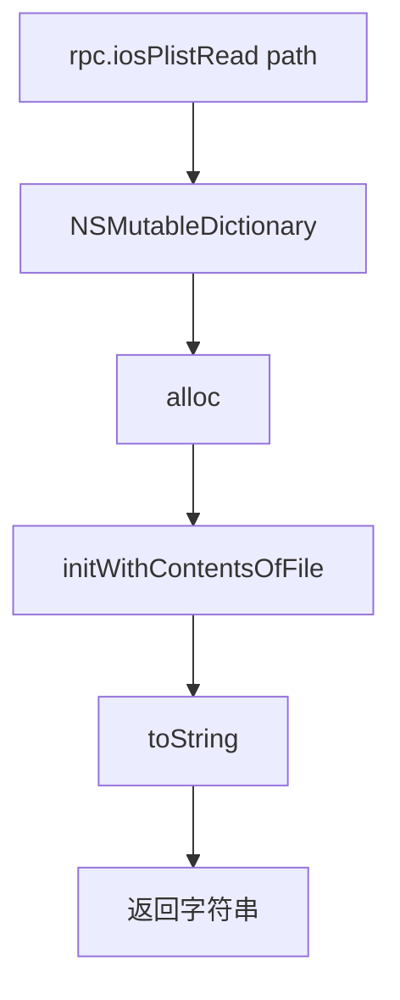

# Plist 解析 <code>agent/src/ios/plist.ts</code>

`plist.ts` 在 iOS 目标进程里用 `NSMutableDictionary.initWithContentsOfFile:` 读取磁盘上的 plist 文件并 `toString()` 返回。支撑 `ios plist read` 命令，用于读取 App 的 `Info.plist`、配置 plist 等。

## 📋 模块概览
| 项目 | 值 |
| --- | --- |
| 文件路径 | `agent/src/ios/plist.ts` |
| 平台 | iOS |
| 导出 RPC | `iosPlistRead` |
| 依赖 | `ios/lib/libobjc.ts`、`ios/lib/types.ts` |

## 🎯 解决的问题
- 在沙盒内读取 plist 文件，包括二进制格式 plist（`initWithContentsOfFile` 自动识别格式）。
- 把嵌套字典转成可读字符串返回，无需 Python 侧再解析。
- `write` 方法已声明但未实现（`:14-16`），当前仅支持读。

## 🏗️ 导出的 RPC 方法
| RPC 名 | 说明 |
| --- | --- |
| `iosPlistRead` | 读指定路径 plist，返回 `toString()` 字符串 |

### `rpc.iosPlistRead` — NSMutableDictionary 反序列化
源码：`agent/src/ios/plist.ts:5`

`ObjC.classes.NSMutableDictionary` 的 `alloc().initWithContentsOfFile_(path)` 同时支持 XML 与二进制 plist，返回的字典直接 `toString()`：
```ts
// agent/src/ios/plist.ts:10-11
const dictionary: NSMutableDictionary = ObjC.classes.NSMutableDictionary;
return dictionary.alloc().initWithContentsOfFile_(path).toString();
```



## ⚙️ 实现要点
- **initWithContentsOfFile 自动识别格式**：Foundation 的 `initWithContentsOfFile:` 同时处理 XML 与 binary plist，模块无需关心格式差异。
- **无路径校验**：传入的 path 不存在或不可读时 `initWithContentsOfFile_` 返回 `nil`，`toString()` 会抛异常——上层需自行保证路径有效。
- **write 未实现**：`write(path, data)` 函数体仅 `// TODO`（`:14-16`），当前无法经此模块写回 plist。
- **纯 ObjC 桥，无 Hook**：只读不写，不挂拦截器。

## 🔍 源码索引
| 符号 | 位置 |
| --- | --- |
| `read` | `agent/src/ios/plist.ts:5` |
| `write` | `agent/src/ios/plist.ts:14` |

## 🔗 相关文档
- [Frida 与 Agent](/guide/frida-agent)
- [RPC 通信机制](/guide/rpc)
- 命令文档：[/reference/commands/ios/plist](/reference/commands/ios/plist)
