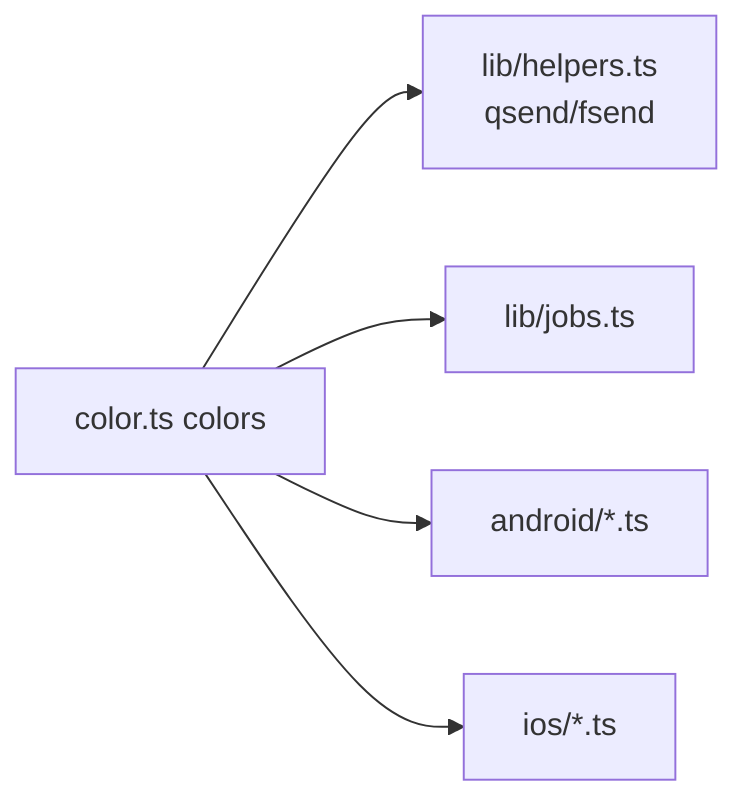

# 颜色工具 <code>agent/src/lib/color.ts</code>

`color.ts` 是 Agent 内部的 ANSI 颜色工具库，所有平台模块在调用 `send()` / `console.log` 时都用它给输出上色。它本身不参与 Hook，但被 `android/*`、`ios/*`、`lib/helpers.ts`、`lib/jobs.ts` 等几乎所有模块复用。

## 📋 模块概览
| 项目 | 值 |
| --- | --- |
| 文件路径 | `agent/src/lib/color.ts` |
| 平台 | 通用 |
| 导出 RPC | 无（工具库） |
| 依赖 | 无 |

## 🎯 解决的问题
- 为 Frida Agent 的 `send()` 消息提供统一的 ANSI 转义包装，让 Python 侧 REPL 输出带颜色。
- 提供 `log` / `clog` / `qlog` 三档日志函数，支持 quiet 静默控制。

## 🏗️ 导出的方法
| 符号 | 说明 |
| --- | --- |
| `colors.ansify(color, ...msg)` | 通用 ANSI 包裹 |
| `colors.clog(color, ...msg)` | 带颜色的 `console.log` |
| `colors.log(...msg)` | 无颜色 `console.log` |
| `colors.qlog(quiet, ...msg)` | quiet 为 false 时才输出 |
| `colors.<color>` | 16 个颜色快捷函数（black/blue/green/.../whiteBright） |

## ⚙️ 实现要点

- 用 `\x1B[<n>m` 形式包裹 ANSI 前景码，结尾 `\x1b[39m` 重置：
  ```ts
  // agent/src/lib/color.ts:3-8
  const base: string = `\x1B[%dm`;
  const reset: string = `\x1b[39m`;
  export const ansify = (color: number, ...msg: string[]): string =>
    base.replace(`%d`, color.toString()) + msg.join(``) + reset;
  ```
- `clog` 用 `eval("console")` 取 `console` 对象，绕过 Frida 沙箱里 `console` 未直接挂在全局的细节。
- 颜色码：30–37 基础色，90–97 亮色（`blackBright` 等），与常见终端一致。
- `qlog` 的 quiet 形参被 `pinning.ts` / `crypto.ts` 等模块在 "Quiet mode" 时复用，控制是否打印每次 Hook 命中。

## 📐 颜色函数被谁复用



## 🔍 源码索引
| 符号 | 位置 |
| --- | --- |
| `ansify` | `agent/src/lib/color.ts:7` |
| `clog` | `agent/src/lib/color.ts:11` |
| `log` | `agent/src/lib/color.ts:13` |
| `qlog` | `agent/src/lib/color.ts:16` |
| `black`..`whiteBright` | `agent/src/lib/color.ts:22-36` |

## 🔗 相关文档
- [Frida 与 Agent](/guide/frida-agent)
- [`helpers.md`](/reference/agent/lib/helpers) · [`jobs.md`](/reference/agent/lib/jobs)
