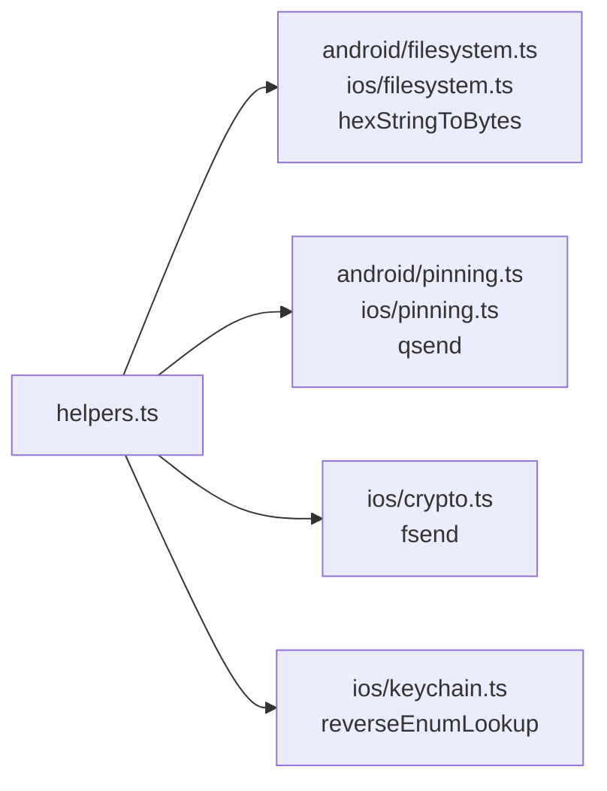

# 辅助函数 <code>agent/src/lib/helpers.ts</code>

`helpers.ts` 是 Agent 内部跨平台复用的工具函数集合，提供枚举反向查找、十六进制转字节、按 quiet 标志发送消息、格式化发送等基础能力。被 `android/filesystem.ts`、`android/pinning.ts`、`ios/crypto.ts`、`ios/keychain.ts` 等模块广泛复用。

## 📋 模块概览
| 项目 | 值 |
| --- | --- |
| 文件路径 | `agent/src/lib/helpers.ts` |
| 平台 | 通用 |
| 导出 RPC | 无（工具库） |
| 依赖 | `lib/color.ts`、`util`（Node 内建，Frida 运行时提供） |

## 🎯 解决的问题
- 把 hex 字符串还原为字节数组，供文件写入。
- 在 quiet 模式下选择性 `send()`，避免 Hook 噪音。
- 把 Hook 捕获的键值对格式化成多行字符串，便于 REPL 阅读。
- 把 `kSec` 之类的枚举值反查为可读 key 名。

## 🏗️ 导出的方法
| 符号 | 说明 |
| --- | --- |
| `reverseEnumLookup(enumType, value)` | 由枚举值反查 key 名 |
| `hexStringToBytes(str)` | hex → Uint8Array |
| `qsend(quiet, message)` | quiet 为 false 时 `send()` |
| `fsend(ident, hook, message)` | 带任务 id / hook 名的格式化 `send()` |
| `debugDump(o, depth)` | 用 `util.inspect` 打印对象 |
| `printArgs(args)`（私有） | 把对象展开为多行 `key : value` |

## ⚙️ 实现要点

- `hexStringToBytes`：两两截取 hex 串 `parseInt(.., 16)`，返回 `Uint8Array`，被 `android/filesystem.ts:writeFile` 与 `ios/filesystem.ts:writeFile` 用于把 Python 传入的 hex 还原为字节写入文件：
  ```ts
  // agent/src/lib/helpers.ts:18-25
  export const hexStringToBytes = (str: string): Uint8Array => {
    var a: number[] = [];
    for (let i = 0, len = str.length; i < len; i += 2) {
      a.push(parseInt(str.substring(i, i+2), 16));
    }
    return new Uint8Array(a);
  };
  ```
- `qsend`：是 `android/pinning.ts` 与 `ios/pinning.ts` 在 Quiet 模式下统一静默的入口：
  ```ts
  // agent/src/lib/helpers.ts:28-32
  export const qsend = (quiet: boolean, message: any): void => {
    if (quiet === false) { send(message); }
  };
  ```
- `fsend`：被 `ios/crypto.ts` 的所有 CommonCrypto Hook 用来打印 `[ident] [hook] (\n key : val \n)` 结构：
  ```ts
  // agent/src/lib/helpers.ts:35-41
  export const fsend = (ident: number, hook: string, message: any): void => {
    send(c.blackBright(`[${ident}] `) + c.magenta(`[${hook}]`) + printArgs(message));
  };
  ```
- `reverseEnumLookup`：遍历枚举 key 比较 value，被 `ios/keychain.ts:135` 把 `kSec` 的 `"ak"` 反查回 `kSecAttrAccessibleWhenUnlocked`。

## 📐 复用关系



## 🔍 源码索引
| 符号 | 位置 |
| --- | --- |
| `reverseEnumLookup` | `agent/src/lib/helpers.ts:6` |
| `hexStringToBytes` | `agent/src/lib/helpers.ts:18` |
| `qsend` | `agent/src/lib/helpers.ts:28` |
| `fsend` | `agent/src/lib/helpers.ts:35` |
| `debugDump` | `agent/src/lib/helpers.ts:44` |
| `printArgs` | `agent/src/lib/helpers.ts:51` |

## 🔗 相关文档
- [Frida 与 Agent](/guide/frida-agent)
- [`color.md`](/reference/agent/lib/color) · [`jobs.md`](/reference/agent/lib/jobs)
- [`filesystem.md`](/reference/agent/android/filesystem) · [`pinning.md`](/reference/agent/android/pinning)
