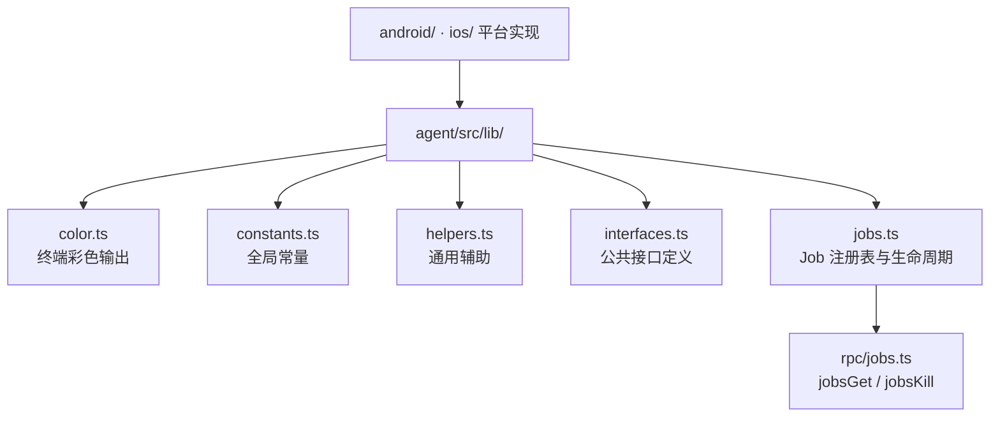

# 🧰 Agent · 公共库

`agent/src/lib/` 下的模块是 Android 与 iOS 实现共用的基础工具：颜色、常量、辅助函数、接口定义、Job 管理。

## 🗺️ 依赖关系

## 📂 文件清单

| 文档 | 源码 | 作用 |
| --- | --- | --- |
| [color](/reference/agent/lib/color) | `lib/color.ts` | 终端彩色输出 |
| [constants](/reference/agent/lib/constants) | `lib/constants.ts` | 全局常量 |
| [helpers](/reference/agent/lib/helpers) | `lib/helpers.ts` | 通用辅助函数 |
| [interfaces](/reference/agent/lib/interfaces) | `lib/interfaces.ts` | 公共接口定义 |
| [jobs](/reference/agent/lib/jobs) | `lib/jobs.ts` | Job 注册表与生命周期 |

## 🔗 相关文档

- [Agent 总览](/reference/agent/)
- [Frida 与 Agent](/guide/frida-agent)
