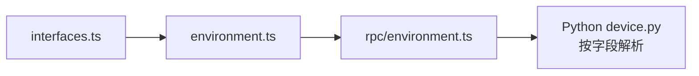

# 公共接口 <code>agent/src/lib/interfaces.ts</code>

`interfaces.ts` 定义 Agent 跨平台使用的 TypeScript 接口类型，描述 Frida 信息、iOS/Android 包信息、bundle 路径等返回结构。它只承载类型，不参与运行时逻辑，但让 `generic/environment.ts` 与 `rpc/environment.ts` 的返回值有清晰契约。

## 📋 模块概览
| 项目 | 值 |
| --- | --- |
| 文件路径 | `agent/src/lib/interfaces.ts` |
| 平台 | 通用 |
| 导出 RPC | 无（类型定义） |
| 依赖 | 无 |

## 🎯 解决的问题
- 为 `environment.ts` 的 6 个返回函数提供结构化类型，Python 侧据此解析设备信息。

## 🏗️ 导出的接口
| 接口 | 用途 |
| --- | --- |
| `IFridaInfo` | `frida()` 返回：arch / debugger / heap / platform / runtime / version |
| `IIosPackage` | `iosPackage()` 返回：应用名 / 设备名 / identifierForVendor / model / systemName / systemVersion |
| `IAndroidPackage` | `androidPackage()` 返回：Build 字段（board/brand/device/...） |
| `IIosBundlePaths` | `iosPaths()` 返回：BundlePath / Caches / Document / Library |

## ⚙️ 实现要点

- `IFridaInfo` 字段全部来自 Frida 全局对象：
  ```ts
  // agent/src/lib/interfaces.ts:1-8
  export interface IFridaInfo {
    arch: string;
    debugger: boolean;
    heap: number;
    platform: string;
    runtime: string;
    version: string;
  }
  ```
  对应 `generic/environment.ts:43-52` 读取 `Process.arch`、`Process.isDebuggerAttached()`、`Frida.heapSize`、`Process.platform`、`Script.runtime`、`Frida.version`。
- `IAndroidPackage` 字段对应 `android.os.Build` 静态字段 + `Java.androidVersion`，见 `environment.ts:88-107`。
- `IIosPackage` 字段对应 `UIDevice.currentDevice()` + `NSBundle.mainBundle()`，见 `environment.ts:54-75`。
- `IIosBundlePaths` 由 `getPathForNSLocation` 配合 `NSCachesDirectory / NSDocumentDirectory / NSLibraryDirectory` 填充，见 `environment.ts:77-86`。

## 📐 类型流向



## 🔍 源码索引
| 符号 | 位置 |
| --- | --- |
| `IFridaInfo` | [`agent/src/lib/interfaces.ts:1`](https://github.com/android-security-engineer/objection-skills/blob/master/agent/src/lib/interfaces.ts#L1) |
| `IIosPackage` | [`agent/src/lib/interfaces.ts:10`](https://github.com/android-security-engineer/objection-skills/blob/master/agent/src/lib/interfaces.ts#L10) |
| `IAndroidPackage` | [`agent/src/lib/interfaces.ts:19`](https://github.com/android-security-engineer/objection-skills/blob/master/agent/src/lib/interfaces.ts#L19) |
| `IIosBundlePaths` | [`agent/src/lib/interfaces.ts:32`](https://github.com/android-security-engineer/objection-skills/blob/master/agent/src/lib/interfaces.ts#L32) |

## 🔗 相关文档
- [Frida 与 Agent](/guide/frida-agent)
- [`environment.md`](/reference/agent/generic/environment) · [`environment.md`](/reference/agent/rpc/environment)
