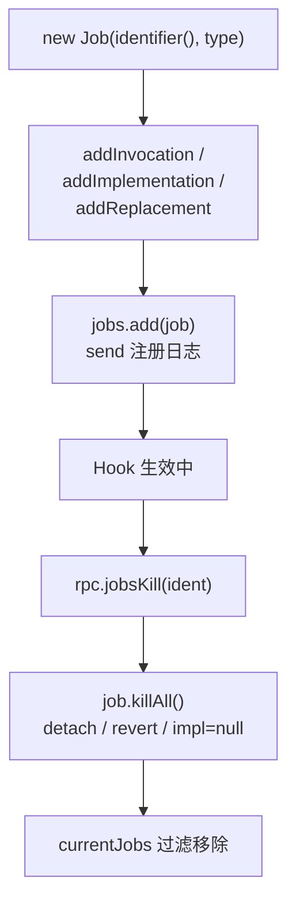

# 任务管理 <code>agent/src/lib/jobs.ts</code>

`jobs.ts` 实现 Agent 的 Hook 任务（Job）抽象。每个长时间生效的 Hook（如 watch class、SSL pinning disable、root disable、crypto monitor）都被封装为一个 `Job`，记录其 InvocationListener / Interceptor 替换 / Java 方法实现替换，便于后续 `jobsKill` 时统一清理。

## 📋 模块概览
| 项目 | 值 |
| --- | --- |
| 文件路径 | `agent/src/lib/jobs.ts` |
| 平台 | 通用 |
| 导出 RPC | 无（被 `rpc/jobs.ts` 包装为 `jobsGet` / `jobsKill`） |
| 依赖 | `lib/color.ts` |

## 🎯 解决的问题
- 给每个 Hook 会话分配唯一 `identifier`，Python 侧据此杀任务。
- 统一管理三类 Hook 资源：`Interceptor.attach` 的 InvocationListener、`Interceptor.replace` 的 NativeCallback、Java 方法 `implementation` 替换。
- 在 `killAll` 时按类型分别 detach / revert / 置空 implementation。

## 🏗️ 导出的方法
| 符号 | 说明 |
| --- | --- |
| `class Job` | 任务容器，存 identifier / type / 三类 hook 句柄 |
| `Job.addInvocation(x)` | 注册一个 InvocationListener |
| `Job.addImplementation(x)` | 注册一个 Java 方法 overload（implementation 替换） |
| `Job.addReplacement(x)` | 注册一个 `Interceptor.replace` 目标 |
| `Job.killAll()` | 清理本任务全部 hook |
| `identifier()` | 生成 6 位随机数字 id |
| `all()` | 返回当前所有 Job |
| `add(job)` | 注册 Job 并 `send` 日志 |
| `hasIdent(ident)` / `hasType(type)` | 查重 |
| `kill(ident)` | 按 id 杀任务 |

## ⚙️ 实现要点

- **三类资源分别清理**，因为它们的 detach 方式不同：
  ```ts
  // agent/src/lib/jobs.ts:41-70
  killAll(): void {
    if (this.invocations && this.invocations.length > 0) {
      this.invocations.forEach((invocation) => {
        invocation ? invocation.detach() : ...;
      });
    }
    if (this.replacements && this.replacements.length > 0) {
      this.replacements.forEach((replacement) => { Interceptor.revert(replacement); });
    }
    if (this.implementations && this.implementations.length > 0) {
      this.implementations.forEach((method) => {
        send(...);
        method.implementation = null;  // 还原 Java 方法
      });
    }
  }
  ```
- **identifier**：用 `Math.random().toString(36).substring(2,8)` 生成 6 位 base36 串再转 Number，见 `:77`。在 `add` 时 `send` 注册日志，Python 侧据此显示任务编号。
- **addInvocation 容错**：`null` 跳过、`undefined` 报 warn。iOS pinning / jailbreak 等模块在目标类不存在时返回 `null`，调用方据此跳过注册（见 `ios/pinning.ts:518` 的 `job.addInvocation(trustKit(...))`）。
- **addImplementation 容错**：`null`（类未找到）跳过、`undefined` 打印堆栈，对应 `android/pinning.ts:382-389` 的 try/catch 返回 null 模式。
- **kill**：先 `killAll()` 再从 `currentJobs` 数组过滤掉该 id，见 `:112-131`。

## 📐 Job 生命周期



## 🔍 源码索引
| 符号 | 位置 |
| --- | --- |
| `class Job` | [`agent/src/lib/jobs.ts:3`](https://github.com/android-security-engineer/objection-skills/blob/master/agent/src/lib/jobs.ts#L3) |
| `addInvocation` | [`agent/src/lib/jobs.ts:15`](https://github.com/android-security-engineer/objection-skills/blob/master/agent/src/lib/jobs.ts#L15) |
| `addImplementation` | [`agent/src/lib/jobs.ts:25`](https://github.com/android-security-engineer/objection-skills/blob/master/agent/src/lib/jobs.ts#L25) |
| `addReplacement` | [`agent/src/lib/jobs.ts:36`](https://github.com/android-security-engineer/objection-skills/blob/master/agent/src/lib/jobs.ts#L36) |
| `killAll` | [`agent/src/lib/jobs.ts:41`](https://github.com/android-security-engineer/objection-skills/blob/master/agent/src/lib/jobs.ts#L41) |
| `currentJobs` | [`agent/src/lib/jobs.ts:75`](https://github.com/android-security-engineer/objection-skills/blob/master/agent/src/lib/jobs.ts#L75) |
| `identifier` | [`agent/src/lib/jobs.ts:77`](https://github.com/android-security-engineer/objection-skills/blob/master/agent/src/lib/jobs.ts#L77) |
| `all` | [`agent/src/lib/jobs.ts:78`](https://github.com/android-security-engineer/objection-skills/blob/master/agent/src/lib/jobs.ts#L78) |
| `add` | [`agent/src/lib/jobs.ts:80`](https://github.com/android-security-engineer/objection-skills/blob/master/agent/src/lib/jobs.ts#L80) |
| `hasIdent` | [`agent/src/lib/jobs.ts:87`](https://github.com/android-security-engineer/objection-skills/blob/master/agent/src/lib/jobs.ts#L87) |
| `hasType` | [`agent/src/lib/jobs.ts:99`](https://github.com/android-security-engineer/objection-skills/blob/master/agent/src/lib/jobs.ts#L99) |
| `kill` | [`agent/src/lib/jobs.ts:112`](https://github.com/android-security-engineer/objection-skills/blob/master/agent/src/lib/jobs.ts#L112) |

## 🔗 相关文档
- [Frida 与 Agent](/guide/frida-agent)
- [RPC 通信机制](/guide/rpc)
- [`jobs.md`](/reference/agent/rpc/jobs) · [`pinning.md`](/reference/agent/android/pinning) · [`root.md`](/reference/agent/android/root)
