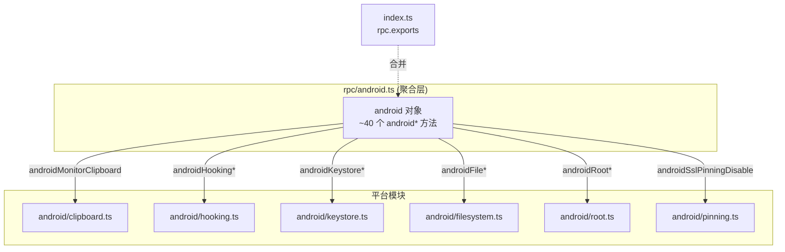

# Android RPC 聚合层 <code>agent/src/rpc/android.ts</code>

`rpc/android.ts` 是 Android 能力的 RPC 出口：它把分散在 `android/clipboard.ts`、`android/hooking.ts`、`android/keystore.ts` 等十余个平台模块里的具名导出，统一包装成一个名为 `android` 的对象，对象里的每个键都是一个以 `android` 开头的 RPC 方法名，值为一个箭头函数，内部转发到对应平台模块的同名或近名函数。该对象最终被 `index.ts` 合并入 `rpc.exports`，成为宿主端所有 `android*` 命令的调用入口。

## 📋 模块概览

| 项目 | 值 |
| --- | --- |
| 文件路径 | `agent/src/rpc/android.ts` |
| 适用平台 | Android |
| 聚合的方法数 | 约 40 个（全部以 `android` 前缀命名） |
| 涉及平台模块 | `clipboard` / `filesystem` / `heap` / `hooking` / `intent` / `keystore` / `pinning` / `root` / `shell` / `userinterface` / `proxy` / `general` |
| 依赖类型 | `frida-java-bridge`、`android/lib/interfaces.js`、`android/lib/types.js` |

## 🎯 解决的问题

1. **统一命名空间**：把十几个模块的导出压平到 `android*` 前缀下，宿主端无需关心底层模块路径，直接按 `androidXxxYyy` 命名调用。
2. **重命名与透传**：平台模块的函数名（如 `hooking.getClassMethods`）被改写为 RPC 名（`androidHookingGetClassMethods`），同时通过箭头函数保留参数与返回值类型，做到对调用方透明。
3. **类型收口**：在包装处显式标注参数与返回类型（如 `Promise<IKeyStoreEntry[]>`），让 `rpc.exports` 拥有完整的 TypeScript 契约，宿主端可据此生成类型存根。

## 🏗️ 聚合的方法

| RPC 名 | 转发目标 | 说明 |
| --- | --- | --- |
| `androidMonitorClipboard` | `clipboard.monitor()` | 监控剪贴板 |
| `androidDeoptimize` | `general.deoptimize()` | 触发 dexo 优化 |
| `androidShellExec` | `androidshell.execute(cmd)` | 在设备执行 shell 命令 |
| `androidFileCwd`/`Ls`/`Exists`/... | `androidfilesystem.*` | 文件系统操作集合 |
| `androidHookingGetClassMethods` 等 | `hooking.*` | 类/方法/Activity 枚举与 Hook |
| `androidHeapEvaluateHandleMethod` 等 | `heap.*` | 堆对象方法调用与字段读取 |
| `androidIntentStartActivity`/`StartService`/`Analyze` | `intent.*` | Intent 启动与隐式分析 |
| `androidKeystoreClear`/`List`/`Detail`/`Watch` | `keystore.*` | 密钥库查看与监控 |
| `androidSslPinningDisable` | `sslpinning.disable(quiet)` | 关闭 SSL Pinning |
| `androidProxySet` | `proxy.set(host, port)` | 设置代理 |
| `androidRootDetectionDisable`/`Enable` | `root.*` | root 检测开关 |
| `androidUiScreenshot`/`SetFlagSecure` | `userinterface.*` | 截图与 FLAG_SECURE |

### `android` — 聚合对象

源码：[`agent/src/rpc/android.ts:27`](https://github.com/android-security-engineer/objection-skills/blob/master/agent/src/rpc/android.ts#L27)

整个模块导出的是一个对象字面量 `android`，键为 RPC 方法名，值为箭头函数。箭头函数体几乎都是一行调用，把参数按位置转发给平台模块函数并返回其结果。下例展示剪贴板、shell、文件、keystore 四类典型包装：

```ts
// agent/src/rpc/android.ts:27
export const android = {
  // android clipboard
  androidMonitorClipboard: () => clipboard.monitor(),

  // android command execution
  androidShellExec: (cmd: string): Promise<IExecutedCommand> => androidshell.execute(cmd),

  // android filesystem
  androidFileCwd: () => androidfilesystem.pwd(),
  androidFileDelete: (path: string) => androidfilesystem.deleteFile(path),
  androidFileDownload: (path: string) => androidfilesystem.readFile(path),
  // ...

  // android keystore
  androidKeystoreClear: () => keystore.clear(),
  androidKeystoreList: (): Promise<IKeyStoreEntry[]> => keystore.list(),
  androidKeystoreDetail: (): Promise<IKeyStoreDetail[]> => keystore.detail(),
  androidKeystoreWatch: (): Promise<void> => keystore.watchKeystore(),

  // android ssl pinning
  androidSslPinningDisable: (quiet: boolean) => sslpinning.disable(quiet),
};
```

### Hooking 子集 — 参数透传与重命名

源码：[`agent/src/rpc/android.ts:49`](https://github.com/android-security-engineer/objection-skills/blob/master/agent/src/rpc/android.ts#L49)

`hooking` 相关方法数量最多，展示了“长参数列表逐个透传 + 默认参数”的典型包装风格。`androidHookingGetClassMethodsOverloads` 还带默认值 `methodAllowList: string[] = []` 与可选 `loader?`，RPC 层与平台函数签名保持一致。

```ts
// agent/src/rpc/android.ts:49
androidHookingGetClassMethods: (className: string): Promise<string[]> => hooking.getClassMethods(className),
androidHookingGetClassMethodsOverloads: (className: string, methodAllowList: string[] = [], loader?: string): Promise<JavaMethodsOverloadsResult> => hooking.getClassMethodsOverloads(className, methodAllowList, loader),
androidHookingWatch: (pattern: string, watchArgs: boolean, watchBacktrace: boolean, watchRet: boolean): Promise<void> =>
  hooking.watch(pattern, watchArgs, watchBacktrace, watchRet),
```



## ⚙️ 实现要点

- **具名导入 + 箭头包装**：文件顶部用 `import * as clipboard from "../android/clipboard.js"` 把每个平台模块整体导入为命名空间，再在对象字面量里用 `(args) => module.fn(args)` 的箭头函数做重命名透传。这种写法既保留了类型推断，又把“RPC 名 → 模块函数”的映射集中在一处可读的表里。
- **命名规则**：RPC 方法名 = `android` + 模块语义 + 动词，如 `android` + `Keystore` + `List` → `androidKeystoreList`；宿主端命令名再据此去掉前缀，得到 `android keystore list`。
- **类型显式化**：几乎所有箭头函数都标注了返回类型（`Promise<...>`、`string[]`、`void` 等），部分还标注参数类型，这使 `rpc.exports` 在 TypeScript 侧成为强类型契约。
- **默认参数透传**：如 `androidIntentAnalyze` 的 `backtrace: boolean = false`、`androidHookingGetClassMethodsOverloads` 的 `methodAllowList = []`，默认值在 RPC 层声明并原样下传。
- **无运行时逻辑**：该文件不含任何 Hook、扫描、IO 逻辑，纯粹是“接线层”，所有行为都发生在被调用的平台模块里。

## 🔍 源码索引

| 符号 | 位置 |
| --- | --- |
| `android` 导出对象 | [`agent/src/rpc/android.ts:27`](https://github.com/android-security-engineer/objection-skills/blob/master/agent/src/rpc/android.ts#L27) |
| `androidMonitorClipboard` | [`agent/src/rpc/android.ts:29`](https://github.com/android-security-engineer/objection-skills/blob/master/agent/src/rpc/android.ts#L29) |
| `androidDeoptimize` | [`agent/src/rpc/android.ts:32`](https://github.com/android-security-engineer/objection-skills/blob/master/agent/src/rpc/android.ts#L32) |
| `androidShellExec` | [`agent/src/rpc/android.ts:35`](https://github.com/android-security-engineer/objection-skills/blob/master/agent/src/rpc/android.ts#L35) |
| `androidFile*` 文件系统组 | [`agent/src/rpc/android.ts:38`](https://github.com/android-security-engineer/objection-skills/blob/master/agent/src/rpc/android.ts#L38) |
| `androidHookingGetClassMethods` | [`agent/src/rpc/android.ts:49`](https://github.com/android-security-engineer/objection-skills/blob/master/agent/src/rpc/android.ts#L49) |
| `androidHeapEvaluateHandleMethod` | [`agent/src/rpc/android.ts:65`](https://github.com/android-security-engineer/objection-skills/blob/master/agent/src/rpc/android.ts#L65) |
| `androidIntentStartActivity` | [`agent/src/rpc/android.ts:73`](https://github.com/android-security-engineer/objection-skills/blob/master/agent/src/rpc/android.ts#L73) |
| `androidKeystoreClear` | [`agent/src/rpc/android.ts:78`](https://github.com/android-security-engineer/objection-skills/blob/master/agent/src/rpc/android.ts#L78) |
| `androidSslPinningDisable` | [`agent/src/rpc/android.ts:84`](https://github.com/android-security-engineer/objection-skills/blob/master/agent/src/rpc/android.ts#L84) |
| `androidProxySet` | [`agent/src/rpc/android.ts:87`](https://github.com/android-security-engineer/objection-skills/blob/master/agent/src/rpc/android.ts#L87) |
| `androidRootDetectionDisable` | [`agent/src/rpc/android.ts:90`](https://github.com/android-security-engineer/objection-skills/blob/master/agent/src/rpc/android.ts#L90) |
| `androidUiScreenshot` | [`agent/src/rpc/android.ts:94`](https://github.com/android-security-engineer/objection-skills/blob/master/agent/src/rpc/android.ts#L94) |

## 🔗 相关文档

- [Frida 与 Agent](/guide/frida-agent)
- [RPC 通信机制](/guide/rpc)
- [Agent 入口 index.ts](/reference/agent/index)
