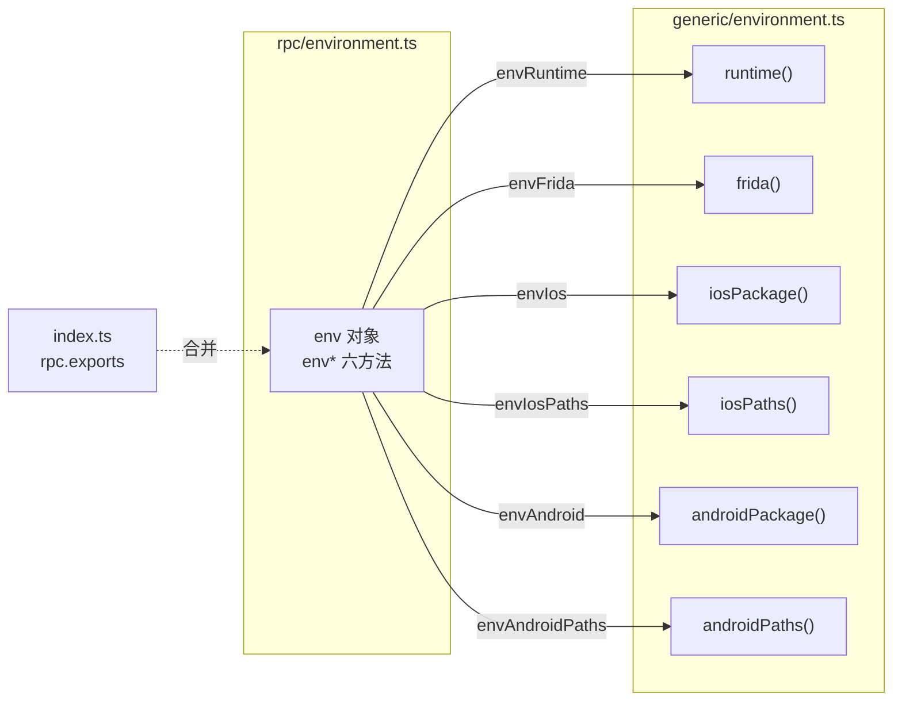

# 环境 RPC 聚合层 <code>agent/src/rpc/environment.ts</code>

`rpc/environment.ts` 是环境信息的 RPC 出口：它把 `generic/environment.ts` 导出的六个平台无关函数（`runtime`、`frida`、`iosPackage`、`iosPaths`、`androidPackage`、`androidPaths`）包装成一个名为 `env` 的对象，每个函数被改名为 `env` 前缀的 RPC 方法并经箭头函数透传。该对象被 `index.ts` 合并入 `rpc.exports`，成为宿主端 `env` 命令的统一入口。

## 📋 模块概览

| 项目 | 值 |
| --- | --- |
| 文件路径 | `agent/src/rpc/environment.ts` |
| 适用平台 | 全平台（iOS 与 Android 各自的方法仅在对应运行时可用） |
| 聚合的方法数 | 6 个 |
| 涉及平台模块 | `generic/environment.ts` |
| 依赖 | 仅 `../generic/environment.js` |

## 🎯 解决的问题

1. **统一前缀**：把 `environment.androidPackage()` 等长名改写为 `envAndroid`、`envFrida` 等 RPC 名，与 `android*`/`ios*` 命名风格并行，便于宿主端按 `env` 命名空间调用。
2. **平台无关聚合**：iOS 与 Android 的环境方法共用一个 `env` 对象，调用方按运行时自行选择 `envIos` 或 `envAndroid`，无需在宿主端区分模块路径。
3. **零逻辑透传**：纯接线层，不增加任何运行时行为，所有采集逻辑都在 `generic/environment.ts` 内。

## 🏗️ 聚合的方法

| RPC 名 | 转发目标 | 说明 |
| --- | --- | --- |
| `envAndroid` | `environment.androidPackage()` | Android 设备 Build 信息与应用包名 |
| `envAndroidPaths` | `environment.androidPaths()` | Android 沙盒关键目录路径 |
| `envFrida` | `environment.frida()` | Frida 与进程元数据（架构、版本、堆大小等） |
| `envIos` | `environment.iosPackage()` | iOS 设备与应用画像 |
| `envIosPaths` | `environment.iosPaths()` | iOS 沙盒关键目录路径 |
| `envRuntime` | `environment.runtime()` | 当前运行时类型（`ios`/`android`/`unknown`） |

### `env` — 聚合对象

源码：`agent/src/rpc/environment.ts:3`

整个文件就是一张“RPC 名 → 箭头函数”的映射表，每个箭头函数调用 `environment` 命名空间下的对应函数并返回其结果。注释按语义分组（`// environment`），无任何额外逻辑。

```ts
// agent/src/rpc/environment.ts:3
export const env = {
  // environment
  envAndroid: () => environment.androidPackage(),
  envAndroidPaths: () => environment.androidPaths(),
  envFrida: () => environment.frida(),
  envIos: () => environment.iosPackage(),
  envIosPaths: () => environment.iosPaths(),
  envRuntime: () => environment.runtime(),
};
```



## ⚙️ 实现要点

- **命名空间整体导入**：用 `import * as environment from "../generic/environment.js"` 把源模块作为命名空间，再在对象字面量里用 `envXxx: () => environment.xxx()` 做重命名透传——这是 rpc 聚合层统一的包装范式。
- **无类型标注**：与 `rpc/android.ts` 不同，本文件未显式标注参数与返回类型，依赖 TypeScript 从 `environment` 模块导出推断；因为六个函数都无参数，这不会带来歧义。
- **iOS/Android 共存于同一对象**：`env` 对象同时包含 `envIos` 与 `envAndroid`，调用方负责按 `envRuntime` 的结果选用正确方法，聚合层不做平台分流。
- **无运行时副作用**：模块本身不读 `ObjC`/`Java`/`Process`，所有采集行为在被调用的源函数里发生。

## 🔍 源码索引

| 符号 | 位置 |
| --- | --- |
| `env` 导出对象 | `agent/src/rpc/environment.ts:3` |
| `envAndroid` | `agent/src/rpc/environment.ts:5` |
| `envAndroidPaths` | `agent/src/rpc/environment.ts:6` |
| `envFrida` | `agent/src/rpc/environment.ts:7` |
| `envIos` | `agent/src/rpc/environment.ts:8` |
| `envIosPaths` | `agent/src/rpc/environment.ts:9` |
| `envRuntime` | `agent/src/rpc/environment.ts:10` |

## 🔗 相关文档

- [Frida 与 Agent](/guide/frida-agent)
- [RPC 通信机制](/guide/rpc)
- [Agent 入口 index.ts](/reference/agent/index)
