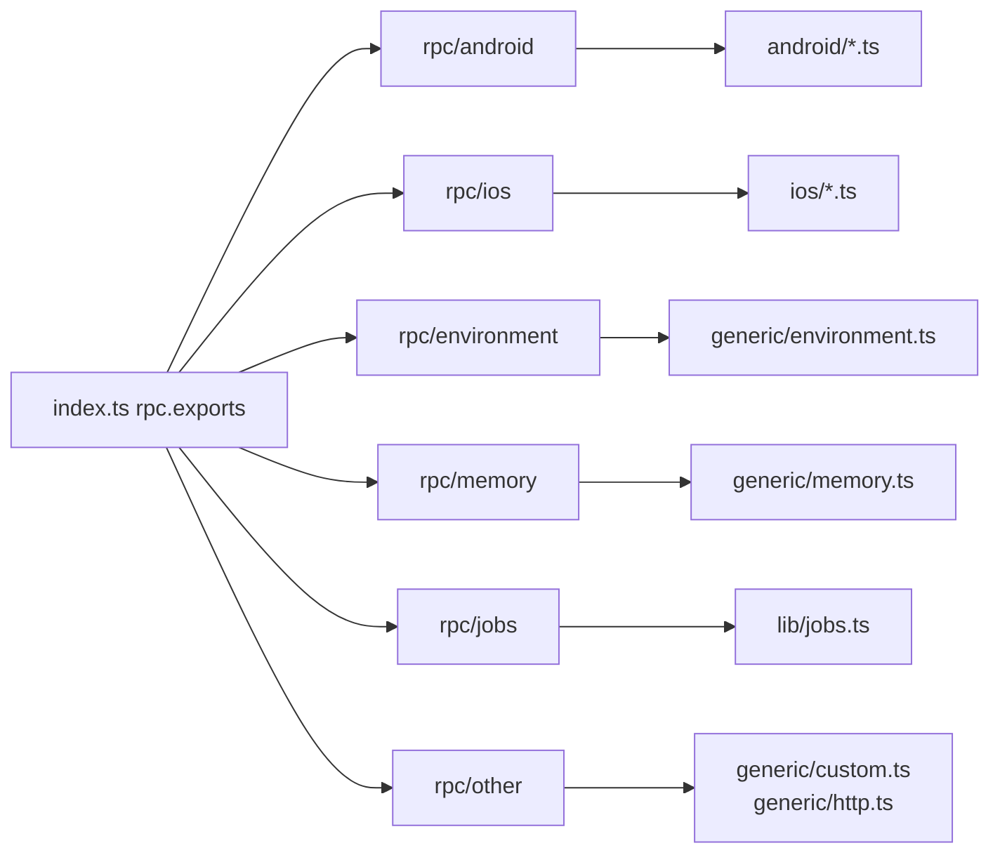

# 📡 Agent · RPC 聚合层

`agent/src/rpc/` 下的文件把各平台模块的具名导出**包装成箭头函数**，汇聚到 `index.ts` 的全局 `rpc.exports`。它们做的是**重命名 + 透传**：把 `keystore.list()` 暴露为 `androidKeystoreList`。

## 📂 文件清单

| 文档 | 源码 | 聚合的方法前缀 |
| --- | --- | --- |
| [android](/reference/agent/rpc/android) | `rpc/android.ts` | `android*`（约 40 个） |
| [ios](/reference/agent/rpc/ios) | `rpc/ios.ts` | `ios*`（约 35 个） |
| [environment](/reference/agent/rpc/environment) | `rpc/environment.ts` | `env*` |
| [memory](/reference/agent/rpc/memory) | `rpc/memory.ts` | `memory*` |
| [jobs](/reference/agent/rpc/jobs) | `rpc/jobs.ts` | `jobsGet`/`jobsKill` |
| [other](/reference/agent/rpc/other) | `rpc/other.ts` | `evaluate` + `httpServer*` |

## 🗺️ 聚合关系

## 🔗 相关文档

- [Agent 入口 index.ts](/reference/agent/index)
- [RPC 通信机制](/guide/rpc)
- [Frida 与 Agent](/guide/frida-agent)
