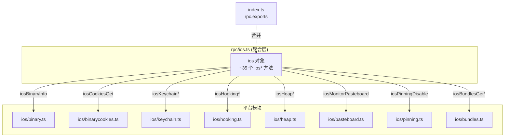

# iOS RPC 聚合层 <code>agent/src/rpc/ios.ts</code>

`rpc/ios.ts` 是 iOS 能力的 RPC 出口：它把 `ios/binary.ts`、`ios/keychain.ts`、`ios/hooking.ts`、`ios/heap.ts`、`ios/pasteboard.ts` 等十余个平台模块的具名导出，统一包装成一个名为 `ios` 的对象，对象里每个键都是以 `ios` 开头的 RPC 方法名，值为箭头函数并转发到对应平台模块函数。该对象被 `index.ts` 合并入 `rpc.exports`，成为宿主端所有 `ios*` 命令的调用入口。

## 📋 模块概览

| 项目 | 值 |
| --- | --- |
| 文件路径 | `agent/src/rpc/ios.ts` |
| 适用平台 | iOS |
| 聚合的方法数 | 约 35 个（全部以 `ios` 前缀命名） |
| 涉及平台模块 | `binary` / `binarycookies` / `bundles` / `credentialstorage` / `filesystem` / `heap` / `hooking` / `crypto` / `jailbreak` / `keychain` / `nsuserdefaults` / `pasteboard` / `pinning` / `plist` / `userinterface` |
| 依赖类型 | `ios/lib/constants.js`、`ios/lib/types.js`、`ios/lib/interfaces.js` |

## 🎯 解决的问题

1. **统一命名空间**：把十五个模块的导出压平到 `ios*` 前缀下，宿主端按 `iosXxxYyy` 命名调用，无需关心底层模块路径。
2. **重命名与透传**：平台函数名（如 `keychain.list`）被改写为 RPC 名（`iosKeychainList`），箭头函数保留参数与返回类型，对调用方透明。
3. **常量注入**：对需要枚举常量的方法（如 `bundles.getBundles(BundleType.NSBundleAllBundles)`），在聚合层就地传入常量，调用方无需感知 `BundleType`。
4. **类型收口**：在包装处显式标注返回类型（如 `IKeychainItem[]`、`IIosCookie[]`），让 `rpc.exports` 拥有完整 TypeScript 契约。

## 🏗️ 聚合的方法

| RPC 名 | 转发目标 | 说明 |
| --- | --- | --- |
| `iosBinaryInfo` | `binary.info()` | 二进制模块信息 |
| `iosCookiesGet` | `binarycookies.get()` | 读取二进制 cookie 文件 |
| `iosCredentialStorage` | `credentialstorage.dump()` | NSURLCredentialStorage 转储 |
| `iosFileCwd`/`Ls`/`Exists`/... | `iosfilesystem.*` | 文件系统操作集合 |
| `iosHeapEvaluateJs`/`ExecMethod`/... | `heap.*` | 堆对象方法调用与 ivar 读取 |
| `iosHookingGetClassMethods`/`Watch`/`Search`/... | `hooking.*` | 类/方法枚举与 Hook |
| `iosMonitorCryptoEnable` | `ioscrypto.monitor()` | 启用 CommonCrypto 监控 |
| `iosJailbreakDisable`/`Enable` | `iosjailbreak.*` | 越狱检测开关 |
| `iosPlistRead` | `plist.read(path)` | 读取 plist |
| `iosUiAlert`/`BiometricsBypass`/`Screenshot`/`WindowDump` | `userinterface.*` | UI 弹窗/截图/窗口转储 |
| `iosPinningDisable` | `sslpinning.disable(quiet)` | 关闭 SSL Pinning |
| `iosMonitorPasteboard` | `pasteboard.monitor()` | 监控剪贴板 |
| `iosBundlesGetBundles`/`GetFrameworks` | `bundles.getBundles(BundleType.*)` | 枚举 Bundle/Framework |
| `iosKeychainAdd`/`Remove`/`Update`/`Empty`/`List`/`ListRaw` | `ioskeychain.*` | 钥匙串增删改查 |
| `iosNsuserDefaultsGet` | `nsuserdefaults.get()` | 读取 NSUserDefaults |

### `ios` — 聚合对象

源码：[`agent/src/rpc/ios.ts:30`](https://github.com/android-security-engineer/objection-skills/blob/master/agent/src/rpc/ios.ts#L30)

整个模块导出一个对象字面量 `ios`，键为 RPC 方法名，值为箭头函数。下例展示 binary、cookie、credential、文件系统四类典型包装：

```ts
// agent/src/rpc/ios.ts:30
export const ios = {
  // binary
  iosBinaryInfo: (): IBinaryModuleDictionary => binary.info(),

  // ios binary cookies
  iosCookiesGet: (): IIosCookie[] => binarycookies.get(),

  // ios nsurlcredentialstorage
  iosCredentialStorage: (): ICredential[] => credentialstorage.dump(),

  // ios filesystem
  iosFileCwd: (): string => iosfilesystem.pwd(),
  iosFileDelete: (path: string): boolean => iosfilesystem.deleteFile(path),
  iosFileDownload: (path: string): string | Buffer => iosfilesystem.readFile(path),
  // ...
};
```

### 钥匙串子集 — 增删改查集合

源码：[`agent/src/rpc/ios.ts:97`](https://github.com/android-security-engineer/objection-skills/blob/master/agent/src/rpc/ios.ts#L97)

`ioskeychain` 是 iOS 安全测试的核心，聚合层把 `add`/`remove`/`update`/`empty`/`list`/`listRaw` 全部暴露，并对 `list` 给出默认参数 `smartDecode: boolean = false`，由调用方决定是否智能解码。

```ts
// agent/src/rpc/ios.ts:97
iosKeychainAdd: (account: string, service: string, data: string): boolean =>
  ioskeychain.add(account, service, data),
iosKeychainRemove: (account: string, service: string): void => ioskeychain.remove(account, service),
iosKeychainUpdate: (account: string, service: string, newData: string): void =>
  ioskeychain.update(account, service, newData),
iosKeychainEmpty: (): void => ioskeychain.empty(),
iosKeychainList: (smartDecode: boolean = false): IKeychainItem[] => ioskeychain.list(smartDecode),
iosKeychainListRaw: (): void => ioskeychain.listRaw(),
```

### Bundle 枚举 — 常量注入示例

源码：[`agent/src/rpc/ios.ts:93`](https://github.com/android-security-engineer/objection-skills/blob/master/agent/src/rpc/ios.ts#L93)

`iosBundlesGetBundles` 与 `iosBundlesGetFrameworks` 共用 `bundles.getBundles`，差别仅在传入的 `BundleType` 常量。聚合层在此处把“枚举所有 Bundle”与“仅枚举 Framework”固化为两个独立 RPC，调用方无需接触 `BundleType`。

```ts
// agent/src/rpc/ios.ts:93
iosBundlesGetBundles: (): IFramework[] => bundles.getBundles(BundleType.NSBundleAllBundles),
iosBundlesGetFrameworks: (): IFramework[] => bundles.getBundles(BundleType.NSBundleFramework),
```



## ⚙️ 实现要点

- **具名导入 + 箭头包装**：顶部 `import * as keychain from "../ios/keychain.js"` 等把每个平台模块整体导入为命名空间，对象字面量里用 `(args) => module.fn(args)` 做重命名透传，与 `rpc/android.ts` 完全同构。
- **常量在聚合层注入**：`iosBundlesGetBundles`/`GetFrameworks` 在箭头函数体内直接传入 `BundleType.NSBundleAllBundles` / `NSBundleFramework`，把“枚举范围”这一语义固化在 RPC 名上，而非暴露给调用方。
- **类型显式化**：多数箭头函数标注了返回类型（`IKeychainItem[]`、`IIosCookie[]`、`IFramework[]` 等），参数也带类型，使 `rpc.exports` 在 TypeScript 侧强类型。
- **默认参数透传**：`iosKeychainList(smartDecode = false)`、`iosPinningDisable(quiet)` 等把默认值或必填参数在聚合层声明并下传。
- **无运行时逻辑**：文件本身不含任何 ObjC 调用或 IO，纯接线层，所有行为发生在被调用的平台模块里。

## 🔍 源码索引

| 符号 | 位置 |
| --- | --- |
| `ios` 导出对象 | [`agent/src/rpc/ios.ts:30`](https://github.com/android-security-engineer/objection-skills/blob/master/agent/src/rpc/ios.ts#L30) |
| `iosBinaryInfo` | [`agent/src/rpc/ios.ts:32`](https://github.com/android-security-engineer/objection-skills/blob/master/agent/src/rpc/ios.ts#L32) |
| `iosCookiesGet` | [`agent/src/rpc/ios.ts:35`](https://github.com/android-security-engineer/objection-skills/blob/master/agent/src/rpc/ios.ts#L35) |
| `iosCredentialStorage` | [`agent/src/rpc/ios.ts:38`](https://github.com/android-security-engineer/objection-skills/blob/master/agent/src/rpc/ios.ts#L38) |
| `iosFile*` 文件系统组 | [`agent/src/rpc/ios.ts:41`](https://github.com/android-security-engineer/objection-skills/blob/master/agent/src/rpc/ios.ts#L41) |
| `iosHeapEvaluateJs` | [`agent/src/rpc/ios.ts:52`](https://github.com/android-security-engineer/objection-skills/blob/master/agent/src/rpc/ios.ts#L52) |
| `iosHookingGetClassMethods` | [`agent/src/rpc/ios.ts:60`](https://github.com/android-security-engineer/objection-skills/blob/master/agent/src/rpc/ios.ts#L60) |
| `iosMonitorCryptoEnable` | [`agent/src/rpc/ios.ts:71`](https://github.com/android-security-engineer/objection-skills/blob/master/agent/src/rpc/ios.ts#L71) |
| `iosJailbreakDisable` | [`agent/src/rpc/ios.ts:74`](https://github.com/android-security-engineer/objection-skills/blob/master/agent/src/rpc/ios.ts#L74) |
| `iosPlistRead` | [`agent/src/rpc/ios.ts:78`](https://github.com/android-security-engineer/objection-skills/blob/master/agent/src/rpc/ios.ts#L78) |
| `iosUi*` UI 组 | [`agent/src/rpc/ios.ts:81`](https://github.com/android-security-engineer/objection-skills/blob/master/agent/src/rpc/ios.ts#L81) |
| `iosPinningDisable` | [`agent/src/rpc/ios.ts:87`](https://github.com/android-security-engineer/objection-skills/blob/master/agent/src/rpc/ios.ts#L87) |
| `iosMonitorPasteboard` | [`agent/src/rpc/ios.ts:90`](https://github.com/android-security-engineer/objection-skills/blob/master/agent/src/rpc/ios.ts#L90) |
| `iosBundlesGetBundles`/`GetFrameworks` | [`agent/src/rpc/ios.ts:93`](https://github.com/android-security-engineer/objection-skills/blob/master/agent/src/rpc/ios.ts#L93) |
| `iosKeychain*` 钥匙串组 | [`agent/src/rpc/ios.ts:97`](https://github.com/android-security-engineer/objection-skills/blob/master/agent/src/rpc/ios.ts#L97) |
| `iosNsuserDefaultsGet` | [`agent/src/rpc/ios.ts:107`](https://github.com/android-security-engineer/objection-skills/blob/master/agent/src/rpc/ios.ts#L107) |

## 🔗 相关文档

- [Frida 与 Agent](/guide/frida-agent)
- [RPC 通信机制](/guide/rpc)
- [Agent 入口 index.ts](/reference/agent/index)
