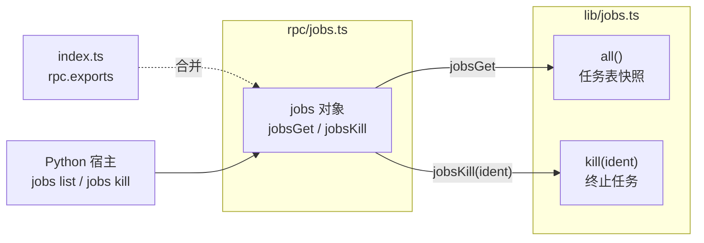

# 任务管理 RPC 聚合层 <code>agent/src/rpc/jobs.ts</code>

`rpc/jobs.ts` 是 objection“任务（job）”体系的 RPC 出口：它把 `lib/jobs.ts` 里维护的后台 Hook 任务表包装成一个名为 `jobs` 的对象，对外暴露 `jobsGet` 与 `jobsKill` 两个方法。宿主端通过它们查询当前正在运行的 Hook 任务、按标识符终止指定任务。该对象被 `index.ts` 合并入 `rpc.exports`。

## 📋 模块概览

| 项目 | 值 |
| --- | --- |
| 文件路径 | `agent/src/rpc/jobs.ts` |
| 适用平台 | 全平台（任务表与平台无关） |
| 聚合的方法数 | 2 个 |
| 涉及平台模块 | `lib/jobs.js` |
| 依赖 | 仅 `../lib/jobs.js` |

## 🎯 解决的问题

1. **后台任务可见性**：Frida 的 Hook 多以异步监听形式长驻，研究员需要一个清单查看当前挂了哪些任务、各任务的标识号。
2. **按需终止**：某个 Hook 不再需要或造成干扰时，能按 `ident` 精确杀掉单个任务，而不必重启整个 Agent。
3. **统一入口**：把 `lib/jobs` 的内部 API 收口为 `jobs*` RPC，与 `android*`/`ios*` 命名风格并行。

## 🏗️ 聚合的方法

| RPC 名 | 转发目标 | 说明 |
| --- | --- | --- |
| `jobsGet` | `j.all()` | 返回当前所有后台任务 |
| `jobsKill` | `j.kill(ident)` | 按标识符终止指定任务 |

### `jobs` — 聚合对象

源码：`agent/src/rpc/jobs.ts:3`

整个文件就是把 `lib/jobs` 命名空间下的 `all` 与 `kill` 两个函数改名为 `jobsGet`/`jobsKill` 并经箭头函数透传。`jobsKill` 接收一个数字标识符 `ident`，下传给 `j.kill`。

```ts
// agent/src/rpc/jobs.ts:3
export const jobs = {
  // jobs
  jobsGet: () => j.all(),
  jobsKill: (ident: number) => j.kill(ident),
};
```



## ⚙️ 实现要点

- **命名空间整体导入**：`import * as j from "../lib/jobs.js"`，再用 `j.all()`/`j.kill()` 调用——这是 rpc 聚合层一以贯之的“具名导入 + 箭头透传”范式。
- **重命名而非原样暴露**：源函数 `all`/`kill` 被改写为 `jobsGet`/`jobsKill`，前缀 `jobs` 让 RPC 名自带命名空间，宿主端命令据此去掉前缀得到 `jobs get`/`jobs kill`。
- **无类型标注**：文件未显式标注返回类型，依赖 `lib/jobs` 导出的类型推断；`jobsKill` 的 `ident: number` 是唯一标注。
- **无运行时逻辑**：纯接线层，任务表的实际维护（注册、去重、终止回调）都在 `lib/jobs.ts` 内。

## 🔍 源码索引

| 符号 | 位置 |
| --- | --- |
| `jobs` 导出对象 | `agent/src/rpc/jobs.ts:3` |
| `jobsGet` | `agent/src/rpc/jobs.ts:5` |
| `jobsKill` | `agent/src/rpc/jobs.ts:6` |

## 🔗 相关文档

- [Frida 与 Agent](/guide/frida-agent)
- [RPC 通信机制](/guide/rpc)
- [Agent 入口 index.ts](/reference/agent/index)
