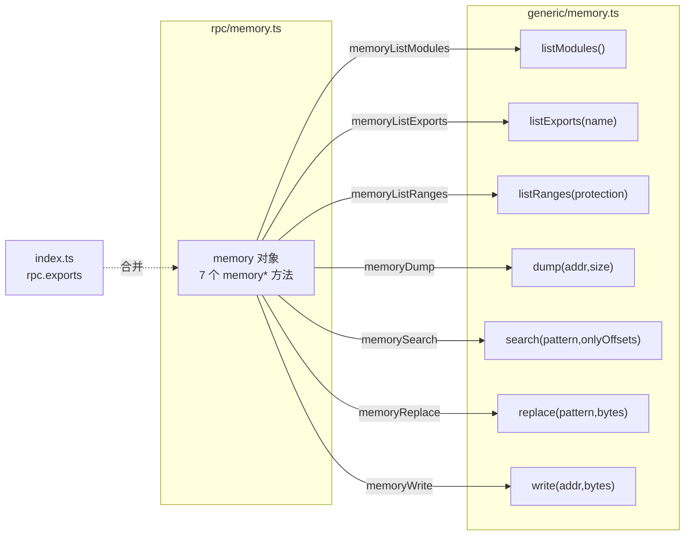

# 内存 RPC 聚合层 <code>agent/src/rpc/memory.ts</code>

`rpc/memory.ts` 是内存操作的 RPC 出口：它把 `generic/memory.ts` 导出的七个函数（`listModules`、`listExports`、`listRanges`、`dump`、`search`、`replace`、`write`）包装成一个名为 `memory` 的对象，每个函数被改名为 `memory` 前缀的 RPC 方法并经箭头函数透传。该对象被 `index.ts` 合并入 `rpc.exports`，成为宿主端 `memory` 命令族的调用入口。

## 📋 模块概览

| 项目 | 值 |
| --- | --- |
| 文件路径 | `agent/src/rpc/memory.ts` |
| 适用平台 | 全平台 |
| 聚合的方法数 | 7 个 |
| 涉及平台模块 | `generic/memory.js` |
| 依赖 | 仅 `../generic/memory.js` |

## 🎯 解决的问题

1. **统一命名空间**：把 `memory.listModules` 等改写为 `memoryListModules`，与 `android*`/`ios*` 命名风格并行，宿主端按 `memoryXxx` 调用。
2. **参数透传**：`dump(address, size)`、`search(pattern, onlyOffsets)`、`replace(pattern, replace)`、`write(address, value)` 等都需多参数，聚合层负责原样下传。
3. **默认值在聚合层声明**：`generic/memory.ts` 里 `listRanges(protection = "rw-")`、`search(onlyOffsets = false)` 有默认值，聚合层调用时不传默认参数（仅写形参名），由源函数兜底。
4. **类型收口**：在包装处显式标注返回类型（`Module[]`、`RangeDetails[]` 等），让 `rpc.exports` 拥有完整 TypeScript 契约。

## 🏗️ 聚合的方法

| RPC 名 | 转发目标 | 说明 |
| --- | --- | --- |
| `memoryDump` | `m.dump(address, size)` | 读取指定地址开始的字节 |
| `memoryListExports` | `m.listExports(name)` | 枚举指定模块的导出符号 |
| `memoryListModules` | `m.listModules()` | 枚举进程已加载模块 |
| `memoryListRanges` | `m.listRanges(protection)` | 枚举满足保护属性的内存范围 |
| `memorySearch` | `m.search(pattern, onlyOffsets)` | 在 `rw-` 内存搜索模式 |
| `memoryReplace` | `m.replace(pattern, replace)` | 搜索并改写命中字节 |
| `memoryWrite` | `m.write(address, value)` | 向地址写入字节数组 |

### `memory` — 聚合对象

源码：[`agent/src/rpc/memory.ts:3`](https://github.com/android-security-engineer/objection-skills/blob/master/agent/src/rpc/memory.ts#L3)

整个文件是一张“RPC 名 → 箭头函数”映射表，每行把参数按位置透传给 `m`（`generic/memory` 命名空间）的对应函数，并标注返回类型。

```ts
// agent/src/rpc/memory.ts:3
export const memory = {
  memoryDump: (address: string, size: number) => m.dump(address, size),
  memoryListExports: (name: string): ModuleExportDetails[] => m.listExports(name),
  memoryListModules: (): Module[] => m.listModules(),
  memoryListRanges: (protection: string): RangeDetails[] => m.listRanges(protection),
  memorySearch: (pattern: string, onlyOffsets: boolean): string[] => m.search(pattern, onlyOffsets),
  memoryReplace: (pattern: string, replace: number[]): string[] => m.replace(pattern, replace),
  memoryWrite: (address: string, value: number[]): void => m.write(address, value),
};
```



## ⚙️ 实现要点

- **具名导入 + 箭头包装**：`import * as m from "../generic/memory.js"`，再用 `m.fn(args)` 透传——与 `rpc/jobs.ts`、`rpc/environment.ts` 完全同构的接线范式。
- **重命名规则**：源函数 `listModules` → RPC `memoryListModules`，前缀 `memory` + 动词/名词，宿主端命令据此去掉前缀得到 `memory list modules` 等。
- **默认值不在聚合层重复**：`listRanges` 与 `search` 的默认值由源函数提供，聚合层只声明形参名（`protection`、`onlyOffsets`），不重复写 `= "rw-"`/`= false`，避免默认值漂移。
- **类型显式化**：除 `memoryDump` 与 `memoryWrite` 外，均标注返回类型（`Module[]`、`ModuleExportDetails[]`、`RangeDetails[]`、`string[]`、`void`），供宿主端类型存根使用。
- **无运行时逻辑**：纯接线层，所有枚举/扫描/改写行为都在 `generic/memory.ts` 内发生。

## 🔍 源码索引

| 符号 | 位置 |
| --- | --- |
| `memory` 导出对象 | [`agent/src/rpc/memory.ts:3`](https://github.com/android-security-engineer/objection-skills/blob/master/agent/src/rpc/memory.ts#L3) |
| `memoryDump` | [`agent/src/rpc/memory.ts:5`](https://github.com/android-security-engineer/objection-skills/blob/master/agent/src/rpc/memory.ts#L5) |
| `memoryListExports` | [`agent/src/rpc/memory.ts:6`](https://github.com/android-security-engineer/objection-skills/blob/master/agent/src/rpc/memory.ts#L6) |
| `memoryListModules` | [`agent/src/rpc/memory.ts:7`](https://github.com/android-security-engineer/objection-skills/blob/master/agent/src/rpc/memory.ts#L7) |
| `memoryListRanges` | [`agent/src/rpc/memory.ts:8`](https://github.com/android-security-engineer/objection-skills/blob/master/agent/src/rpc/memory.ts#L8) |
| `memorySearch` | [`agent/src/rpc/memory.ts:9`](https://github.com/android-security-engineer/objection-skills/blob/master/agent/src/rpc/memory.ts#L9) |
| `memoryReplace` | [`agent/src/rpc/memory.ts:10`](https://github.com/android-security-engineer/objection-skills/blob/master/agent/src/rpc/memory.ts#L10) |
| `memoryWrite` | [`agent/src/rpc/memory.ts:11`](https://github.com/android-security-engineer/objection-skills/blob/master/agent/src/rpc/memory.ts#L11) |

## 🔗 相关文档

- [Frida 与 Agent](/guide/frida-agent)
- [RPC 通信机制](/guide/rpc)
- [Agent 入口 index.ts](/reference/agent/index)
