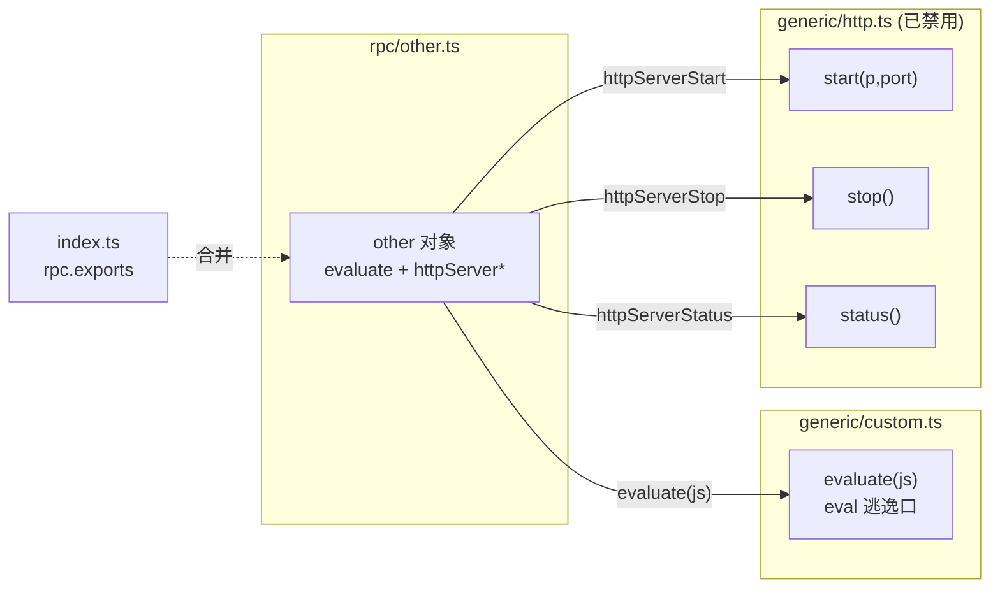

# 杂项 RPC 聚合层 <code>agent/src/rpc/other.ts</code>

`rpc/other.ts` 是“兜底”聚合层：它把不属于任何平台命名空间、也不属于 jobs/memory 的零散能力——任意 JS 求值与进程内 HTTP 服务器——收口到一个名为 `other` 的对象，对外暴露 `evaluate` 与 `httpServerStart`/`httpServerStop`/`httpServerStatus` 四个方法。该对象被 `index.ts` 合并入 `rpc.exports`。

## 📋 模块概览

| 项目 | 值 |
| --- | --- |
| 文件路径 | `agent/src/rpc/other.ts` |
| 适用平台 | 全平台 |
| 聚合的方法数 | 4 个 |
| 涉及平台模块 | `generic/custom.js`（evaluate）、`generic/http.js`（http server） |
| 依赖 | `../generic/custom.js`、`../generic/http.js` |

## 🎯 解决的问题

1. **逃逸口聚合**：`custom.evaluate` 这类不属于任何业务命名空间的“后门”能力需要一个落脚点，`other` 命名空间即此用途。
2. **HTTP 服务器归口**：`generic/http.ts` 的 `start`/`stop`/`status` 三个函数被统一冠以 `httpServer*` 前缀，与 `evaluate` 并列在同一对象里。
3. **命名一致性**：让所有顶层 RPC 方法都落在某个命名空间对象内（`android`/`ios`/`env`/`memory`/`jobs`/`other`），便于 `index.ts` 一次性合并。

## 🏗️ 聚合的方法

| RPC 名 | 转发目标 | 说明 |
| --- | --- | --- |
| `evaluate` | `custom.evaluate(js)` | 在 Agent 上下文执行任意 JS 字符串 |
| `httpServerStart` | `http.start(p, port)` | （已禁用）预期启动 HTTP 服务器 |
| `httpServerStatus` | `http.status()` | 打印 HTTP 服务器运行状态 |
| `httpServerStop` | `http.stop()` | 关闭 HTTP 服务器 |

### `other` — 聚合对象

源码：[`agent/src/rpc/other.ts:4`](https://github.com/android-security-engineer/objection-skills/blob/master/agent/src/rpc/other.ts#L4)

整个文件就是一张“RPC 名 → 箭头函数”映射表。`evaluate` 把 JS 字符串透传给 `custom.evaluate`；`httpServer*` 三个方法分别转发到 `http.start`/`status`/`stop`。注意 `generic/http.ts` 当前已禁用，`httpServerStart` 实际只会打印禁用提示。

```ts
// agent/src/rpc/other.ts:4
export const other = {
  evaluate: (js: string): void => custom.evaluate(js),

  // http server
  httpServerStart: (p: string, port: number): void => http.start(p, port),
  httpServerStatus: (): void => http.status(),
  httpServerStop: (): void => http.stop(),
};
```



## ⚙️ 实现要点

- **具名导入 + 箭头包装**：`import * as custom from "../generic/custom.js"`、`import * as http from "../generic/http.js"`，再以 `(args) => module.fn(args)` 透传——与 `rpc/android.ts`、`rpc/ios.ts` 完全同构的接线范式。
- **`evaluate` 不加前缀**：与 `httpServer*` 不同，`evaluate` 没有被改名为 `otherEvaluate`，而是直接以 `evaluate` 为键——它是顶层“后门”，前缀反而会拖累调用便利性。
- **HTTP 服务器禁用现状透传**：聚合层本身不做禁用判断，禁用发生在 `generic/http.ts:start()` 内（开头即打印 `not currently available`）；聚合层只负责把调用转发过去，行为后果由源模块决定。
- **类型显式化**：四个方法都标注了返回类型 `void`，参数也带类型（`js: string`、`p: string`、`port: number`），供宿主端类型存根使用。
- **无运行时逻辑**：纯接线层，所有行为发生在 `custom.evaluate`（`eval`）或 `http.*`（已禁用）内。

## 🔍 源码索引

| 符号 | 位置 |
| --- | --- |
| `other` 导出对象 | [`agent/src/rpc/other.ts:4`](https://github.com/android-security-engineer/objection-skills/blob/master/agent/src/rpc/other.ts#L4) |
| `evaluate` | [`agent/src/rpc/other.ts:5`](https://github.com/android-security-engineer/objection-skills/blob/master/agent/src/rpc/other.ts#L5) |
| `httpServerStart` | [`agent/src/rpc/other.ts:8`](https://github.com/android-security-engineer/objection-skills/blob/master/agent/src/rpc/other.ts#L8) |
| `httpServerStatus` | [`agent/src/rpc/other.ts:9`](https://github.com/android-security-engineer/objection-skills/blob/master/agent/src/rpc/other.ts#L9) |
| `httpServerStop` | [`agent/src/rpc/other.ts:10`](https://github.com/android-security-engineer/objection-skills/blob/master/agent/src/rpc/other.ts#L10) |

## 🔗 相关文档

- [Frida 与 Agent](/guide/frida-agent)
- [RPC 通信机制](/guide/rpc)
- [Agent 入口 index.ts](/reference/agent/index)
